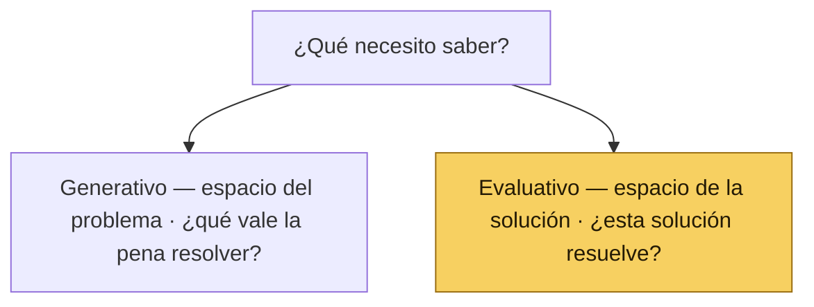
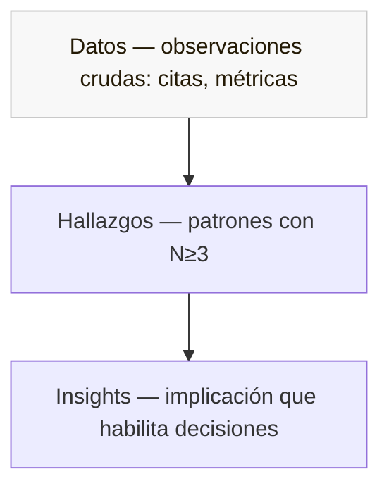

# 🧠 Cabeza · Motor de Evidencia

*Parte del sistema [Producto de Cabeza, Tripa y Corazón](#/inicio)*

| | |
| --- | --- |
| **Versión** | v1.0 |
| **Estado** | Documento vivo · 🚧 transcripción en curso (§1–§6 listas; §7–§14 en camino) |
| **Audiencia** | Producto, Diseño, Data & Analytics (Growth), Engineering, Customer Success, Liderazgo |
| **Aplica a** | Cualquier iniciativa, especialmente las que entren al Discovery Track |

---

## Qué es la Cabeza

La **Cabeza** es la práctica transversal con la que un equipo de producto responde a una sola pregunta: **¿por qué los usuarios hacen lo que hacen?** No es un equipo, no es una herramienta, no es un proceso nuevo encima del [Marco de Desarrollo](#/tripa). Es la capa que hace explícito el sistema de inteligencia que el desarrollo de producto ya asume — para poder hablarlo, mejorarlo y asignarle responsables.

La razón de existir de la Cabeza es una sola: **construir sobre conocimiento, no sobre esperanza.** La mayoría de los productos no fracasan por mal diseño ni por mal código, sino por construir lo incorrecto — y eso casi siempre nace de malos insumos en el momento equivocado. El research existe para que las decisiones se tomen con evidencia y no con la opinión más fuerte de la sala.

Dos posturas sostienen esa práctica. La primera es de objetividad: **tú no eres el usuario**, y lo que crees saber sobre él es una hipótesis hasta que la evidencia lo confirme. La segunda es de humildad: una **hipótesis es solo una idea** escrita de forma que se pueda probar — no un compromiso ni una verdad, solo una idea a la que se le da la oportunidad de estar equivocada.

Las tres piezas del sistema se reparten el trabajo como se reparte el sabor de un buen taco:

- 🔥 **[Tripa — Marco de Desarrollo de Producto](#/tripa)** — el cómo construimos, con disciplina y consistencia de ejecución.
- ❤️ **[Corazón — Playbook de Diseño de Producto](#/corazon/diseno)** — el cómo lo construimos con craft y cuidado del usuario.
- 🧠 **Cabeza — Motor de Evidencia** — el cómo sabemos qué construir, con objetividad. (Este documento.)

---

## Qué es la Investigación de Producto

Investigar es el estudio sistemático de información para establecer hechos y formar conclusiones. En contexto de producto, el nombre específico para esa práctica es: **Investigación de Producto**.

> **Investigación de Producto = Investigación de Usuarios + Investigación de Mercado**

Las dos miran al mismo problema desde alturas distintas:

| | Investigación de Usuarios 👥 | Investigación de Mercado 🌊 |
| --- | --- | --- |
| Vista | Micro. La persona y su comportamiento. | Macro. La industria y la competencia. |
| Pregunta | ¿Cómo usa esta persona el producto? ¿Por qué actúa así? | ¿Cómo están las aguas? ¿Quién es quién? ¿Qué oportunidades y amenazas hay? |
| Foco | El usuario, sus necesidades, su contexto, su modelo mental. | Segmentos, tendencias, marcas, competencia, posicionamiento. |
| Métodos típicos | Entrevistas, concept tests, pruebas de usabilidad, etnografía, análisis de tickets. | Análisis competitivo, benchmarks de industria, segmentación, posicionamiento, pricing research. |
| Modalidad típica | Hoy, mayoritariamente remota: videollamada, herramientas de test async, formularios. | Mezcla de research secundario (reportes, analytics públicos) y primario (entrevistas a buyers, no users). |

*Referencia: Dr. Nick Fine, [sobre las diferencias entre User Research y UX](https://www.linkedin.com/posts/drnickfine_the-differences-between-user-research-ux-activity-7290193863326011392-grzd).*

Las dos son necesarias. Sin Investigación de Usuarios, el producto se construye en el aire; sin Investigación de Mercado, se construye en una burbuja.

---

## Qué documenta hoy el Motor de Evidencia

**Importante:** El Motor de Evidencia actual documenta solo **Investigación de Usuarios.** Investigación de Mercado está pendiente de documentar como capa explícita del Motor de Evidencia.

Esto es decisión consciente, no omisión. La función de Investigación de Mercado suele vivir distribuida entre el PM (estrategia, posicionamiento) y Data & Analytics (Growth) (analítica de funnel, retención). Bajo Product-Led Growth, **Data & Analytics (Growth) es quien define y documenta la estrategia de Investigación de Mercado** que esta capa todavía no formaliza. Cuando se documente, vivirá en una sección hermana con su propio playbook.

#### Roadmap del Motor de Evidencia

| Capa | Estado | Owner futuro |
| --- | --- | --- |
| Investigación de Usuarios | ✅ Documentada (este documento) | Product Design — facilitador del motor |
| Investigación de Mercado | ⏳ Pendiente de documentar | Data & Analytics (Growth) |
| Conexión entre ambas (triangulación cualitativa-cuantitativa-mercado) | ⏳ Pendiente | TBD |

**Cuando este documento dice "research" sin calificativo, se refiere a Investigación de Usuarios.** Si en algún punto hace referencia a research de mercado, lo nombra explícitamente.

---

## Por qué existe el Motor de Evidencia

Hoy, la responsabilidad de entender al usuario está distribuida sin nombre: Customer Success la toca con tickets, Data & Analytics con métricas, Producto y Diseño con pruebas, el liderazgo con decisiones. Sin un marco común, cada área genera evidencia que las otras no consumen, y la decisión final termina apoyándose en intuición o en la voz más fuerte de la sala.

El Motor de Evidencia le pone nombre a la práctica para que la suma sea mayor que las partes.

---

## Cómo opera

El motor procesa información en tres niveles, siguiendo el modelo Datos → Hallazgos → Insights:

1. **Datos crudos** — citas, observaciones, tickets, métricas. No es información todavía.
2. **Hallazgos** — patrones que se repiten en N≥3 fuentes independientes.
3. **Insights** — interpretación que habilita decisiones Build / Pivot / No build.

La regla del salto es la más importante: cada insight tiene que poder reconstruirse hacia abajo, hasta los datos crudos que lo sostienen. Saltarse un nivel es el error más común y el más caro.

---

## Cómo se documenta

El motor opera sobre cinco documentos. Uno es el meta-doc — **este Playbook** — que rige toda la práctica. Los otros cuatro son operativos por iniciativa:

- 📋 **[Plan de Investigación](#/plantillas/plan-de-investigacion)** (padre)
- 📝 **[Research Brief](#/plantillas/research-brief)** (anexo de sesión)
- 🔬 **[Estrategia de Análisis](#/plantillas/estrategia-de-analisis)** (cómo se procesa el dato)
- 📊 **[Reporte de Hallazgos](#/plantillas/reporte-de-hallazgos)** (cómo se comunica el veredicto)

> 🌟 **Regla de oro:** Ningún test sin Brief firmado, ningún reporte sin Estrategia, ningún hallazgo al Initiative Spec sin presentación al equipo.

---

## Quién participa

Cinco equipos, una habilidad por equipo:

- **Customer Success** — escucha estructurada y categorización con dimensiones etnográficas.
- **Data & Analytics** — triangulación cualitativa-cuantitativa.
- **Ingeniería** — evaluación temprana de viabilidad técnica.
- **PM** — defensa del rigor de evidencia bajo presión.
- **Product Design** — síntesis sin sesgo de confirmación.

Product Design es el facilitador del motor y dueño del proceso de investigación; las demás áreas aportan evidencia que el facilitador organiza y convierte en insights.

---

## Qué no es el Motor de Evidencia

- **No es un proceso encima del [Marco de Desarrollo](#/tripa).** Es la capa que explicita lo que el Marco de Desarrollo ya implica.
- **No es propiedad de una sola área.** Product Design facilita el motor y es dueño del proceso de investigación, pero la evidencia es contribución de todo el equipo: cada área aporta datos que el facilitador organiza y convierte en insights.
- **No decide.** Alimenta la decisión. El research clasifica las apuestas con un veredicto explícito (PASA / AMBIGUO / NO PASA por apuesta; 🟢 Verde / 🟡 Ámbar / 🔴 Rojo en agregado). La decisión Build / Pivot / No build la toma el equipo en sesión de presentación, con el reporte como input.

---

## 🧱 1 · Fundamentos

### 1.1 · Qué es User Research

User Research es el proceso de entender cómo un usuario específico hace uso de una solución específica en un contexto específico. Es investigación aplicada: no produce conocimiento por su cuenta, lo produce al servicio de una decisión.

Ese servicio tiene un destinatario claro: el **Initiative Spec** del [Marco de Desarrollo](#/tripa). Cada estudio de research existe para reducir el riesgo de una decisión que el equipo ya tiene en la mesa — sea entrar a Discovery, pasar a Design, comprometer Sprints de Delivery, o regresar al espacio del problema.

Las plantillas operativas que el Motor de Evidencia produce viven en la barra de [Plantillas, Guías y Craft](#/plantillas): [Plan de Investigación](#/plantillas/plan-de-investigacion) · [Research Brief](#/plantillas/research-brief) · [Estrategia de Análisis](#/plantillas/estrategia-de-analisis) · [Reporte de Hallazgos](#/plantillas/reporte-de-hallazgos).

El research bien hecho produce tres cosas, en orden:

- **Datos** — citas, observaciones, tickets, métricas. No es información todavía.
- **Hallazgos** — patrones que se repiten en N≥3 fuentes independientes.
- **Insights** — interpretación que habilita decisiones Build / Pivot / No build.

La regla más importante del Motor de Evidencia es la **regla del salto**: cada insight tiene que poder reconstruirse hacia abajo, hasta los datos crudos que lo sostienen. Saltarse un nivel es el error más común y el más caro.

### 1.2 · Por qué importa para el Marco de Desarrollo

El [Marco de Desarrollo](#/tripa) asume que las decisiones se toman con evidencia. Pero la evidencia no aparece sola — alguien tiene que producirla, alguien tiene que procesarla y alguien tiene que comunicarla a tiempo para que entre a la decisión, no después.

Hoy, esa responsabilidad está distribuida sin nombre: Customer Success la toca con tickets, Data & Analytics con métricas, Producto y Diseño con pruebas, el liderazgo con decisiones. Sin un marco común, cada área genera evidencia que las otras no consumen, y la decisión final termina apoyándose en intuición o en la voz más fuerte de la sala. El Motor de Evidencia le pone nombre a la práctica para que la suma sea mayor que las partes.

### 1.3 · Marco mental: doble diamante y capas

El research vive en dos espacios:

- **Espacio del problema** — *construir la cosa correcta.* Aquí trabajan los métodos generativos: entrevistas, etnografía, análisis de tickets. Producen información nueva sobre quién es el usuario, qué intenta hacer, qué fricciones encuentra.
- **Espacio de la solución** — *construirla correctamente.* Aquí trabajan los métodos evaluativos: pruebas de concepto, pruebas de usabilidad, A/B tests. Confirman o rechazan si una solución específica resuelve el problema.

Las decisiones de diseño se construyen en **capas sumatorias** (modelo JJ Garrett): Estrategia → Alcance → Estructura → Contenido → Visual. Las capas inferiores sostienen a las superiores. El research nutre todas las capas — no solo la visual ni solo la estratégica.

### 1.4 · Vocabulario base

El Motor de Evidencia adopta el vocabulario del Cuaderno de Adrián Solca. Estos términos se mencionan ahora y se desarrollan en las secciones que siguen:

- **Planeación · Ejecución · Comunicación** — las tres etapas universales de cualquier proceso de investigación. Toda iniciativa de Discovery sigue este orden.
- **Datos · Hallazgos · Insights** — la pirámide de análisis.
- **Generativo vs Evaluativo** — los dos reinos del research según qué producen (información nueva vs validación de información existente).
- **Descriptivo vs Analítico** — los dos reinos del research según qué tipo de dato producen (cualitativo no representativo vs cuantitativo representativo).
- **Metodología vs Método** — la metodología es el racional flexible y único de cada estudio. Los métodos son las recetas rígidas (entrevista, concept test, A/B test).

### 1.5 · Principio rector: justo la investigación necesaria

El balance que el Motor de Evidencia persigue es **suficiente información para decidir, sin caer en falso sentido de seguridad ni en falsa expectativa de certidumbre**. En la práctica:

- En entornos fast-paced — sprints de dos semanas, decisiones que no esperan — el research evaluativo gana casi siempre. Hago un prototipo, lo pongo en manos del usuario, mido. Eso es más rápido y más barato que un discovery profundo, y en la mayoría de iniciativas alcanza para validar.
- El research generativo se reserva para apuestas grandes con incertidumbre alta: nuevos features, nuevos abordajes al producto, exploración de mercados adyacentes. No para optimización ni mejora.
- La pregunta no es *cuánto research*, sino *qué research alimenta esta decisión específica*.

Este principio es la razón por la que el Motor de Evidencia existe como capa explícita y no como un departamento dedicado. La investigación se asigna por iniciativa, no por organigrama.

### 1.6 · Qué no es el Motor de Evidencia

- **No es un proceso encima del [Marco de Desarrollo](#/tripa).** Es la capa que explicita lo que el Marco de Desarrollo ya implica.
- **No es propiedad de una sola área.** Product Design es el facilitador del motor: conduce los estudios cualitativos, organiza la información y convierte los datos en insights. Las demás áreas aportan evidencia; el facilitador la integra.
- **No decide.** Alimenta la decisión. El research clasifica las apuestas con un veredicto explícito (PASA / AMBIGUO / NO PASA por apuesta; 🟢 Verde / 🟡 Ámbar / 🔴 Rojo en agregado). La decisión Build / Pivot / No build la toma el equipo en sesión de presentación, con el reporte como input.

---

## 🔀 2 · Tipos de research

### 2.1 · Generativo vs Evaluativo

| Generativo | Evaluativo |
| --- | --- |
| Produce información nueva. | Confirma o rechaza información existente. |
| Vive en el espacio del problema. | Vive en el espacio de la solución. |
| Pregunta qué problema vale la pena resolver. | Pregunta si esta solución resuelve el problema. |
| Métodos típicos: entrevistas, etnografía, análisis de tickets. | Métodos típicos: prueba de concepto, prueba de usabilidad, A/B test, encuesta. |

**En un producto en evolución continua, el research evaluativo carga la mayor parte del trabajo.** Las apuestas se validan con prototipos o con cambios incrementales en producción. El research generativo se ejecuta cuando hay una apuesta grande con incertidumbre alta — un nuevo módulo, una expansión de scope, una hipótesis de mercado adyacente.

### 2.2 · Descriptivo vs Analítico

| Descriptivo | Analítico |
| --- | --- |
| Cómo alguien hace algo. | Cuántos lo hacen. |
| Cualitativo. | Cuantitativo. |
| No es estadísticamente representativo. | Sí lo es (con muestra suficiente). |
| Da contexto, mental models, vocabulario. | Da distribuciones, proporciones, magnitudes. |
| Métodos: entrevistas, etnografía, concept tests moderados, card sorting cualitativo. | Métodos: encuestas, A/B tests, analytics, fake doors, tree testing async. |

Estos dos ejes son ortogonales. Un método puede ser **generativo descriptivo** (entrevista exploratoria), **generativo analítico** (encuesta abierta a base masiva para detectar patrones nuevos), **evaluativo descriptivo** (concept test moderado) o **evaluativo analítico** (A/B test).

### 2.3 · La matriz de información

Una segunda forma de pensar los métodos: ¿qué tipo de fuente da el dato?

| | Lo que la gente dice (actitudinal) | Lo que la gente hace (comportamiento) |
| --- | --- | --- |
| Escuchar opinión | Entrevistas, focus groups, formularios, pruebas de concepto | — |
| Observar acciones | — | Pruebas de usabilidad, etnografía, tracking visual |
| Medir actitudes | Encuestas, NPS, CSAT | — |
| Medir acciones | — | Analytics, A/B tests, tree testing |

La trampa común es tratar lo que la gente dice como evidencia de lo que hace. Para saber si alguien va a usar un feature, no se le pregunta si lo usaría — se le pone enfrente y se observa qué hace.

### 2.4 · Fuentes de información: jerarquía de calidad

| Tipo de fuente | Calidad | Cuándo usar |
| --- | --- | --- |
| Investigación primaria — el usuario en su contexto o en sesión moderada. | Máxima. | Default para validación de hipótesis. |
| Investigación secundaria — gente que interactúa con el usuario (Customer Success) o que se imagina al usuario (Gerentes, Legal). | Media. Trae sesgos corporativos. | Como complemento, nunca como sustituto. |
| Investigación terciaria — reportes de la industria, benchmarks públicos. | Baja para decisiones de producto, alta para contexto de mercado. | Background, no validación. |

### 2.5 · Cómo elegir el tipo correcto

Cuatro preguntas en orden:

1. **¿Estoy en espacio del problema o en espacio de la solución?** → Define si es generativo o evaluativo.
2. **¿Necesito entender cómo o cuánto?** → Define si es descriptivo o analítico.
3. **¿Lo que necesito saber es lo que dicen o lo que hacen?** → Define la matriz de información.
4. **¿Tengo acceso al usuario primario, o solo a fuentes secundarias?** → Define la jerarquía de calidad.

El método se elige al final, después de contestar las cuatro. No al principio. Decir *"vamos a hacer entrevistas"* antes de saber qué se quiere averiguar es uno de los anti-patrones más comunes.

---

## 📐 3 · Anatomía del Plan de Investigación

> 📋 Plantilla completa en la barra: [Plan de Investigación](#/plantillas/plan-de-investigacion).

### 3.1 · Las cuatro preguntas de planeación

Si una de estas no se puede contestar, el plan no está listo para ejecutarse:

1. **¿Qué queremos saber?** El objetivo de investigación, formulado como pregunta investigable.
2. **¿De quién?** Los perfiles de participantes, con cuotas de reclutamiento.
3. **¿Cómo lo extraemos?** El método (o combinación de métodos) que produce la información.
4. **¿Para qué va a servir saberlo?** La decisión específica que el estudio desbloquea.

La cuarta pregunta es la trampa más común. *"Para entender mejor a los usuarios"* no es respuesta — es deseo. La respuesta correcta nombra una decisión: *"para decidir si el módulo de Comunicados entra al backlog del Q3 o se descarta"*.

**La fórmula del objetivo.** Un objetivo bien redactado tiene cuatro componentes:

> **[Qué queremos hacer] + [Pregunta clave] + [De quién] + [Para qué]**

Ejemplo:

> *Explorar (qué) cuáles son los pasos que sigue el usuario para registrar el cobro de cuota de piso (pregunta) en administraciones de tianguis medianos y grandes (de quién) para identificar oportunidades de simplificación del flujo (para qué).*

**Prueba del objetivo.** Lee tu objetivo en voz alta. Si puedes terminarlo con la frase *"…y según lo que descubramos, vamos a decidir si X o Y"*, está bien escrito. Si no puedes (no hay X y Y claros), el objetivo está vago.

### 3.2 · El lenguaje de las hipótesis

El Motor de Evidencia usa vocabulario propio para nombrar lo que el research valida:

- **Apuesta de diseño** — una decisión de diseño que asume algo no validado. Cada apuesta debe explicitarse antes del test, para que el research la cubra.
- **Observable** — lo que el investigador identifica de antemano que debe poder observar para validar o invalidar una apuesta. Sin observables, la sesión es turismo.
- **Umbral de decisión** — el criterio cuantitativo o cualitativo que distingue *pasa* de *no pasa*, definido antes de ver datos.
- **Hipótesis de valor** — el statement *"Si… entonces… resultando en…"* que define la apuesta de la iniciativa entera. Lo provee el Initiative Spec; el Plan lo descompone en apuestas testeables.
- **Triangulación** — confirmar un hallazgo con al menos dos fuentes independientes. Sin triangulación, sigue siendo hipótesis.

### 3.3 · Estructura del Plan

| Sección | Contenido |
| --- | --- |
| 1. Contexto | Señales que detonaron el estudio. Qué se hizo antes. Qué decisión bloquea. |
| 2. Objetivos | Pregunta(s) de investigación con la fórmula de §3.1. Indicadores de éxito. |
| 3. Apuestas y observables | Lista de apuestas con sus observables y umbrales de decisión. |
| 4. Metodología | Método(s) elegidos, justificación, conexión con los tipos de research. |
| 5. Perfiles y reclutamiento | Quién, cuántos, cuotas de mezcla, criterios de inclusión y exclusión. |
| 6. Tareas y escenarios | Qué hará el participante en sesión. Para tests con prototipo, los escenarios scripted. |
| 7. Logística | Calendario, herramientas, roles, incentivos, plan B. |
| 8. Análisis y entregables | Cómo se procesa el dato (referencia a la [Estrategia de Análisis](#/plantillas/estrategia-de-analisis)). Qué documentos salen del estudio ([Reporte de Hallazgos](#/plantillas/reporte-de-hallazgos)). |
| 9. Riesgos y mitigaciones | Qué puede fallar. Sesgos del facilitador. Protocolo de urgencias. |

### 3.4 · Reclutamiento

Dos decisiones cargan la mayor parte del riesgo del estudio: el método y el reclutamiento. Si el reclutamiento se hace mal, ningún método compensa.

**Tamaño de muestra.** El número mínimo que da señal sin caer en estadística falsa. Los rangos por método están en §4. Como referencia general:

- **Cualitativo moderado** — 5 a 8 participantes por segmento. La saturación llega típicamente entre el sexto y el octavo.
- **Cualitativo async** — 15 a 30, según qué tan pareja se espere la señal.
- **Cuantitativo** — mínimo 50 para señal débil, 100+ para confianza razonable, 300+ para representatividad.

**Mezcla de fuentes.** Balance entre clientes existentes (validan fit con el producto actual) y prospects (validan adopción y comunicación). El default sugerido es **60–70% clientes / 30–40% prospects**, ajustable según objetivo.

**Riesgo de sobre-recluta de poder-usuarios.** El error más común es reclutar solo a los administradores más activos, porque son los que contestan más rápido. Esos perfiles ya están convencidos del valor — su feedback no es representativo de la audiencia que queremos convertir. **Reservar al menos 30% del reclutamiento para perfiles de uso medio o bajo.**

### 3.5 · Logística

Detalles concretos sin los cuales la prueba se cae el día de la verdad:

- **Calendario** — fechas límite para reclutamiento, ventana de ejecución, fecha de entrega de hallazgos.
- **Herramientas** — stack confirmado y probado antes del primer participante (ver §10).
- **Roles** — quién facilita, quién toma notas, quién observa, quién analiza. En sesión moderada, mínimo dos personas: facilitador + observador silente.
- **Incentivos** — monto, forma de entrega, condiciones.
- **Consentimiento** — documento que el participante firma antes de la sesión, autorizando grabación y uso interno de los datos.
- **Plan B** — qué hacer si un participante cancela, si la herramienta falla, si surge una pregunta fuera del scope.

> El detalle operativo de cada sesión (guion, escenarios scripted, prompts) vive en el [Research Brief](#/plantillas/research-brief), anexo del Plan.

---

## 🧰 4 · Métodos disponibles

### 4.1 · Matriz de decisión: cómo elegir método

Antes del catálogo, esta matriz ayuda a converger hacia el método correcto a partir del tipo de incertidumbre del estudio. Cruzar columna con fila da el método primario; los métodos secundarios se eligen para triangular.

| Tipo de incertidumbre | Pregunta que contesta | Método primario | Método de triangulación | Output esperado |
| --- | --- | --- | --- | --- |
| Problema (espacio del problema) | ¿Existe el problema? ¿Cómo se manifiesta? | Entrevistas en profundidad · Etnografía · Análisis de tickets Customer Success | Encuestas a base · Analytics de funnel | Mental models · friction points · jobs-to-be-done |
| Deseabilidad (espacio de la solución) | ¿La solución resuelve el problema? ¿Resuena? | Prueba de concepto moderada con prototipo | Test de preferencia async · Encuesta a base | Veredicto por apuesta · valencia emocional · vocabulario |
| Usabilidad (espacio de la solución) | ¿La gente puede operar la solución? | Prueba de usabilidad async · Moderada con think-aloud | Tree testing · A/B test sobre flujo | Tasa de éxito · time on task · errores |
| Adopción / intención | ¿La gente realmente lo va a usar? | Fake door / smoke test | Encuesta de intent-to-use · cohort tracking | Tasa de activación · señal de demanda |
| Arquitectura de información | ¿La estructura coincide con el modelo mental? | Card sorting · Tree testing | Entrevistas exploratorias | Taxonomía validada · vocabulario espontáneo |
| Optimización (delivery) | ¿Cuál variante convierte más? | A/B test en producción | Analytics de cohort · encuesta post-uso | Variante ganadora con magnitud y significancia |

> **Cómo se lee.** Una iniciativa puede tocar más de una fila — empezar por la dominante. Para apuestas grandes con alta incertidumbre, combinar dos filas (ej: Problema + Deseabilidad). Versión navegable en la guía [Matriz para elegir método](#/guias/matriz-metodo).

### 4.2 · Catálogo de métodos

Cada método se describe con cinco campos: **Cuándo aplica · Qué información da · Qué información NO da · Tamaño de muestra · Modalidad**. Ordenados de generativo a evaluativo. Catálogo extendido en [Craft · Catálogo de métodos](#/craft/catalogo-metodos).

#### Entrevista en profundidad
*Cualitativa · Generativa · Descriptiva*

Conversaciones estructuradas pero abiertas con un participante para extraer información sobre comportamientos, motivaciones, contexto de uso y modelos mentales. Es el método más versátil y el más fácil de hacer mal.

| Campo | |
| --- | --- |
| Cuándo aplica | Cuando no sabemos lo suficiente del problema, del contexto o del usuario. Casi siempre la primera pieza de research que se ejecuta en una iniciativa nueva. |
| Qué da | Mental models, jobs-to-be-done, friction points, vocabulario que usa el usuario, alternativas actuales, contexto de uso. |
| Qué NO da | Lo que la gente realmente hace (vs lo que dice que hace). Para eso, etnografía o pruebas. Tampoco da datos cuantitativos. |
| Muestra | 5–8 por segmento. Saturación entre el sexto y el octavo. |
| Modalidad | Moderada por definición. Zoom funciona; presencial es mejor cuando el contexto es relevante. |

#### Etnografía
*Cualitativa · Generativa · Descriptiva*

Observación del usuario en su contexto real, sin moderación activa. El investigador acompaña sin intervenir.

| Campo | |
| --- | --- |
| Cuándo aplica | Cuando el contexto físico o social del uso importa y no se puede reconstruir en sesión moderada. |
| Qué da | Comportamiento real sin sesgo de ambiente controlado. Información descriptiva del contexto. |
| Qué NO da | No permite cuantificar. No revela motivaciones internas (para eso, entrevista en paralelo). |
| Muestra | 4–6 sesiones suelen ser suficientes para detectar patrones contextuales. |
| Modalidad | Presencial preferentemente. Remoto vía screen-recording solo captura el contexto digital. |

#### Prueba de concepto
*Cualitativa · Evaluativa · Descriptiva*

Se le presenta al usuario un prototipo o artefacto que comunica una idea, y se mide deseabilidad y comprensión antes de construir. Es el método principal del Discovery Track.

| Campo | |
| --- | --- |
| Cuándo aplica | Antes de comprometer Sprints de Delivery a una solución. Cuando hay apuestas de diseño que requieren validación antes de pasar a Design Spec. |
| Qué da | Deseabilidad de la idea, mental model con que la interpreta el usuario, barreras potenciales, vocabulario espontáneo, valencia emocional (positiva/negativa/neutra) por cada apuesta. |
| Qué NO da | No mide usabilidad ni performance — para eso es la prueba de usabilidad post-UI. No mide intención de uso real (para eso, fake door). |
| Muestra | 5–8 participantes con la mezcla cliente/prospect del Plan. |
| Modalidad | Moderada en Zoom. Prototipo cargado en la herramienta correcta. Observador silente obligatorio. |

> 📋 Estructura operativa de la sesión (guion, escenarios scripted, prompts): [Research Brief](#/plantillas/research-brief).

#### Prueba de usabilidad
*Cuantitativa · Evaluativa · Analítica o descriptiva (según modalidad)*

El usuario usa una solución ya construida (o muy avanzada) y se observa qué hace, no qué dice.

| Campo | |
| --- | --- |
| Cuándo aplica | Después de que el concepto pasó. Antes de comprometer release a producción. Típicamente con UI definitiva. |
| Qué da | Métricas: tiempo en tarea, tasa de éxito, errores, clics, abandono. Lo que el usuario hace cuando intenta completar un flujo. |
| Qué NO da | No revela por qué falla (para eso, sesión moderada con think-aloud). No mide deseabilidad — alguien puede completar la tarea sin querer usar el producto. |
| Muestra | Moderada: 5–8. Async: 15–30 mínimo. |
| Modalidad | Async es el caso típico. Moderada cuando el flujo es complejo o nuevo. |

#### Test de preferencia
*Cualitativa o cuantitativa · Evaluativa · Descriptiva*

Se le presentan al usuario dos o más alternativas de diseño y se mide cuál prefiere y por qué. Útil cuando el equipo está dividido entre dos enfoques con argumentos válidos de cada lado.

| Campo | |
| --- | --- |
| Cuándo aplica | Cuando hay 2–3 enfoques de diseño candidatos y la decisión interna está estancada. No para decidir entre 5 variantes — eso paraliza al usuario. |
| Qué da | Preferencia (cuál) y razón (por qué). Async con N≥30 da señal cuantitativa de proporción. |
| Qué NO da | No reemplaza una prueba de usabilidad. Una opción puede ser preferida estéticamente pero ser menos usable. La preferencia no es performance. |
| Muestra | Async: 15–30. Moderada: 5–8. |
| Modalidad | Async (forced choice + razón abierta) es el caso típico. |

#### Card sorting y tree testing
*Cualitativa o cuantitativa · Generativa o evaluativa · Analítica*

Card sorting: el usuario agrupa tarjetas (típicamente nombres de funcionalidades) en categorías. Tree testing: el usuario navega una estructura para encontrar algo. Ambos prueban si la arquitectura de información coincide con el modelo mental.

| Campo | |
| --- | --- |
| Cuándo aplica | Cuando se está rediseñando navegación, taxonomía o arquitectura de información. Antes de invertir en UI. |
| Qué da | Cómo agrupa el usuario los conceptos, qué nombres usa, dónde busca cosas, qué espera encontrar dónde. |
| Qué NO da | No prueba si el diseño visual funciona — solo la estructura subyacente. |
| Muestra | Card sorting cualitativo: 6–10. Tree testing: 30+ idealmente, 15+ aceptable. |
| Modalidad | Async o moderada para card sorting cualitativo. |

#### Encuestas
*Cuantitativa · Generativa o evaluativa · Analítica*

Cuestionarios estructurados aplicados a una muestra grande. Útiles para medir intent-to-use, satisfacción, frecuencia de comportamientos. Útiles también como triangulación de hallazgos cualitativos.

| Campo | |
| --- | --- |
| Cuándo aplica | Cuando ya hay hipótesis específicas que se quieren cuantificar. No como método exploratorio — para eso, entrevistas. |
| Qué da | Distribuciones, proporciones, correlaciones simples, NPS / CSAT, intent-to-use. |
| Qué NO da | El por qué. Las encuestas miden el qué, no el porqué. |
| Muestra | Mínimo 50 para señal débil; 100+ para confianza razonable; 300+ para representatividad. |
| Modalidad | Async (herramienta de encuestas). |

#### A/B test
*Cuantitativo · Evaluativo · Analítico*

Dos versiones de una misma cosa (botón, copy, layout) se publican en paralelo y se mide cuál convierte más.

| Campo | |
| --- | --- |
| Cuándo aplica | Cuando hay un cambio acotado con métrica clara de conversión y se necesita decidir entre dos opciones. No para validar ideas grandes — para eso, concept test. |
| Qué da | Cuál variante gana en la métrica medida, con magnitud y significancia. |
| Qué NO da | No revela por qué gana. No funciona para flujos completos o vistas enteras (no se mide el ejercicio integral). |
| Muestra | Suficiente tráfico para alcanzar significancia; depende del baseline. |
| Modalidad | Async, en producción, sin moderación. El usuario nunca sabe que está en una prueba. |

#### Fake door / Smoke test
*Cuantitativo · Evaluativo · Analítico*

Se publica una entrada (botón, landing, anuncio) que comunica una funcionalidad que aún no existe. Se mide cuántos usuarios la activan.

| Campo | |
| --- | --- |
| Cuándo aplica | Para medir intención de uso real (vs declarada) antes de construir. La única forma honesta de medir si la gente de verdad va a usar algo. |
| Qué da | Tasa de click/activación. Señal de demanda. |
| Qué NO da | No dice por qué clicaron ni qué esperaban encontrar — para eso, encuesta de seguimiento o entrevista. |
| Muestra | Suficiente tráfico para alcanzar señal interpretable. |
| Modalidad | Async, en producción. Requiere protocolo claro de qué ven los usuarios al dar click (página de "próximamente" + opción de mantenerse informados). |

---

## 🎙️ 5 · Ejecución

### 5.1 · Pre-flight check

Antes de cada sesión:

- [ ] Prototipo cargado y funcionando en la herramienta correcta.
- [ ] Grabación habilitada y probada (audio y pantalla).
- [ ] Guion de la sesión revisado, con preguntas críticas marcadas. → [Research Brief](#/plantillas/research-brief)
- [ ] Plantilla de notas abierta y compartida con el observador. → [Notas de Sesión](#/plantillas/notas-de-sesion)
- [ ] Consentimiento del participante confirmado por escrito.
- [ ] Backup de invitación enviado al participante 24h y 1h antes.

> Procedimiento detallado en la guía [Pre-flight, conducción y moderación](#/guias/sesion-research).

### 5.2 · Conducción de la sesión

**Roles obligatorios**

- **Facilitador** — conduce la sesión, sigue el guion, hace las preguntas, regula el tiempo.
- **Observador silente** — toma notas, marca timestamps, registra reacciones no verbales. **No interviene.** El observador es la mitigación principal del sesgo de moderación.

**Reglas de moderación**

- **No enseñar el producto.** Si el participante no entiende cómo funciona algo, anotarlo como hallazgo y dejarlo intentarlo. Enseñar destruye el dato.
- **Contestar preguntas con preguntas.** *"¿Qué pasa cuando aprieto este botón?"* → *"¿Qué esperarías que pase?"*
- **Crear seguridad.** *"No estamos probándote a ti. Estamos probando el producto. Si algo no es claro, es problema nuestro, no tuyo."*
- **No liderar al testigo.** Las preguntas neutrales suenan distinto a las dirigidas: *"¿Qué te llama la atención de esta pantalla?"* (neutral) vs *"¿No te parece útil este resumen?"* (dirigida).

**Tiempo**

- Sesiones moderadas: 60 min máximo, idealmente 45.
- Pasada la hora, la calidad del dato baja. La energía del participante se agota antes que la del facilitador.

### 5.3 · Mitigación de sesgo del facilitador

Cuando el facilitador es la misma persona que diseñó la solución, hay sesgo de confirmación natural. El Motor de Evidencia lo trata como riesgo conocido y lo mitiga con tres mecanismos:

1. **Observador silente** — codifica notas en paralelo sin ver las del facilitador.
2. **[Análisis a ciegas](#/guias/analisis-ciegas)** — el observador (o un tercero, como Data & Analytics) etiqueta los datos sin ver lo que etiquetó el facilitador. Después se comparan los taggings. Donde coinciden, el código es robusto. Donde difieren, la observación es ambigua y se trata como tal.
3. **Revisión cruzada** — un par (otro PD, el PM, o el EM) revisa el reporte antes de la presentación al equipo.

Estos mecanismos no son opcionales cuando el facilitador es también el dueño de la solución. Son la diferencia entre research y validación de prejuicios.

---

## 🔬 6 · Análisis

> 📋 Plantilla: [Estrategia de Análisis](#/plantillas/estrategia-de-analisis). Técnicas extendidas en [Craft · Técnicas de análisis](#/craft/tecnicas-analisis).

### 6.1 · Los cuatro pasos

| Paso | Qué se hace | Cuándo |
| --- | --- | --- |
| 1. Revisar | Leer transcripciones sin analizar. Validar que las notas concuerden con la transcripción. | Día siguiente al cierre de sesiones. |
| 2. Codificar | Etiquetar observaciones por apuesta y por valencia (positiva/negativa/neutra/ambigua). Análisis a ciegas con observador. | Día 1 del análisis, tarde. |
| 3. Encontrar temáticas | Identificar patrones que aparecen en N≥3 sesiones independientes. Triangular con otras fuentes (Customer Success, analytics). | Día 2, mañana. |
| 4. Insights y veredicto | Aplicar la fórmula Hallazgo · Interpretación · Implicación. Veredicto preliminar por apuesta. | Día 2, tarde. |

### 6.2 · La pirámide Datos → Hallazgos → Insights

- **Datos** — información cruda sin procesar. Citas textuales, observaciones literales, métricas en bruto. *"En el minuto 12, P3 dijo: 'no entiendo qué significa este preset'."*
- **Hallazgos** — patrones categorizados que emergen de los datos. *Aún no son conclusiones.* Se construyen con N≥3. *"5 de 6 administradores eligen un preset al primer set-up en vez de empezar en blanco."*
- **Insights** — interpretación de los hallazgos en el contexto del problema. Es lo que habilita decisiones. *"La estrategia de presets como aceleradores de set-up funciona. Implicación: invertir en cobertura del catálogo tiene retorno claro."*

**La regla del salto:** cada insight tiene que poder reconstruirse hacia abajo, hasta los datos crudos que lo sostienen. Si no se puede, es opinión, no insight.

### 6.3 · Anatomía de un insight bien formado

Un insight tiene tres componentes — los tres son necesarios:

> **[Hallazgo] · [Interpretación] · [Implicación]**

Sin **hallazgo**, no es insight, es opinión. Sin **interpretación**, es solo el hallazgo. Sin **implicación**, no informa decisiones.

**Ejemplo:**

> *Hallazgo:* Los administradores (5 de 6) eligen presets al primer set-up por reducción de trabajo. *Interpretación:* Esto valida que el patrón "guided onboarding" funciona para esta audiencia y que los administradores están dispuestos a confiar en sugerencias del sistema cuando son específicas a su contexto. *Implicación:* Invertir en cobertura del catálogo de presets es high-ROI, y se puede aplicar el mismo patrón a otras configuraciones iniciales.

### 6.4 · Análisis a ciegas

Procedimiento:

1. Facilitador y observador (o tercero) codifican las mismas transcripciones de manera independiente, sin ver el tagging del otro.
2. Se comparan los taggings.
3. **Coincidencias** → código robusto. Pasa al hallazgo.
4. **Diferencias** → observación ambigua. Se reporta como tal o se descarta del veredicto.

El análisis a ciegas es la mitigación principal contra el sesgo de confirmación cuando el investigador también diseñó la solución. → Guía: [Análisis a ciegas](#/guias/analisis-ciegas).

### 6.5 · Técnicas de análisis disponibles

Los cuatro pasos de §6.1 son el proceso. Las técnicas de abajo son las herramientas que se aplican durante esos pasos — especialmente en el paso 3 (encontrar temáticas) y paso 4 (insights). El analista elige según el tipo de dato y la pregunta del estudio.

#### Análisis temático (Braun & Clarke)
**Qué es.** Identificación de patrones recurrentes (temas) en datos cualitativos a través de codificación inductiva. Es la técnica default cuando no hay un framework predefinido y el dato es cualitativo abierto (entrevistas, transcripciones).

**Cuándo aplica.** Estudios generativos descriptivos donde no sabes qué patrones emergerán. Análisis de tickets Customer Success cuando no hay taxonomía previa.

**Cómo se aplica.**
1. Familiarización (lectura completa sin codificar).
2. Generación de códigos iniciales (etiquetas a fragmentos).
3. Búsqueda de temas (agrupar códigos relacionados).
4. Revisión de temas (refinar, fusionar, descartar).
5. Definición de cada tema con una frase declarativa.

**Ejemplos.**
- *Análisis de 47 tickets de Customer Success sobre "cuotas de plaza vencidas":* emergieron 3 temas no esperados (la pena del marchante frente a sus vecinos de pasillo, el miedo a perder el lugar histórico en el corredor, la presión de la mesa directiva de comerciantes) que reformularon el PRD original.
- *Entrevistas exploratorias para Comunicados:* análisis temático sobre 8 transcripciones reveló que el "canal informal" no es WhatsApp (como se asumía) sino conversaciones en el lobby.

#### Mental model diagrams (Indi Young)
**Qué es.** Diagrama jerárquico que captura cómo el usuario piensa sobre una tarea o dominio, no cómo el sistema está organizado. Lado superior = comportamientos y motivos del usuario; lado inferior = features que (o no) los soportan.

**Cuándo aplica.** Cuando el equipo está rediseñando arquitectura de información o cuando hay desconexión entre el modelo mental del usuario y la organización del producto. También útil para detectar gaps funcionales.

**Cómo se aplica.**
1. Entrevistas cualitativas (5–10) con foco en una tarea específica.
2. Extracción de "atomic actions" (verbos + objetos: *"recordar al staff que limpie", "evidenciar que limpió"*).
3. Agrupación en mental spaces (clusters de comportamientos relacionados).
4. Mapeo del producto actual al modelo mental — gaps visibles.

**Ejemplos.**
- *Modelo mental del administrador para "operación diaria":* reveló que el administrador piensa en "zonas del tianguis" (pasillo de comida, pasillo de ropa, entrada) antes que en "tareas" — base del rediseño del modelo de Zonas en Actividades.
- *Modelo mental para "comunicación con marchantes":* mostró que el administrador agrupa mensajes por urgencia social, no por canal, lo que llevó a repensar la priorización de notificaciones.

#### Journey mapping
**Qué es.** Visualización temporal del recorrido del usuario por una experiencia (multi-touchpoint), capturando acciones, pensamientos, emociones y oportunidades de mejora en cada paso.

**Cuándo aplica.** Cuando una experiencia abarca múltiples sesiones, canales o estados (no una sola pantalla). Útil para alinear al equipo cross-functional sobre la experiencia completa.

**Cómo se aplica.**
1. Definir scope del journey (entrada → salida).
2. Identificar fases (5–7 típicamente).
3. Para cada fase: acciones · puntos de contacto · pensamientos · emociones (curva) · oportunidades.
4. Sintetizar pain points y momentos de la verdad.

**Ejemplos.**
- *Journey de onboarding del administrador:* desde la firma del contrato hasta el AHA Moment. Identificó 3 puntos donde el administrador tira la toalla antes de generar su primer reporte.
- *Journey de "cuotas vencidas mes a mes":* mapeó el ciclo emocional del administrador del día 1 al día 30, revelando que el dolor pico no es la falta de pago sino la conversación con la mesa directiva de comerciantes.

#### Affinity diagramming
**Qué es.** Agrupación bottom-up de observaciones individuales en clusters por afinidad — sin categorías predefinidas. Es la técnica más simple para encontrar estructura en data dispersa.

**Cuándo aplica.** Cuando tienes muchas observaciones (50+) y no sabes cómo organizarlas. Útil en sesiones colaborativas con el equipo.

**Cómo se aplica.**
1. Cada observación en una nota (post-it físico o digital).
2. Agrupar en silencio: notas similares juntas, sin pre-etiquetar grupos.
3. Después de la agrupación, nombrar cada cluster con la frase que mejor lo captura.
4. Identificar relaciones entre clusters.

**Ejemplos.**
- *Sesión de affinity con Customer Success sobre tickets de Q1:* 120 tickets en 12 clusters, 4 patrones que no estaban en la taxonomía oficial.
- *Post-concept-test debrief:* observaciones del observador silente agrupadas por afinidad antes del análisis estructurado, para detectar señales que no caben en las apuestas predefinidas.

#### Triangulación cualitativa-cuantitativa
**Qué es.** Confirmar (o desafiar) un hallazgo cualitativo con un dato cuantitativo, o viceversa. No es una técnica única sino una disciplina aplicable en el paso 3 del análisis.

**Cuándo aplica.** Siempre que un hallazgo principal vaya a entrar al reporte. Sin triangulación, el hallazgo es hipótesis.

**Cómo se aplica.**
1. Para cada hallazgo principal, identificar al menos una fuente alternativa que lo pueda confirmar.
2. Cruzar contra esa fuente: ¿el patrón aparece también ahí?
3. Clasificar: confirmado · parcial · no soportado · contradicho.
4. Reportar la confianza del hallazgo según el resultado.

**Ejemplos.**
- *Hallazgo cualitativo:* "los administradores evitan funciones de Comunicados en horario nocturno." *Triangulación:* analytics confirma 73% del uso del módulo entre 9am–6pm. **Confirmado.**
- *Hallazgo cualitativo:* "los administradores no usan el dashboard porque está sobrecargado." *Triangulación:* analytics muestra que 4 de las 5 cards más usadas están en el dashboard. **Contradicho.** El hallazgo se reformula: el administrador usa el dashboard pero no lo recuerda hacerlo.

#### Análisis de planeación estratégica (FODA / OKR mapping)
**Qué es.** Cruzar hallazgos del research contra el OST trimestral o un FODA de la iniciativa para evaluar fit estratégico. No es análisis cualitativo per se — es la traducción de insights a decisiones de portafolio.

**Cuándo aplica.** Al cierre del estudio, antes de la sesión de presentación, cuando la decisión Build / Pivot / No build implica trade-offs estratégicos (capacidad de Eng, scope del trimestre, prioridades cross-equipo).

**Cómo se aplica.**
1. Listar los hallazgos principales (3–5).
2. Mapearlos contra el Outcome del trimestre: ¿cuáles aceleran el Outcome? ¿Cuáles lo desaceleran o son neutros?
3. Mapear contra capacidad de Engineering: ¿qué cuesta atender cada hallazgo?
4. Output: lista priorizada de acciones con justificación estratégica, no solo evidencial.

**Ejemplos.**
- *Reporte de Actividades Fase 1:* la triangulación con OST mostró que A4 (audit trail) acelera retención (Outcome del Q3) más que A5 (reagendar), lo que reordenó la prioridad de implementación.
- *Reporte post-launch de Comunicados:* cruzar hallazgos vs FODA reveló que la oportunidad principal no era mejorar el módulo, sino cancelar y redirigir capacidad al Cobro de cuotas — decisión estratégica derivada del research.

### 6.6 · Diferencia entre hallazgo e insight

Un equipo puede leer el mismo hallazgo y derivar dos insights distintos según su contexto y prioridades — eso es legítimo. Lo que no es legítimo es saltarse el hallazgo y publicar la interpretación como si fuera el dato.

| Hallazgo (descriptivo) | Insight (interpretativo) |
| --- | --- |
| 4 de 6 administradores expresan preocupación de que su personal de plaza no pueda escanear un QR. | El handoff vía QR asume un nivel de digitalización del personal que no existe en la mayoría de los tianguis. Implicación: el QR no es la ruta principal — debe diseñarse una vía alternativa. |
| 3 de 6 administradores de tianguis pequeños mencionan que el audit trail "sería raro" para su personal de confianza. | La narrativa del audit trail como protección legal no resuena en tianguis pequeños. Implicación: el copy debe contextualizar el audit trail según el tamaño del tianguis. |

---

> 🚧 **Hasta aquí la primera pasada (encuadre + §1–§6).** Lo que sigue en este documento — §7 Comunicación, §8 Estándares de calidad, §9 Anti-patrones, §10 Stack, §11 Conexión con el [Marco de Desarrollo](#/tripa), §12 Plantillas, §13 Recursos y §14 Glosario — se transcribe en la siguiente pasada.
