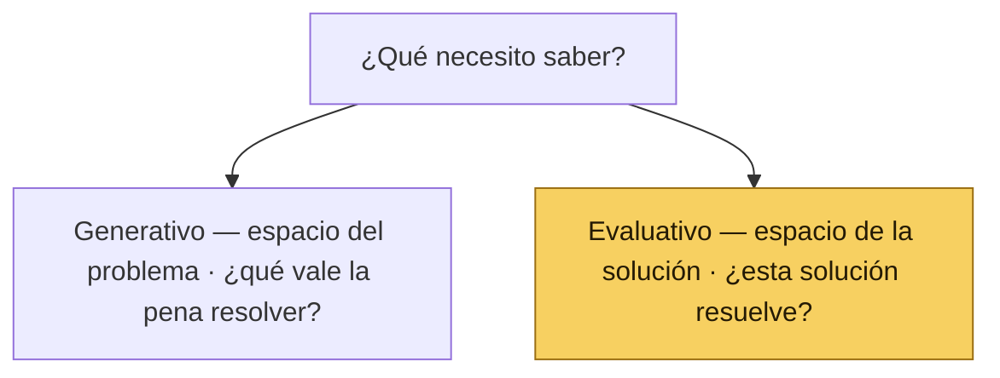
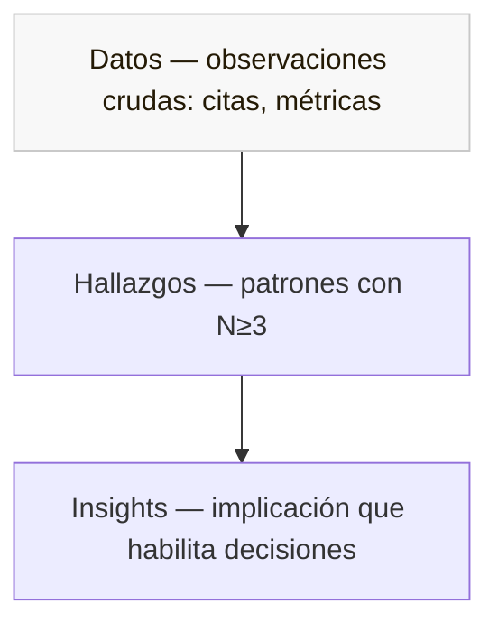
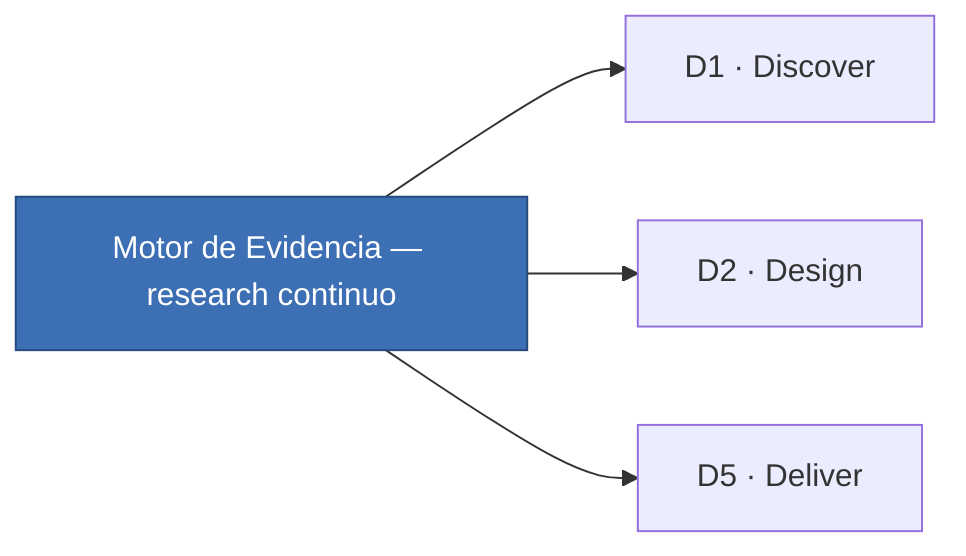

# 🧠 Cabeza · Motor de Evidencia

*Parte del sistema [Producto de Cabeza, Tripa y Corazón](#/inicio)*

| | |
| --- | --- |
| **Versión** | v1.0 |
| **Estado** | Documento vivo |
| **Audiencia** | Producto, Diseño, Data & Analytics (Growth), Engineering, Customer Success, Liderazgo |
| **Aplica a** | Cualquier iniciativa, especialmente las que entren al Discovery Track |

---

## Qué es la Cabeza

La **Cabeza** es la práctica transversal con la que un equipo de producto responde a una sola pregunta: **¿por qué los usuarios hacen lo que hacen?** No es un equipo, no es una herramienta, no es un proceso nuevo encima del [Marco de Desarrollo](#/tripa). Es la capa que hace explícito el sistema de inteligencia que el desarrollo de producto ya asume — para poder hablarlo, mejorarlo y asignarle responsables.

La razón de existir de la Cabeza es una sola: **construir sobre conocimiento, no sobre esperanza.** La mayoría de los productos no fracasan por mal diseño ni por mal código, sino por construir lo incorrecto — y eso casi siempre nace de malos insumos en el momento equivocado. El research existe para que las decisiones se tomen con evidencia y no con la opinión más fuerte de la sala.

Dos posturas sostienen esa práctica. La primera es de objetividad: **tú no eres el usuario**, y lo que crees saber sobre él es una hipótesis hasta que la evidencia lo confirme. La segunda es de humildad: una **hipótesis es solo una idea** escrita de forma que se pueda probar — no un compromiso ni una verdad, solo una idea a la que se le da la oportunidad de estar equivocada.

Las tres piezas del sistema se reparten el trabajo como se reparte el sabor de un buen taco:

- 🔥 **[Tripa — Marco de Desarrollo de Producto](#/tripa)** — el cómo construimos, con disciplina y consistencia de ejecución.
- ❤️ **[Corazón — Playbook de Diseño de Producto](#/corazon/diseno)** — el cómo lo construimos con craft y cuidado del usuario.
- 🧠 **Cabeza — Motor de Evidencia** — el cómo sabemos qué construir, con objetividad. (Este documento.)

---

## Qué es la Investigación de Producto

Investigar es el estudio sistemático de información para establecer hechos y formar conclusiones. En contexto de producto, el nombre específico para esa práctica es: **Investigación de Producto**.

> **Investigación de Producto = Investigación de Usuarios + Investigación de Mercado**

Las dos miran al mismo problema desde alturas distintas:

| | Investigación de Usuarios 👥 | Investigación de Mercado 🌊 |
| --- | --- | --- |
| Vista | Micro. La persona y su comportamiento. | Macro. La industria y la competencia. |
| Pregunta | ¿Cómo usa esta persona el producto? ¿Por qué actúa así? | ¿Cómo están las aguas? ¿Quién es quién? ¿Qué oportunidades y amenazas hay? |
| Foco | El usuario, sus necesidades, su contexto, su modelo mental. | Segmentos, tendencias, marcas, competencia, posicionamiento. |
| Métodos típicos | Entrevistas, concept tests, pruebas de usabilidad, etnografía, análisis de tickets. | Análisis competitivo, benchmarks de industria, segmentación, posicionamiento, pricing research. |
| Modalidad típica | Hoy, mayoritariamente remota: videollamada, herramientas de test async, formularios. | Mezcla de research secundario (reportes, analytics públicos) y primario (entrevistas a buyers, no users). |

*Referencia: Dr. Nick Fine, [sobre las diferencias entre User Research y UX](https://www.linkedin.com/posts/drnickfine_the-differences-between-user-research-ux-activity-7290193863326011392-grzd).*

Las dos son necesarias. Sin Investigación de Usuarios, el producto se construye en el aire; sin Investigación de Mercado, se construye en una burbuja.

---

## Qué documenta hoy el Motor de Evidencia

**Importante:** El Motor de Evidencia actual documenta solo **Investigación de Usuarios.** Investigación de Mercado está pendiente de documentar como capa explícita del Motor de Evidencia.

Esto es decisión consciente, no omisión. La función de Investigación de Mercado suele vivir distribuida entre el PM (estrategia, posicionamiento) y Data & Analytics (Growth) (analítica de funnel, retención). Bajo Product-Led Growth, **Data & Analytics (Growth) es quien define y documenta la estrategia de Investigación de Mercado** que esta capa todavía no formaliza. Cuando se documente, vivirá en una sección hermana con su propio playbook.

#### Roadmap del Motor de Evidencia

| Capa | Estado | Owner futuro |
| --- | --- | --- |
| Investigación de Usuarios | ✅ Documentada (este documento) | Product Design — facilitador del motor |
| Investigación de Mercado | ⏳ Pendiente de documentar | Data & Analytics (Growth) |
| Conexión entre ambas (triangulación cualitativa-cuantitativa-mercado) | ⏳ Pendiente | TBD |

**Cuando este documento dice "research" sin calificativo, se refiere a Investigación de Usuarios.** Si en algún punto hace referencia a research de mercado, lo nombra explícitamente.

---

## Por qué existe el Motor de Evidencia

Hoy, la responsabilidad de entender al usuario está distribuida sin nombre: Customer Success la toca con tickets, Data & Analytics con métricas, Producto y Diseño con pruebas, el liderazgo con decisiones. Sin un marco común, cada área genera evidencia que las otras no consumen, y la decisión final termina apoyándose en intuición o en la voz más fuerte de la sala.

El Motor de Evidencia le pone nombre a la práctica para que la suma sea mayor que las partes.

---

## Cómo opera

El motor procesa información en tres niveles, siguiendo el modelo Datos → Hallazgos → Insights:

1. **Datos crudos** — citas, observaciones, tickets, métricas. No es información todavía.
2. **Hallazgos** — patrones que se repiten en N≥3 fuentes independientes.
3. **Insights** — interpretación que habilita decisiones Build / Pivot / No build.

La regla del salto es la más importante: cada insight tiene que poder reconstruirse hacia abajo, hasta los datos crudos que lo sostienen. Saltarse un nivel es el error más común y el más caro.

---

## Cómo se documenta

El motor opera sobre cinco documentos. Uno es el meta-doc — **este Playbook** — que rige toda la práctica. Los otros cuatro son operativos por iniciativa:

- 📋 **[Plan de Investigación](#/plantillas/plan-de-investigacion)** (padre)
- 📝 **[Research Brief](#/plantillas/research-brief)** (anexo de sesión)
- 🔬 **[Estrategia de Análisis](#/plantillas/estrategia-de-analisis)** (cómo se procesa el dato)
- 📊 **[Reporte de Hallazgos](#/plantillas/reporte-de-hallazgos)** (cómo se comunica el veredicto)

> 🌟 **Regla de oro:** Ningún test sin Brief firmado, ningún reporte sin Estrategia, ningún hallazgo al Initiative Spec sin presentación al equipo.

---

## Quién participa

Cinco equipos, una habilidad por equipo:

- **Customer Success** — escucha estructurada y categorización con dimensiones etnográficas.
- **Data & Analytics** — triangulación cualitativa-cuantitativa.
- **Ingeniería** — evaluación temprana de viabilidad técnica.
- **PM** — defensa del rigor de evidencia bajo presión.
- **Product Design** — síntesis sin sesgo de confirmación.

Product Design es el facilitador del motor y dueño del proceso de investigación; las demás áreas aportan evidencia que el facilitador organiza y convierte en insights.

---

## Qué no es el Motor de Evidencia

- **No es un proceso encima del [Marco de Desarrollo](#/tripa).** Es la capa que explicita lo que el Marco de Desarrollo ya implica.
- **No es propiedad de una sola área.** Product Design facilita el motor y es dueño del proceso de investigación, pero la evidencia es contribución de todo el equipo: cada área aporta datos que el facilitador organiza y convierte en insights.
- **No decide.** Alimenta la decisión. El research clasifica las apuestas con un veredicto explícito (PASA / AMBIGUO / NO PASA por apuesta; 🟢 Verde / 🟡 Ámbar / 🔴 Rojo en agregado). La decisión Build / Pivot / No build la toma el equipo en sesión de presentación, con el reporte como input.

---

## 🧱 1 · Fundamentos

### 1.1 · Qué es User Research

User Research es el proceso de entender cómo un usuario específico hace uso de una solución específica en un contexto específico. Es investigación aplicada: no produce conocimiento por su cuenta, lo produce al servicio de una decisión.

Ese servicio tiene un destinatario claro: el **Initiative Spec** del [Marco de Desarrollo](#/tripa). Cada estudio de research existe para reducir el riesgo de una decisión que el equipo ya tiene en la mesa — sea entrar a Discovery, pasar a Design, comprometer Sprints de Delivery, o regresar al espacio del problema.

Las plantillas operativas que el Motor de Evidencia produce viven en la barra de [Plantillas, Guías y Craft](#/plantillas): [Plan de Investigación](#/plantillas/plan-de-investigacion) · [Research Brief](#/plantillas/research-brief) · [Estrategia de Análisis](#/plantillas/estrategia-de-analisis) · [Reporte de Hallazgos](#/plantillas/reporte-de-hallazgos).

El research bien hecho produce tres cosas, en orden:

- **Datos** — citas, observaciones, tickets, métricas. No es información todavía.
- **Hallazgos** — patrones que se repiten en N≥3 fuentes independientes.
- **Insights** — interpretación que habilita decisiones Build / Pivot / No build.

La regla más importante del Motor de Evidencia es la **regla del salto**: cada insight tiene que poder reconstruirse hacia abajo, hasta los datos crudos que lo sostienen. Saltarse un nivel es el error más común y el más caro.

### 1.2 · Por qué importa para el Marco de Desarrollo

El [Marco de Desarrollo](#/tripa) asume que las decisiones se toman con evidencia. Pero la evidencia no aparece sola — alguien tiene que producirla, alguien tiene que procesarla y alguien tiene que comunicarla a tiempo para que entre a la decisión, no después.

Hoy, esa responsabilidad está distribuida sin nombre: Customer Success la toca con tickets, Data & Analytics con métricas, Producto y Diseño con pruebas, el liderazgo con decisiones. Sin un marco común, cada área genera evidencia que las otras no consumen, y la decisión final termina apoyándose en intuición o en la voz más fuerte de la sala. El Motor de Evidencia le pone nombre a la práctica para que la suma sea mayor que las partes.

### 1.3 · Marco mental: doble diamante y capas

El research vive en dos espacios:

- **Espacio del problema** — *construir la cosa correcta.* Aquí trabajan los métodos generativos: entrevistas, etnografía, análisis de tickets. Producen información nueva sobre quién es el usuario, qué intenta hacer, qué fricciones encuentra.
- **Espacio de la solución** — *construirla correctamente.* Aquí trabajan los métodos evaluativos: pruebas de concepto, pruebas de usabilidad, A/B tests. Confirman o rechazan si una solución específica resuelve el problema.

Las decisiones de diseño se construyen en **capas sumatorias** (modelo JJ Garrett): Estrategia → Alcance → Estructura → Contenido → Visual. Las capas inferiores sostienen a las superiores. El research nutre todas las capas — no solo la visual ni solo la estratégica.

### 1.4 · Vocabulario base

El Motor de Evidencia adopta el vocabulario del Cuaderno de Adrián Solca. Estos términos se mencionan ahora y se desarrollan en las secciones que siguen:

- **Planeación · Ejecución · Comunicación** — las tres etapas universales de cualquier proceso de investigación. Toda iniciativa de Discovery sigue este orden.
- **Datos · Hallazgos · Insights** — la pirámide de análisis.
- **Generativo vs Evaluativo** — los dos reinos del research según qué producen (información nueva vs validación de información existente).
- **Descriptivo vs Analítico** — los dos reinos del research según qué tipo de dato producen (cualitativo no representativo vs cuantitativo representativo).
- **Metodología vs Método** — la metodología es el racional flexible y único de cada estudio. Los métodos son las recetas rígidas (entrevista, concept test, A/B test).

### 1.5 · Principio rector: justo la investigación necesaria

El balance que el Motor de Evidencia persigue es **suficiente información para decidir, sin caer en falso sentido de seguridad ni en falsa expectativa de certidumbre**. En la práctica:

- En entornos fast-paced — sprints de dos semanas, decisiones que no esperan — el research evaluativo gana casi siempre. Hago un prototipo, lo pongo en manos del usuario, mido. Eso es más rápido y más barato que un discovery profundo, y en la mayoría de iniciativas alcanza para validar.
- El research generativo se reserva para apuestas grandes con incertidumbre alta: nuevos features, nuevos abordajes al producto, exploración de mercados adyacentes. No para optimización ni mejora.
- La pregunta no es *cuánto research*, sino *qué research alimenta esta decisión específica*.

Este principio es la razón por la que el Motor de Evidencia existe como capa explícita y no como un departamento dedicado. La investigación se asigna por iniciativa, no por organigrama.

### 1.6 · Qué no es el Motor de Evidencia

- **No es un proceso encima del [Marco de Desarrollo](#/tripa).** Es la capa que explicita lo que el Marco de Desarrollo ya implica.
- **No es propiedad de una sola área.** Product Design es el facilitador del motor: conduce los estudios cualitativos, organiza la información y convierte los datos en insights. Las demás áreas aportan evidencia; el facilitador la integra.
- **No decide.** Alimenta la decisión. El research clasifica las apuestas con un veredicto explícito (PASA / AMBIGUO / NO PASA por apuesta; 🟢 Verde / 🟡 Ámbar / 🔴 Rojo en agregado). La decisión Build / Pivot / No build la toma el equipo en sesión de presentación, con el reporte como input.

---

## 🔀 2 · Tipos de research

### 2.1 · Generativo vs Evaluativo

| Generativo | Evaluativo |
| --- | --- |
| Produce información nueva. | Confirma o rechaza información existente. |
| Vive en el espacio del problema. | Vive en el espacio de la solución. |
| Pregunta qué problema vale la pena resolver. | Pregunta si esta solución resuelve el problema. |
| Métodos típicos: entrevistas, etnografía, análisis de tickets. | Métodos típicos: prueba de concepto, prueba de usabilidad, A/B test, encuesta. |



**En un producto en evolución continua, el research evaluativo carga la mayor parte del trabajo.** Las apuestas se validan con prototipos o con cambios incrementales en producción. El research generativo se ejecuta cuando hay una apuesta grande con incertidumbre alta — un nuevo módulo, una expansión de scope, una hipótesis de mercado adyacente.

### 2.2 · Descriptivo vs Analítico

| Descriptivo | Analítico |
| --- | --- |
| Cómo alguien hace algo. | Cuántos lo hacen. |
| Cualitativo. | Cuantitativo. |
| No es estadísticamente representativo. | Sí lo es (con muestra suficiente). |
| Da contexto, mental models, vocabulario. | Da distribuciones, proporciones, magnitudes. |
| Métodos: entrevistas, etnografía, concept tests moderados, card sorting cualitativo. | Métodos: encuestas, A/B tests, analytics, fake doors, tree testing async. |

Estos dos ejes son ortogonales. Un método puede ser **generativo descriptivo** (entrevista exploratoria), **generativo analítico** (encuesta abierta a base masiva para detectar patrones nuevos), **evaluativo descriptivo** (concept test moderado) o **evaluativo analítico** (A/B test).

### 2.3 · La matriz de información

Una segunda forma de pensar los métodos: ¿qué tipo de fuente da el dato?

| | Lo que la gente dice (actitudinal) | Lo que la gente hace (comportamiento) |
| --- | --- | --- |
| Escuchar opinión | Entrevistas, focus groups, formularios, pruebas de concepto | — |
| Observar acciones | — | Pruebas de usabilidad, etnografía, tracking visual |
| Medir actitudes | Encuestas, NPS, CSAT | — |
| Medir acciones | — | Analytics, A/B tests, tree testing |

La trampa común es tratar lo que la gente dice como evidencia de lo que hace. Para saber si alguien va a usar un feature, no se le pregunta si lo usaría — se le pone enfrente y se observa qué hace.

### 2.4 · Fuentes de información: jerarquía de calidad

| Tipo de fuente | Calidad | Cuándo usar |
| --- | --- | --- |
| Investigación primaria — el usuario en su contexto o en sesión moderada. | Máxima. | Default para validación de hipótesis. |
| Investigación secundaria — gente que interactúa con el usuario (Customer Success) o que se imagina al usuario (Gerentes, Legal). | Media. Trae sesgos corporativos. | Como complemento, nunca como sustituto. |
| Investigación terciaria — reportes de la industria, benchmarks públicos. | Baja para decisiones de producto, alta para contexto de mercado. | Background, no validación. |

### 2.5 · Cómo elegir el tipo correcto

Cuatro preguntas en orden:

1. **¿Estoy en espacio del problema o en espacio de la solución?** → Define si es generativo o evaluativo.
2. **¿Necesito entender cómo o cuánto?** → Define si es descriptivo o analítico.
3. **¿Lo que necesito saber es lo que dicen o lo que hacen?** → Define la matriz de información.
4. **¿Tengo acceso al usuario primario, o solo a fuentes secundarias?** → Define la jerarquía de calidad.

El método se elige al final, después de contestar las cuatro. No al principio. Decir *"vamos a hacer entrevistas"* antes de saber qué se quiere averiguar es uno de los anti-patrones más comunes.

---

## 📐 3 · Anatomía del Plan de Investigación

> 📋 Plantilla completa en la barra: [Plan de Investigación](#/plantillas/plan-de-investigacion).

### 3.1 · Las cuatro preguntas de planeación

Si una de estas no se puede contestar, el plan no está listo para ejecutarse:

1. **¿Qué queremos saber?** El objetivo de investigación, formulado como pregunta investigable.
2. **¿De quién?** Los perfiles de participantes, con cuotas de reclutamiento.
3. **¿Cómo lo extraemos?** El método (o combinación de métodos) que produce la información.
4. **¿Para qué va a servir saberlo?** La decisión específica que el estudio desbloquea.

La cuarta pregunta es la trampa más común. *"Para entender mejor a los usuarios"* no es respuesta — es deseo. La respuesta correcta nombra una decisión: *"para decidir si el módulo de Comunicados entra al backlog del Q3 o se descarta"*.

**La fórmula del objetivo.** Un objetivo bien redactado tiene cuatro componentes:

> **[Qué queremos hacer] + [Pregunta clave] + [De quién] + [Para qué]**

Ejemplo:

> *Explorar (qué) cuáles son los pasos que sigue el usuario para registrar el cobro de cuota de piso (pregunta) en administraciones de tianguis medianos y grandes (de quién) para identificar oportunidades de simplificación del flujo (para qué).*

**Prueba del objetivo.** Lee tu objetivo en voz alta. Si puedes terminarlo con la frase *"…y según lo que descubramos, vamos a decidir si X o Y"*, está bien escrito. Si no puedes (no hay X y Y claros), el objetivo está vago.

### 3.2 · El lenguaje de las hipótesis

El Motor de Evidencia usa vocabulario propio para nombrar lo que el research valida:

- **Apuesta de diseño** — una decisión de diseño que asume algo no validado. Cada apuesta debe explicitarse antes del test, para que el research la cubra.
- **Observable** — lo que el investigador identifica de antemano que debe poder observar para validar o invalidar una apuesta. Sin observables, la sesión es turismo.
- **Umbral de decisión** — el criterio cuantitativo o cualitativo que distingue *pasa* de *no pasa*, definido antes de ver datos.
- **Hipótesis de valor** — el statement *"Si… entonces… resultando en…"* que define la apuesta de la iniciativa entera. Lo provee el Initiative Spec; el Plan lo descompone en apuestas testeables.
- **Triangulación** — confirmar un hallazgo con al menos dos fuentes independientes. Sin triangulación, sigue siendo hipótesis.

### 3.3 · Estructura del Plan

| Sección | Contenido |
| --- | --- |
| 1. Contexto | Señales que detonaron el estudio. Qué se hizo antes. Qué decisión bloquea. |
| 2. Objetivos | Pregunta(s) de investigación con la fórmula de §3.1. Indicadores de éxito. |
| 3. Apuestas y observables | Lista de apuestas con sus observables y umbrales de decisión. |
| 4. Metodología | Método(s) elegidos, justificación, conexión con los tipos de research. |
| 5. Perfiles y reclutamiento | Quién, cuántos, cuotas de mezcla, criterios de inclusión y exclusión. |
| 6. Tareas y escenarios | Qué hará el participante en sesión. Para tests con prototipo, los escenarios scripted. |
| 7. Logística | Calendario, herramientas, roles, incentivos, plan B. |
| 8. Análisis y entregables | Cómo se procesa el dato (referencia a la [Estrategia de Análisis](#/plantillas/estrategia-de-analisis)). Qué documentos salen del estudio ([Reporte de Hallazgos](#/plantillas/reporte-de-hallazgos)). |
| 9. Riesgos y mitigaciones | Qué puede fallar. Sesgos del facilitador. Protocolo de urgencias. |

### 3.4 · Reclutamiento

Dos decisiones cargan la mayor parte del riesgo del estudio: el método y el reclutamiento. Si el reclutamiento se hace mal, ningún método compensa.

**Tamaño de muestra.** El número mínimo que da señal sin caer en estadística falsa. Los rangos por método están en §4. Como referencia general:

- **Cualitativo moderado** — 5 a 8 participantes por segmento. La saturación llega típicamente entre el sexto y el octavo.
- **Cualitativo async** — 15 a 30, según qué tan pareja se espere la señal.
- **Cuantitativo** — mínimo 50 para señal débil, 100+ para confianza razonable, 300+ para representatividad.

**Mezcla de fuentes.** Balance entre clientes existentes (validan fit con el producto actual) y prospects (validan adopción y comunicación). El default sugerido es **60–70% clientes / 30–40% prospects**, ajustable según objetivo.

**Riesgo de sobre-recluta de poder-usuarios.** El error más común es reclutar solo a los administradores más activos, porque son los que contestan más rápido. Esos perfiles ya están convencidos del valor — su feedback no es representativo de la audiencia que queremos convertir. **Reservar al menos 30% del reclutamiento para perfiles de uso medio o bajo.**

### 3.5 · Logística

Detalles concretos sin los cuales la prueba se cae el día de la verdad:

- **Calendario** — fechas límite para reclutamiento, ventana de ejecución, fecha de entrega de hallazgos.
- **Herramientas** — stack confirmado y probado antes del primer participante (ver §10).
- **Roles** — quién facilita, quién toma notas, quién observa, quién analiza. En sesión moderada, mínimo dos personas: facilitador + observador silente.
- **Incentivos** — monto, forma de entrega, condiciones.
- **Consentimiento** — documento que el participante firma antes de la sesión, autorizando grabación y uso interno de los datos.
- **Plan B** — qué hacer si un participante cancela, si la herramienta falla, si surge una pregunta fuera del scope.

> El detalle operativo de cada sesión (guion, escenarios scripted, prompts) vive en el [Research Brief](#/plantillas/research-brief), anexo del Plan.

---

## 🧰 4 · Métodos disponibles

### 4.1 · Matriz de decisión: cómo elegir método

Antes del catálogo, esta matriz ayuda a converger hacia el método correcto a partir del tipo de incertidumbre del estudio. Cruzar columna con fila da el método primario; los métodos secundarios se eligen para triangular.

| Tipo de incertidumbre | Pregunta que contesta | Método primario | Método de triangulación | Output esperado |
| --- | --- | --- | --- | --- |
| Problema (espacio del problema) | ¿Existe el problema? ¿Cómo se manifiesta? | Entrevistas en profundidad · Etnografía · Análisis de tickets Customer Success | Encuestas a base · Analytics de funnel | Mental models · friction points · jobs-to-be-done |
| Deseabilidad (espacio de la solución) | ¿La solución resuelve el problema? ¿Resuena? | Prueba de concepto moderada con prototipo | Test de preferencia async · Encuesta a base | Veredicto por apuesta · valencia emocional · vocabulario |
| Usabilidad (espacio de la solución) | ¿La gente puede operar la solución? | Prueba de usabilidad async · Moderada con think-aloud | Tree testing · A/B test sobre flujo | Tasa de éxito · time on task · errores |
| Adopción / intención | ¿La gente realmente lo va a usar? | Fake door / smoke test | Encuesta de intent-to-use · cohort tracking | Tasa de activación · señal de demanda |
| Arquitectura de información | ¿La estructura coincide con el modelo mental? | Card sorting · Tree testing | Entrevistas exploratorias | Taxonomía validada · vocabulario espontáneo |
| Optimización (delivery) | ¿Cuál variante convierte más? | A/B test en producción | Analytics de cohort · encuesta post-uso | Variante ganadora con magnitud y significancia |

> **Cómo se lee.** Una iniciativa puede tocar más de una fila — empezar por la dominante. Para apuestas grandes con alta incertidumbre, combinar dos filas (ej: Problema + Deseabilidad). Versión navegable en la guía [Matriz para elegir método](#/guias/matriz-metodo).

### 4.2 · Catálogo de métodos

Cada método se describe con cinco campos: **Cuándo aplica · Qué información da · Qué información NO da · Tamaño de muestra · Modalidad**. Ordenados de generativo a evaluativo. Catálogo extendido en [Craft · Catálogo de métodos](#/craft/catalogo-metodos).

#### Entrevista en profundidad
*Cualitativa · Generativa · Descriptiva*

Conversaciones estructuradas pero abiertas con un participante para extraer información sobre comportamientos, motivaciones, contexto de uso y modelos mentales. Es el método más versátil y el más fácil de hacer mal.

| Campo | |
| --- | --- |
| Cuándo aplica | Cuando no sabemos lo suficiente del problema, del contexto o del usuario. Casi siempre la primera pieza de research que se ejecuta en una iniciativa nueva. |
| Qué da | Mental models, jobs-to-be-done, friction points, vocabulario que usa el usuario, alternativas actuales, contexto de uso. |
| Qué NO da | Lo que la gente realmente hace (vs lo que dice que hace). Para eso, etnografía o pruebas. Tampoco da datos cuantitativos. |
| Muestra | 5–8 por segmento. Saturación entre el sexto y el octavo. |
| Modalidad | Moderada por definición. Zoom funciona; presencial es mejor cuando el contexto es relevante. |

#### Etnografía
*Cualitativa · Generativa · Descriptiva*

Observación del usuario en su contexto real, sin moderación activa. El investigador acompaña sin intervenir.

| Campo | |
| --- | --- |
| Cuándo aplica | Cuando el contexto físico o social del uso importa y no se puede reconstruir en sesión moderada. |
| Qué da | Comportamiento real sin sesgo de ambiente controlado. Información descriptiva del contexto. |
| Qué NO da | No permite cuantificar. No revela motivaciones internas (para eso, entrevista en paralelo). |
| Muestra | 4–6 sesiones suelen ser suficientes para detectar patrones contextuales. |
| Modalidad | Presencial preferentemente. Remoto vía screen-recording solo captura el contexto digital. |

#### Prueba de concepto
*Cualitativa · Evaluativa · Descriptiva*

Se le presenta al usuario un prototipo o artefacto que comunica una idea, y se mide deseabilidad y comprensión antes de construir. Es el método principal del Discovery Track.

| Campo | |
| --- | --- |
| Cuándo aplica | Antes de comprometer Sprints de Delivery a una solución. Cuando hay apuestas de diseño que requieren validación antes de pasar a Design Spec. |
| Qué da | Deseabilidad de la idea, mental model con que la interpreta el usuario, barreras potenciales, vocabulario espontáneo, valencia emocional (positiva/negativa/neutra) por cada apuesta. |
| Qué NO da | No mide usabilidad ni performance — para eso es la prueba de usabilidad post-UI. No mide intención de uso real (para eso, fake door). |
| Muestra | 5–8 participantes con la mezcla cliente/prospect del Plan. |
| Modalidad | Moderada en Zoom. Prototipo cargado en la herramienta correcta. Observador silente obligatorio. |

> 📋 Estructura operativa de la sesión (guion, escenarios scripted, prompts): [Research Brief](#/plantillas/research-brief).

#### Prueba de usabilidad
*Cuantitativa · Evaluativa · Analítica o descriptiva (según modalidad)*

El usuario usa una solución ya construida (o muy avanzada) y se observa qué hace, no qué dice.

| Campo | |
| --- | --- |
| Cuándo aplica | Después de que el concepto pasó. Antes de comprometer release a producción. Típicamente con UI definitiva. |
| Qué da | Métricas: tiempo en tarea, tasa de éxito, errores, clics, abandono. Lo que el usuario hace cuando intenta completar un flujo. |
| Qué NO da | No revela por qué falla (para eso, sesión moderada con think-aloud). No mide deseabilidad — alguien puede completar la tarea sin querer usar el producto. |
| Muestra | Moderada: 5–8. Async: 15–30 mínimo. |
| Modalidad | Async es el caso típico. Moderada cuando el flujo es complejo o nuevo. |

#### Test de preferencia
*Cualitativa o cuantitativa · Evaluativa · Descriptiva*

Se le presentan al usuario dos o más alternativas de diseño y se mide cuál prefiere y por qué. Útil cuando el equipo está dividido entre dos enfoques con argumentos válidos de cada lado.

| Campo | |
| --- | --- |
| Cuándo aplica | Cuando hay 2–3 enfoques de diseño candidatos y la decisión interna está estancada. No para decidir entre 5 variantes — eso paraliza al usuario. |
| Qué da | Preferencia (cuál) y razón (por qué). Async con N≥30 da señal cuantitativa de proporción. |
| Qué NO da | No reemplaza una prueba de usabilidad. Una opción puede ser preferida estéticamente pero ser menos usable. La preferencia no es performance. |
| Muestra | Async: 15–30. Moderada: 5–8. |
| Modalidad | Async (forced choice + razón abierta) es el caso típico. |

#### Card sorting y tree testing
*Cualitativa o cuantitativa · Generativa o evaluativa · Analítica*

Card sorting: el usuario agrupa tarjetas (típicamente nombres de funcionalidades) en categorías. Tree testing: el usuario navega una estructura para encontrar algo. Ambos prueban si la arquitectura de información coincide con el modelo mental.

| Campo | |
| --- | --- |
| Cuándo aplica | Cuando se está rediseñando navegación, taxonomía o arquitectura de información. Antes de invertir en UI. |
| Qué da | Cómo agrupa el usuario los conceptos, qué nombres usa, dónde busca cosas, qué espera encontrar dónde. |
| Qué NO da | No prueba si el diseño visual funciona — solo la estructura subyacente. |
| Muestra | Card sorting cualitativo: 6–10. Tree testing: 30+ idealmente, 15+ aceptable. |
| Modalidad | Async o moderada para card sorting cualitativo. |

#### Encuestas
*Cuantitativa · Generativa o evaluativa · Analítica*

Cuestionarios estructurados aplicados a una muestra grande. Útiles para medir intent-to-use, satisfacción, frecuencia de comportamientos. Útiles también como triangulación de hallazgos cualitativos.

| Campo | |
| --- | --- |
| Cuándo aplica | Cuando ya hay hipótesis específicas que se quieren cuantificar. No como método exploratorio — para eso, entrevistas. |
| Qué da | Distribuciones, proporciones, correlaciones simples, NPS / CSAT, intent-to-use. |
| Qué NO da | El por qué. Las encuestas miden el qué, no el porqué. |
| Muestra | Mínimo 50 para señal débil; 100+ para confianza razonable; 300+ para representatividad. |
| Modalidad | Async (herramienta de encuestas). |

#### A/B test
*Cuantitativo · Evaluativo · Analítico*

Dos versiones de una misma cosa (botón, copy, layout) se publican en paralelo y se mide cuál convierte más.

| Campo | |
| --- | --- |
| Cuándo aplica | Cuando hay un cambio acotado con métrica clara de conversión y se necesita decidir entre dos opciones. No para validar ideas grandes — para eso, concept test. |
| Qué da | Cuál variante gana en la métrica medida, con magnitud y significancia. |
| Qué NO da | No revela por qué gana. No funciona para flujos completos o vistas enteras (no se mide el ejercicio integral). |
| Muestra | Suficiente tráfico para alcanzar significancia; depende del baseline. |
| Modalidad | Async, en producción, sin moderación. El usuario nunca sabe que está en una prueba. |

#### Fake door / Smoke test
*Cuantitativo · Evaluativo · Analítico*

Se publica una entrada (botón, landing, anuncio) que comunica una funcionalidad que aún no existe. Se mide cuántos usuarios la activan.

| Campo | |
| --- | --- |
| Cuándo aplica | Para medir intención de uso real (vs declarada) antes de construir. La única forma honesta de medir si la gente de verdad va a usar algo. |
| Qué da | Tasa de click/activación. Señal de demanda. |
| Qué NO da | No dice por qué clicaron ni qué esperaban encontrar — para eso, encuesta de seguimiento o entrevista. |
| Muestra | Suficiente tráfico para alcanzar señal interpretable. |
| Modalidad | Async, en producción. Requiere protocolo claro de qué ven los usuarios al dar click (página de "próximamente" + opción de mantenerse informados). |

---

## 🎙️ 5 · Ejecución

### 5.1 · Pre-flight check

Antes de cada sesión:

- [ ] Prototipo cargado y funcionando en la herramienta correcta.
- [ ] Grabación habilitada y probada (audio y pantalla).
- [ ] Guion de la sesión revisado, con preguntas críticas marcadas. → [Research Brief](#/plantillas/research-brief)
- [ ] Plantilla de notas abierta y compartida con el observador. → [Notas de Sesión](#/plantillas/notas-de-sesion)
- [ ] Consentimiento del participante confirmado por escrito.
- [ ] Backup de invitación enviado al participante 24h y 1h antes.

> Procedimiento detallado en la guía [Pre-flight, conducción y moderación](#/guias/sesion-research).

### 5.2 · Conducción de la sesión

**Roles obligatorios**

- **Facilitador** — conduce la sesión, sigue el guion, hace las preguntas, regula el tiempo.
- **Observador silente** — toma notas, marca timestamps, registra reacciones no verbales. **No interviene.** El observador es la mitigación principal del sesgo de moderación.

**Reglas de moderación**

- **No enseñar el producto.** Si el participante no entiende cómo funciona algo, anotarlo como hallazgo y dejarlo intentarlo. Enseñar destruye el dato.
- **Contestar preguntas con preguntas.** *"¿Qué pasa cuando aprieto este botón?"* → *"¿Qué esperarías que pase?"*
- **Crear seguridad.** *"No estamos probándote a ti. Estamos probando el producto. Si algo no es claro, es problema nuestro, no tuyo."*
- **No liderar al testigo.** Las preguntas neutrales suenan distinto a las dirigidas: *"¿Qué te llama la atención de esta pantalla?"* (neutral) vs *"¿No te parece útil este resumen?"* (dirigida).

**Tiempo**

- Sesiones moderadas: 60 min máximo, idealmente 45.
- Pasada la hora, la calidad del dato baja. La energía del participante se agota antes que la del facilitador.

### 5.3 · Mitigación de sesgo del facilitador

Cuando el facilitador es la misma persona que diseñó la solución, hay sesgo de confirmación natural. El Motor de Evidencia lo trata como riesgo conocido y lo mitiga con tres mecanismos:

1. **Observador silente** — codifica notas en paralelo sin ver las del facilitador.
2. **[Análisis a ciegas](#/guias/analisis-ciegas)** — el observador (o un tercero, como Data & Analytics) etiqueta los datos sin ver lo que etiquetó el facilitador. Después se comparan los taggings. Donde coinciden, el código es robusto. Donde difieren, la observación es ambigua y se trata como tal.
3. **Revisión cruzada** — un par (otro PD, el PM, o el EM) revisa el reporte antes de la presentación al equipo.

Estos mecanismos no son opcionales cuando el facilitador es también el dueño de la solución. Son la diferencia entre research y validación de prejuicios.

---

## 🔬 6 · Análisis

> 📋 Plantilla: [Estrategia de Análisis](#/plantillas/estrategia-de-analisis). Técnicas extendidas en [Craft · Técnicas de análisis](#/craft/tecnicas-analisis).

### 6.1 · Los cuatro pasos

| Paso | Qué se hace | Cuándo |
| --- | --- | --- |
| 1. Revisar | Leer transcripciones sin analizar. Validar que las notas concuerden con la transcripción. | Día siguiente al cierre de sesiones. |
| 2. Codificar | Etiquetar observaciones por apuesta y por valencia (positiva/negativa/neutra/ambigua). Análisis a ciegas con observador. | Día 1 del análisis, tarde. |
| 3. Encontrar temáticas | Identificar patrones que aparecen en N≥3 sesiones independientes. Triangular con otras fuentes (Customer Success, analytics). | Día 2, mañana. |
| 4. Insights y veredicto | Aplicar la fórmula Hallazgo · Interpretación · Implicación. Veredicto preliminar por apuesta. | Día 2, tarde. |

### 6.2 · La pirámide Datos → Hallazgos → Insights



- **Datos** — información cruda sin procesar. Citas textuales, observaciones literales, métricas en bruto. *"En el minuto 12, P3 dijo: 'no entiendo qué significa este preset'."*
- **Hallazgos** — patrones categorizados que emergen de los datos. *Aún no son conclusiones.* Se construyen con N≥3. *"5 de 6 administradores eligen un preset al primer set-up en vez de empezar en blanco."*
- **Insights** — interpretación de los hallazgos en el contexto del problema. Es lo que habilita decisiones. *"La estrategia de presets como aceleradores de set-up funciona. Implicación: invertir en cobertura del catálogo tiene retorno claro."*

**La regla del salto:** cada insight tiene que poder reconstruirse hacia abajo, hasta los datos crudos que lo sostienen. Si no se puede, es opinión, no insight.

### 6.3 · Anatomía de un insight bien formado

Un insight tiene tres componentes — los tres son necesarios:

> **[Hallazgo] · [Interpretación] · [Implicación]**

Sin **hallazgo**, no es insight, es opinión. Sin **interpretación**, es solo el hallazgo. Sin **implicación**, no informa decisiones.

**Ejemplo:**

> *Hallazgo:* Los administradores (5 de 6) eligen presets al primer set-up por reducción de trabajo. *Interpretación:* Esto valida que el patrón "guided onboarding" funciona para esta audiencia y que los administradores están dispuestos a confiar en sugerencias del sistema cuando son específicas a su contexto. *Implicación:* Invertir en cobertura del catálogo de presets es high-ROI, y se puede aplicar el mismo patrón a otras configuraciones iniciales.

### 6.4 · Análisis a ciegas

Procedimiento:

1. Facilitador y observador (o tercero) codifican las mismas transcripciones de manera independiente, sin ver el tagging del otro.
2. Se comparan los taggings.
3. **Coincidencias** → código robusto. Pasa al hallazgo.
4. **Diferencias** → observación ambigua. Se reporta como tal o se descarta del veredicto.

El análisis a ciegas es la mitigación principal contra el sesgo de confirmación cuando el investigador también diseñó la solución. → Guía: [Análisis a ciegas](#/guias/analisis-ciegas).

### 6.5 · Técnicas de análisis disponibles

Los cuatro pasos de §6.1 son el proceso. Las técnicas de abajo son las herramientas que se aplican durante esos pasos — especialmente en el paso 3 (encontrar temáticas) y paso 4 (insights). El analista elige según el tipo de dato y la pregunta del estudio.

#### Análisis temático (Braun & Clarke)
**Qué es.** Identificación de patrones recurrentes (temas) en datos cualitativos a través de codificación inductiva. Es la técnica default cuando no hay un framework predefinido y el dato es cualitativo abierto (entrevistas, transcripciones).

**Cuándo aplica.** Estudios generativos descriptivos donde no sabes qué patrones emergerán. Análisis de tickets Customer Success cuando no hay taxonomía previa.

**Cómo se aplica.**
1. Familiarización (lectura completa sin codificar).
2. Generación de códigos iniciales (etiquetas a fragmentos).
3. Búsqueda de temas (agrupar códigos relacionados).
4. Revisión de temas (refinar, fusionar, descartar).
5. Definición de cada tema con una frase declarativa.

**Ejemplos.**
- *Análisis de 47 tickets de Customer Success sobre "cuotas de plaza vencidas":* emergieron 3 temas no esperados (la pena del marchante frente a sus vecinos de pasillo, el miedo a perder el lugar histórico en el corredor, la presión de la mesa directiva de comerciantes) que reformularon el PRD original.
- *Entrevistas exploratorias para Comunicados:* análisis temático sobre 8 transcripciones reveló que el "canal informal" no es WhatsApp (como se asumía) sino conversaciones en el lobby.

#### Mental model diagrams (Indi Young)
**Qué es.** Diagrama jerárquico que captura cómo el usuario piensa sobre una tarea o dominio, no cómo el sistema está organizado. Lado superior = comportamientos y motivos del usuario; lado inferior = features que (o no) los soportan.

**Cuándo aplica.** Cuando el equipo está rediseñando arquitectura de información o cuando hay desconexión entre el modelo mental del usuario y la organización del producto. También útil para detectar gaps funcionales.

**Cómo se aplica.**
1. Entrevistas cualitativas (5–10) con foco en una tarea específica.
2. Extracción de "atomic actions" (verbos + objetos: *"recordar al staff que limpie", "evidenciar que limpió"*).
3. Agrupación en mental spaces (clusters de comportamientos relacionados).
4. Mapeo del producto actual al modelo mental — gaps visibles.

**Ejemplos.**
- *Modelo mental del administrador para "operación diaria":* reveló que el administrador piensa en "zonas del tianguis" (pasillo de comida, pasillo de ropa, entrada) antes que en "tareas" — base del rediseño del modelo de Zonas en Actividades.
- *Modelo mental para "comunicación con marchantes":* mostró que el administrador agrupa mensajes por urgencia social, no por canal, lo que llevó a repensar la priorización de notificaciones.

#### Journey mapping
**Qué es.** Visualización temporal del recorrido del usuario por una experiencia (multi-touchpoint), capturando acciones, pensamientos, emociones y oportunidades de mejora en cada paso.

**Cuándo aplica.** Cuando una experiencia abarca múltiples sesiones, canales o estados (no una sola pantalla). Útil para alinear al equipo cross-functional sobre la experiencia completa.

**Cómo se aplica.**
1. Definir scope del journey (entrada → salida).
2. Identificar fases (5–7 típicamente).
3. Para cada fase: acciones · puntos de contacto · pensamientos · emociones (curva) · oportunidades.
4. Sintetizar pain points y momentos de la verdad.

**Ejemplos.**
- *Journey de onboarding del administrador:* desde la firma del contrato hasta el AHA Moment. Identificó 3 puntos donde el administrador tira la toalla antes de generar su primer reporte.
- *Journey de "cuotas vencidas mes a mes":* mapeó el ciclo emocional del administrador del día 1 al día 30, revelando que el dolor pico no es la falta de pago sino la conversación con la mesa directiva de comerciantes.

#### Affinity diagramming
**Qué es.** Agrupación bottom-up de observaciones individuales en clusters por afinidad — sin categorías predefinidas. Es la técnica más simple para encontrar estructura en data dispersa.

**Cuándo aplica.** Cuando tienes muchas observaciones (50+) y no sabes cómo organizarlas. Útil en sesiones colaborativas con el equipo.

**Cómo se aplica.**
1. Cada observación en una nota (post-it físico o digital).
2. Agrupar en silencio: notas similares juntas, sin pre-etiquetar grupos.
3. Después de la agrupación, nombrar cada cluster con la frase que mejor lo captura.
4. Identificar relaciones entre clusters.

**Ejemplos.**
- *Sesión de affinity con Customer Success sobre tickets de Q1:* 120 tickets en 12 clusters, 4 patrones que no estaban en la taxonomía oficial.
- *Post-concept-test debrief:* observaciones del observador silente agrupadas por afinidad antes del análisis estructurado, para detectar señales que no caben en las apuestas predefinidas.

#### Triangulación cualitativa-cuantitativa
**Qué es.** Confirmar (o desafiar) un hallazgo cualitativo con un dato cuantitativo, o viceversa. No es una técnica única sino una disciplina aplicable en el paso 3 del análisis.

**Cuándo aplica.** Siempre que un hallazgo principal vaya a entrar al reporte. Sin triangulación, el hallazgo es hipótesis.

**Cómo se aplica.**
1. Para cada hallazgo principal, identificar al menos una fuente alternativa que lo pueda confirmar.
2. Cruzar contra esa fuente: ¿el patrón aparece también ahí?
3. Clasificar: confirmado · parcial · no soportado · contradicho.
4. Reportar la confianza del hallazgo según el resultado.

**Ejemplos.**
- *Hallazgo cualitativo:* "los administradores evitan funciones de Comunicados en horario nocturno." *Triangulación:* analytics confirma 73% del uso del módulo entre 9am–6pm. **Confirmado.**
- *Hallazgo cualitativo:* "los administradores no usan el dashboard porque está sobrecargado." *Triangulación:* analytics muestra que 4 de las 5 cards más usadas están en el dashboard. **Contradicho.** El hallazgo se reformula: el administrador usa el dashboard pero no lo recuerda hacerlo.

#### Análisis de planeación estratégica (FODA / OKR mapping)
**Qué es.** Cruzar hallazgos del research contra el OST trimestral o un FODA de la iniciativa para evaluar fit estratégico. No es análisis cualitativo per se — es la traducción de insights a decisiones de portafolio.

**Cuándo aplica.** Al cierre del estudio, antes de la sesión de presentación, cuando la decisión Build / Pivot / No build implica trade-offs estratégicos (capacidad de Eng, scope del trimestre, prioridades cross-equipo).

**Cómo se aplica.**
1. Listar los hallazgos principales (3–5).
2. Mapearlos contra el Outcome del trimestre: ¿cuáles aceleran el Outcome? ¿Cuáles lo desaceleran o son neutros?
3. Mapear contra capacidad de Engineering: ¿qué cuesta atender cada hallazgo?
4. Output: lista priorizada de acciones con justificación estratégica, no solo evidencial.

**Ejemplos.**
- *Reporte de Actividades Fase 1:* la triangulación con OST mostró que A4 (audit trail) acelera retención (Outcome del Q3) más que A5 (reagendar), lo que reordenó la prioridad de implementación.
- *Reporte post-launch de Comunicados:* cruzar hallazgos vs FODA reveló que la oportunidad principal no era mejorar el módulo, sino cancelar y redirigir capacidad al Cobro de cuotas — decisión estratégica derivada del research.

### 6.6 · Diferencia entre hallazgo e insight

Un equipo puede leer el mismo hallazgo y derivar dos insights distintos según su contexto y prioridades — eso es legítimo. Lo que no es legítimo es saltarse el hallazgo y publicar la interpretación como si fuera el dato.

| Hallazgo (descriptivo) | Insight (interpretativo) |
| --- | --- |
| 4 de 6 administradores expresan preocupación de que su personal de plaza no pueda escanear un QR. | El handoff vía QR asume un nivel de digitalización del personal que no existe en la mayoría de los tianguis. Implicación: el QR no es la ruta principal — debe diseñarse una vía alternativa. |
| 3 de 6 administradores de tianguis pequeños mencionan que el audit trail "sería raro" para su personal de confianza. | La narrativa del audit trail como protección legal no resuena en tianguis pequeños. Implicación: el copy debe contextualizar el audit trail según el tamaño del tianguis. |

---

## 📣 7 · Comunicación

> 📋 Plantilla: [Reporte de Hallazgos](#/plantillas/reporte-de-hallazgos).

### 7.1 · Documentación final

Cada estudio produce dos documentos al cierre:

- **Reporte de hallazgos** — documento principal de consumo. Tiene la narrativa, los insights, las recomendaciones, y se anexa al **Initiative Spec D2** de la iniciativa. → [Plantilla](#/plantillas/reporte-de-hallazgos)
- **Repositorio de evidencia** — carpeta con grabaciones, transcripciones, notas y datos crudos. Sirve para que cualquier persona del equipo pueda re-verificar un hallazgo en el futuro o reusar la data en otro estudio.

### 7.2 · Estructura del reporte

| Sección | Qué contiene |
| --- | --- |
| 1. Contexto del estudio | Pregunta de investigación, apuestas evaluadas, método, calendario, participantes. |
| 2. Validez del estudio | Limitaciones de muestra, sesgos identificados, qué tan generalizable es la información. |
| 3. Hallazgos por apuesta | Cada apuesta con su veredicto explícito y la evidencia que lo sostiene. |
| 4. Insights | Hallazgo · Interpretación · Implicación para los hallazgos centrales. |
| 5. Recomendación | Veredicto global y propuesta de siguiente paso. |
| 6. Anexos | Citas textuales, capturas, tabla completa de tagging. |

### 7.3 · Veredicto explícito

El reporte clasifica las apuestas — no recomienda decisiones genéricas:

| Veredicto por apuesta | Significado |
| --- | --- |
| ✅ PASA | La evidencia respalda la apuesta. Procede a Build. |
| ⚠️ AMBIGUO | La evidencia es mixta o insuficiente. Requiere rediseño y re-test, o investigación complementaria. |
| ❌ NO PASA | La evidencia contradice la apuesta. Requiere Pivot o descarte. |

Y un veredicto global agregado:

| Veredicto global | Criterio | Decisión sugerida |
| --- | --- | --- |
| 🟢 Verde | ≥5 apuestas pasan. | Build. |
| 🟡 Ámbar | 3–4 apuestas pasan. | Pivot acotado. |
| 🔴 Rojo | ≤2 apuestas pasan. | No build, regresar al espacio del problema. |

Los umbrales se ajustan al estudio; los del ejemplo son los del Plan de Actividades. Lo importante es que se definan **antes** de ver los datos, no después.

### 7.4 · Presentación viva

El reporte se presenta de manera viva al equipo. **No se manda por Slack y se espera que lo lean** — nadie lo lee. La presentación es la diferencia entre un reporte que cambia decisiones y un PDF que muere en una carpeta.

Estructura sugerida (~30 min):

| Bloque | Tiempo | Contenido |
| --- | --- | --- |
| Apertura | 3 min | Recordar la pregunta de investigación y las apuestas. |
| Validez | 3 min | Limitaciones del estudio. Qué se puede y no se puede afirmar. |
| Hallazgos por apuesta | 12 min | Veredicto + evidencia + cita representativa por cada apuesta. |
| Insights y recomendación | 7 min | Los 3–5 insights centrales. Recomendación global. |
| Discusión y decisión | 5 min | El equipo decide. El facilitador modera, no decide. |

### 7.5 · Quién decide

El reporte **recomienda**. El equipo **decide**. La decisión Build / Pivot / No build se toma en sesión de presentación, no en silla del investigador. Esta separación es estructural en el Motor de Evidencia — sin ella, el research se vuelve indistinguible de la opinión del investigador.

---

## ✔️ 8 · Estándares de calidad

### 8.1 · Estándares de planeación

Antes de pasar a ejecución, el Plan debe cumplir:

- **Decisión nombrada.** ¿La pregunta de investigación nombra una decisión específica que el estudio desbloquea? (*"Para entender mejor a los usuarios"* no califica.)
- **Apuestas explícitas.** ¿Cada apuesta tiene observable + umbral de decisión definidos antes de ver datos?
- **Método justificado.** ¿La metodología explica por qué se eligió ese método y por qué se descartaron las alternativas?
- **Reclutamiento balanceado.** ¿Las cuotas reservan ≥30% del cupo a perfiles de uso medio o bajo?
- **Riesgos documentados.** ¿Los principales riesgos del estudio están listados con mitigación concreta?
- **Sign-off real.** ¿Hay aprobación escrita de los stakeholders antes del primer participante?

### 8.2 · Estándares de ejecución

Durante las sesiones, cada una debe cumplir:

- **Pre-flight check completo.** ¿Los 6 ítems del checklist (§5.1) están marcados antes de cada sesión?
- **Dos personas mínimo en moderada.** ¿Hay facilitador + observador silente? El observador no interviene.
- **Consentimiento documentado.** ¿El participante firmó el consentimiento antes de que empezara la grabación?
- **Sesión dentro del rango de tiempo.** ¿La sesión duró ≤60 min? Si excedió, ¿se documentó por qué?
- **Notas etiquetadas el mismo día.** ¿El tagging de las observaciones se completó el mismo día de la sesión, no acumulado al final?

### 8.3 · Estándares de análisis

Antes de declarar hallazgos, el análisis debe cumplir:

- **Análisis a ciegas ejecutado.** Si el facilitador también diseñó la solución, ¿se hizo [análisis a ciegas](#/guias/analisis-ciegas) con observador o tercero?
- **Regla del N≥3 respetada.** ¿Todos los hallazgos reportados aparecen en ≥3 fuentes independientes? Las observaciones aisladas se reportan como tal.
- **Triangulación documentada.** ¿Cada hallazgo principal tiene al menos una fuente alternativa que lo confirme (Customer Success, analytics, demos previas)?
- **Regla del salto respetada.** ¿Cada insight puede reconstruirse hacia abajo hasta el dato crudo? Si no, no es insight, es opinión.
- **Hallazgos contradictorios incluidos.** ¿El análisis incluye hallazgos que contradicen las hipótesis iniciales, o solo los que las confirman?

### 8.4 · Estándares de comunicación

Antes de publicar el reporte y presentarlo:

- **Veredicto explícito.** ¿Cada apuesta tiene su veredicto (PASA / AMBIGUO / NO PASA) y el estudio tiene un veredicto global (🟢 / 🟡 / 🔴)?
- **Validez documentada.** ¿El reporte declara explícitamente las limitaciones del estudio (sesgos, muestra, factores que comprometen los datos)?
- **Insights con la fórmula completa.** ¿Cada insight tiene Hallazgo · Interpretación · Implicación? Falta de cualquiera = no es insight.
- **Revisión cruzada.** Si el facilitador también diseñó la solución, ¿un par revisó el reporte antes de la presentación?
- **Presentación viva agendada.** ¿Hay sesión de 30 min programada con el equipo? Slack no cuenta.
- **Repositorio de evidencia accesible.** ¿Las grabaciones, transcripciones, plantillas de notas y datos crudos están en una carpeta compartida con el equipo?

### 8.5 · Auditoría retrospectiva

Cada estudio cerrado puede ser auditado retrospectivamente con esta lista. Si más del 30% de los puntos no se cumplió, el estudio se marca como **estudio en falsificación parcial** — sus hallazgos siguen siendo input, pero con confianza reducida.

Esta auditoría se ejecuta cuando:

- Un Impact Report contradice las predicciones del estudio (el estudio falló — ¿por qué?).
- Un nuevo estudio sobre el mismo tema arroja resultados distintos (¿cuál creemos?).
- Un nuevo miembro del equipo quiere consumir hallazgos viejos (¿son confiables?).

> **Nota.** Los estándares no son perfeccionismo. Son la diferencia entre research que predice y research que adivina. Si una iniciativa tiene urgencia que impide cumplir con todos los estándares, el Protocolo de Urgencias del [Marco de Desarrollo](#/tripa) (§11) aplica — pero el post-mortem es obligatorio.

### 8.6 · Tamaños de muestra

| Método | Mínimo | Recomendado | Saturación |
| --- | --- | --- | --- |
| Entrevistas en profundidad | 5 | 6–8 | 8–12 |
| Prueba de concepto moderada | 5 | 6–8 | 8–10 |
| Prueba de usabilidad moderada | 5 | 6–8 | 8–10 |
| Prueba de usabilidad async | 15 | 20–25 | 30+ |
| Test de preferencia async | 15 | 20–30 | 50+ |
| Encuesta cuantitativa | 50 | 100–200 | 300+ |
| Card sort / Tree test | 8 | 15–25 | 30+ |

El mínimo es el piso por debajo del cual el estudio no se debe ejecutar. El recomendado es el rango de costo / beneficio óptimo. Saturación es el punto donde añadir participantes ya no produce hallazgos nuevos — útil saber para no sobre-reclutar.

### 8.7 · Mezcla de fuentes

Default sugerido por tipo de iniciativa:

| Tipo de iniciativa | Clientes | Prospects | Ex-clientes |
| --- | --- | --- | --- |
| Mejora de feature existente | 80–100% | 0–20% | 0% |
| Feature nuevo en producto existente | 60–70% | 30–40% | 0% |
| Línea de producto nueva | 40–50% | 50–60% | 0–10% |
| Estudio de churn | 20–30% | 0% | 70–80% |

### 8.8 · Incentivos

El incentivo no es un soborno — es reconocimiento de que el participante está cediendo tiempo y atención. Define el incentivo antes de reclutar, no después.

- **Sesión moderada de 60 min:** MXN 600–1,000 (gift card Amazon o transferencia).
- **Sesión moderada de 30–45 min:** MXN 400–600.
- **Test async (15–20 min):** MXN 150–300.
- **Encuesta corta (5–10 min):** MXN 50–100 o sorteo de un premio mayor.
- **Early access / créditos en plataforma:** alternativa válida para clientes existentes que valoran el producto. Comunicar valor monetario equivalente.

### 8.9 · Anti-bias checklist

Antes de cada estudio, verificar (versión navegable: [Anti-bias checklist](#/guias/anti-bias)):

- [ ] ¿El reclutamiento mezcla niveles de uso? (No solo power users.)
- [ ] ¿Las preguntas son neutras? (Evitar "¿No te parece útil…?" y similares.)
- [ ] ¿El facilitador conoce su sesgo de confirmación? (Quien diseña la solución no debe facilitar la prueba sin un observador externo.)
- [ ] ¿Hay un observador adicional tomando notas independientes?
- [ ] ¿La interpretación se hace con al menos dos personas? (Análisis a ciegas en paralelo, luego comparación.)
- [ ] ¿Los hallazgos se cruzaron con al menos una fuente alternativa antes de reportarse?

---

## 🚩 9 · Anti-patrones y red flags

### 9.1 · Anti-patrones en la planeación

| Anti-patrón | Síntoma | Mitigación |
| --- | --- | --- |
| Research solution-first | El plan describe la solución antes que la pregunta. El research "valida" lo ya decidido. | Forzar que la pregunta de investigación se escriba antes de mencionar cualquier diseño. |
| Objetivo vago | "Queremos saber qué piensan los usuarios." Es deseo, no objetivo. | Aplicar la prueba del objetivo: "…y según lo que descubramos, vamos a decidir si X o Y." |
| Reclutamiento sesgado | Los participantes son los amigos del equipo o los power users que siempre contestan. | Definir cuotas por nivel de uso y antigüedad como cliente. Reservar ≥30% del cupo a perfiles de uso medio o bajo. |
| Método antes del objetivo | "Vamos a hacer entrevistas" antes de saber qué se quiere averiguar. | El método se elige al final de la planeación, no al principio. Las cuatro preguntas de §3.1 anteceden a la elección. |
| Saltarse el Plan | Estudio que arranca sin documento aprobado. | Regla de oro: ningún test sin Plan firmado. |

### 9.2 · Anti-patrones en la ejecución

| Anti-patrón | Síntoma | Mitigación |
| --- | --- | --- |
| Liderar al testigo | "¿No te parece útil que…?" / "¿Verdad que sería más fácil así?" | Revisar el guion del Brief en busca de preguntas dirigidas y reformularlas a neutrales. |
| Enseñar el producto | El facilitador explica cómo funciona el prototipo, lo que destruye el dato. | Practicar el reflejo de "contestar con preguntas" antes de la primera sesión. Si el participante no entiende, ese es el hallazgo. |
| No tener observador | Una sola persona facilita y toma notas — pierde 30% de la sesión. | Siempre dos personas en moderada: facilitador + observador silente. No es opcional. |
| Sesión muy larga | Pasada la hora, el usuario se cansa y la calidad del dato baja. | 60 min máximo, idealmente 45. |
| Saltar el pre-flight | Herramienta no probada, prototipo roto, grabación que no arranca. | Pre-flight check obligatorio antes de cada sesión (§5.1). |

### 9.3 · Anti-patrones en el análisis y reporte

| Anti-patrón | Síntoma | Mitigación |
| --- | --- | --- |
| Cherry-picking de citas | Reportar solo las citas que confirman lo que se quería confirmar. | Reportar también los hallazgos que contradicen las hipótesis iniciales. El análisis a ciegas (§6.4) es la mitigación estructural. |
| Generalizar desde N=1 | "Los usuarios piensan que…" cuando solo un participante lo dijo. | Nunca usar plurales sin ≥3 confirmaciones. Si es observación aislada relevante: "Un participante mencionó…" |
| Saltarse el hallazgo | Reportar la interpretación como si fuera el dato. | La regla del salto: cada insight debe poder reconstruirse hacia abajo hasta el dato crudo (§6.2). |
| Reportar en lugar de presentar | Mandar el Reporte por Slack y esperar que el equipo lo lea. Nadie lo lee. | Presentación viva de 30 min, con discusión y registro de decisiones (§7.4). |
| No conectar con la decisión | Reporte que describe lo que pasó pero no recomienda qué hacer. | Cada hallazgo termina en "Recomendación: …" explícita. Veredicto por apuesta (§7.3). |
| Decidir desde la silla del investigador | El investigador concluye Build/Pivot/No build y lo presenta como decisión tomada. | El reporte recomienda. El equipo decide. Separación estructural (§7.5). |

### 9.4 · Red flags estructurales

Señales de que la práctica de research del equipo necesita revisión, más allá de un estudio puntual:

- **Más del 30% de las iniciativas que entran a Delivery vuelven a Discovery** por incertidumbre que apareció en construcción. → El Discovery se está cortando muy temprano.
- **Los Impact Reports no concuerdan con las predicciones del research.** → El research está produciendo conjeturas, no validaciones.
- **Más de la mitad del equipo no consume los reportes.** → El formato o la cadencia de comunicación no está funcionando.
- **La misma pregunta aparece en estudios consecutivos.** → Los hallazgos no se están consolidando en conocimiento institucional.
- **El Plan se redacta después de empezar las sesiones.** → El proceso se está usando como justificación retrospectiva, no como guía.

Cuando aparece una red flag, no se ataca el estudio en curso — se levanta en la **Retrospectiva de Proceso del Cooldown** ([Marco de Desarrollo](#/tripa) §2) para ajustar el sistema.

### 9.5 · Conexión con las Red Flags del Marco de Desarrollo

Algunas de las 15 Red Flags que el [Marco de Desarrollo](#/tripa) lista en su Sección 11 son directamente relevantes para el research:

- 🚩 **Red Flag #5:** *"La deuda técnica y de diseño están siempre fuera de scope."* La deuda de research también: si los hallazgos pendientes nunca entran al Cooldown, se acumulan y el motor pierde memoria.
- 🚩 **Red Flag #12:** *"Alguien va directo a otra área a solicitar cambios sin pasar por el proceso."* Aplica a research también: pedidos de "una entrevistita rápida" sin Plan ni Brief no se aceptan; se redirigen al Discovery Track.
- 🚩 **Red Flag #15:** *"Las iniciativas se desarrollan porque 'el cliente dijo'."* La traducción al Motor de Evidencia: una solicitud de cliente puede ser señal de Oportunidad válida, pero pasa primero por triangulación con Customer Success y Data & Analytics antes de tocar un Plan.

---

## 🧰 10 · Stack de herramientas

### 10.1 · Stack actual (default)

| Herramienta | Función | Costo | Cuándo se usa |
| --- | --- | --- | --- |
| Zoom | Sesiones moderadas (concept tests, entrevistas) | Plan existente del equipo | Toda sesión sincrónica con grabación |
| Otter.ai (free tier) | Transcripción automática | $0 (300 min/mes) | Sesiones moderadas. Limitar a 3–4 sesiones/mes en free; upgrade si supera. |
| Herramienta de documentación / wiki | Wiki interna · Initiative Spec · repositorio del Motor de Evidencia · plantillas | — | Fuente de verdad documental |
| Hoja de cálculo | Tagging de observaciones · matrices de análisis · plantillas de notas con fórmulas | — | Análisis cualitativo estructurado |
| Inflight | Internal review de prototipos · feedback asíncrono del equipo | Plan existente | Entre construcción del prototipo y testing externo |

### 10.2 · Stack escalable (cuando aplique)

| Herramienta | Función | Costo aprox. | Cuándo activarla |
| --- | --- | --- | --- |
| Herramienta de tests async | Tests async (preferencia, usabilidad post-UI, tree testing) con N=15–30 | — | Cuando hay UI definitiva y se requiere validación cuantitativa async. |
| Otter.ai Pro | Transcripción ilimitada con identificación de hablantes | USD 16.99/mes | Cuando el volumen mensual supera el free tier de forma sostenida. |
| Optimal Workshop | Card sorting y tree testing async con análisis estadístico | USD 191/mes | Solo para iniciativas de rediseño de IA mayor. No es default. |
| Herramienta de encuestas | Encuestas async cuantitativas | — | Para triangulación cuantitativa de hallazgos cualitativos. |

### 10.3 · Reglas del stack

- **Probar antes del primer participante.** Cualquier herramienta nueva en el stack se valida en sesión piloto antes de la primera sesión real. Las fallas técnicas en sesiones reales destruyen el dato.
- **No agregar herramientas por la herramienta.** Cada tool entra al stack porque resuelve un dolor concreto del proceso, no porque "está de moda" o "tiene una función nueva".
- **Cancelar lo que no se usa.** Subscripciones que no han generado un estudio en 60 días se pausan o cancelan en el Cooldown.
- **Costo total del stack mensual debe ser justificable contra el costo de no investigar.** Una iniciativa mal validada que se construye en vano cuesta más que un año entero de licencias de research.

---

## 🔗 11 · Conexión con el Marco de Desarrollo

### 11.1 · Mapeo a las 5Ds

Cada fase del [Marco de Desarrollo](#/tripa) tiene un perfil de research distinto. La elección del método y la profundidad del Plan se calibran a la fase:

| Fase | Sub-página del Initiative Spec | Research que alimenta | Cuándo se ejecuta |
| --- | --- | --- | --- |
| D1 · Discover | PRD | Entrevistas generativas · análisis de feedback Customer Success · analytics · fake doors | Antes del Opportunity Mapping (continuo, durante Cooldown del Discovery Track). |
| D2 · Design | Design Spec / RFC | Pruebas de concepto · tests de preferencia · card sorting | Discovery Sprint (3 semanas). |
| D3 · Develop | ADR / diseño detallado | Pruebas de usabilidad async (validación de UI a detalle) | Delivery Sprint, antes del Product Jam. |
| D4 · Deploy | [Release Checklist](#/plantillas/release-checklist) | Validación con beta users · soft launch | Antes del release general. |
| D5 · Deliver | [Impact Report](#/plantillas/impact-report) | Análisis de cohort post-release · encuesta de satisfacción · A/B test | 30 días post-release (continuo) o mes 1 + mes 3 (periódico). |



### 11.2 · Cadencia: Sprint vs Cooldown

El [Marco de Desarrollo](#/tripa) organiza el trabajo en ciclos de **3 semanas de Sprint + 1 semana de Cooldown**. El research se asigna distinto a cada uno:

| Etapa | Foco del Discovery Track | Tipo de research típico |
| --- | --- | --- |
| Sprint (3 sem) | Iniciativas activas en D1/D2. Concept tests con prototipo, sesiones moderadas, análisis. | Evaluativo descriptivo (concept tests). Análisis de estudios concluidos. |
| Cooldown (1 sem) | Preparación del siguiente ciclo. Revisión de feedback acumulado. Redacción de nuevos Planes. | Generativo (entrevistas exploratorias). Triangulación de tickets de Customer Success con métricas de Data & Analytics. Consolidación de insights. |

**Regla operativa:** los Planes de Investigación se redactan en Cooldown y se ejecutan en el Sprint siguiente. Si un Plan se redacta a mitad de Sprint, casi siempre es señal de research solution-first (anti-patrón §9.1).

### 11.3 · RACI: quién hace qué en cada estudio

El [Marco de Desarrollo](#/tripa) define la RACI por fase. Esta es la traducción específica al research:

| Rol | Responsabilidad en research |
| --- | --- |
| PD (Product Design) | **Facilitador del Motor de Evidencia.** R en D1 y D2. Dueño del proceso de investigación: redacta Planes, Briefs, Estrategias y Reportes, conduce sesiones moderadas y **organiza y genera los insights** a partir de lo que aportan las demás áreas. |
| Data & Analytics (Growth) | R en D1 (capa cuantitativa). Aporta datos de comportamiento y **triangula lo cualitativo con lo cuantitativo** para el facilitador. Lleva los insights consolidados al Opportunity Mapping. Bajo Product-Led Growth, conecta el comportamiento medido con la evidencia cualitativa. |
| Customer Success | C en research formal. Es el **canal de voz del cliente**: recopila feedback cualitativo continuo, categoriza tickets con dimensiones etnográficas y sirve como recruiter. |
| EM / Engineering | C en D1, R en D3–D4. Aporta evaluación temprana de viabilidad técnica vía Revisión Cruzada Asincrónica (ver [Marco de Desarrollo](#/tripa) §7). |
| PM (Product Manager) | A en D1. Sign-off del scope del Plan cuando alimenta el OST. Defiende el rigor de evidencia bajo presión. Decide en la sesión de presentación, junto con el equipo. |

Roles operativos por sesión (propios del Motor de Evidencia):

- **Facilitador** — conduce. Default: PD.
- **Observador silente** — codifica en paralelo. Puede ser Data & Analytics, otro PD, o alguien de Customer Success entrenado.
- **Recruiter** — convoca participantes. Default: Customer Success.

### 11.4 · Qué entra al Initiative Spec, dónde y cuándo

Los outputs del research no flotan — viven en sub-páginas específicas del Initiative Spec:

| Output | Va a | Cuándo |
| --- | --- | --- |
| Hallazgos generativos (entrevistas, análisis de tickets) | Sub-página D1 (PRD) | Antes del Opportunity Mapping. |
| [Plan de Investigación](#/plantillas/plan-de-investigacion) | Anexo D1 o D2 (según fase) | Al inicio del estudio. |
| [Reporte de Hallazgos](#/plantillas/reporte-de-hallazgos) (concept test) | Sub-página D2 (Design Spec) | Al cierre del estudio, antes del Kick-off. |
| [Reporte de Hallazgos](#/plantillas/reporte-de-hallazgos) (usabilidad) | Sub-página D3 (ADR) | Al cierre, antes del Product Jam. |
| Análisis post-release | Sub-página D5 ([Impact Report](#/plantillas/impact-report)) | 30 días post-release. |

### 11.5 · Quién consume cada output

| Output | Audiencia primaria |
| --- | --- |
| [Plan de Investigación](#/plantillas/plan-de-investigacion) | PM (sign-off de scope) · Data & Analytics (validación de hipótesis a probar) · PD (ejecutor) |
| [Research Brief](#/plantillas/research-brief) | PD (ejecutor) · observador de la sesión · recruiter |
| [Reporte de Hallazgos](#/plantillas/reporte-de-hallazgos) | Equipo completo. Anexo en Initiative Spec D2 o D5. |
| Repositorio de evidencia | Disponible al equipo. Consultable cuando aparezcan dudas en Delivery o en Impact Report. |

### 11.6 · Mecanismos del Marco de Desarrollo que el Motor de Evidencia consume

El Motor de Evidencia usa los mecanismos que el [Marco de Desarrollo](#/tripa) ya define:

- **Opportunity Mapping** (D1) — donde Data & Analytics consolida insights de research y los lleva a la decisión trimestral. El Motor de Evidencia alimenta este momento; no lo reemplaza.
- **Revisión Cruzada Asincrónica** — donde EM y PD validan mutuamente sus propuestas. Es el mecanismo por el que Eng entra al Discovery sin bloquearlo.
- **Kick-off (gate D2→D3)** — el momento donde el Reporte de Hallazgos del concept test debe estar publicado para que el Design Spec pase. Si no hay reporte, no hay Kick-off.
- **Retrospectiva de Proceso (Cooldown)** — donde se levantan red flags estructurales del research (§9.4).
- **Protocolo de Urgencias** — excepción acotada que permite saltarse el research formal cuando aplican los criterios estrictos del Marco de Desarrollo. **No es licencia para operar fuera del Motor de Evidencia de forma habitual.** Post-mortem obligatorio.

### 11.7 · Ciclo completo: del Discovery al Impact Report

El ciclo se cierra cuando los hallazgos del research se contrastan con los resultados reales:

```
D1 Insights (research generativo)
    ↓
D2 Concept test → Reporte → Veredicto por apuesta
    ↓ (si pasa el gate)
D3 Usabilidad async → Validación de UI
    ↓
D4 Beta users / soft launch
    ↓
D5 Impact Report → ¿Las predicciones del research se cumplieron?
    ↓
Si NO → red flag estructural (§9.4) → revisión en Cooldown
Si SÍ → conocimiento institucional → repositorio de evidencia
```

El cierre del ciclo no es ceremonial. Es el mecanismo que distingue research que predice de research que adivina. Si los Impact Reports consistentemente difieren de las predicciones, el motor está roto y hay que repararlo en la práctica, no en la documentación.

---

## 📄 12 · Plantillas

El Motor de Evidencia distingue dos categorías de plantillas:

- **Operativas** (§12.1) — son las que estructuran el flujo de un estudio. El Plan, el Brief y todo lo que cuelga de ellos. Sin estas, el estudio no se ejecuta.
- **De soporte y método** (§12.2) — son las que aceleran tareas específicas dentro del flujo. Un facilitador puede tener una sesión sin ellas, pero las usa cuando aplican porque se ahorra tiempo y reduce errores. No reemplazan al Brief — lo complementan.

### 12.1 · Plantillas operativas

El Motor de Evidencia opera sobre **6 plantillas operativas reusables**. Una es opcional según la iniciativa (Voiceover); las otras cinco son el flujo estándar.

**Cómo se relacionan**

```
Plan de Investigación  ←  Documento padre por iniciativa
    │
    ├─ Research Brief                  (anexo · uno por test individual)
    │     │
    │     └─ Notas de Sesión           (una por sesión moderada)
    │
    ├─ Voiceover Internal Review       (opcional · prototipos para review interno)
    │
    ├─ Estrategia de Análisis          (anexo · cómo se procesa el dato)
    │
    └─ Reporte de Hallazgos            (output final · se anexa al Initiative Spec)
```

**Regla de oro:** ningún test sin Brief firmado · ningún reporte sin Estrategia · ningún hallazgo al Initiative Spec sin presentación al equipo.

#### [Plan de Investigación](#/plantillas/plan-de-investigacion)

| Campo | Detalle |
| --- | --- |
| **Qué es** | Documento padre por iniciativa. Cubre objetivo, metodología, reclutamiento, logística, criterios de éxito, riesgos. |
| **Cuándo se usa** | En Planeación · al inicio de cada iniciativa de Discovery, antes de reclutar. Se redacta en Cooldown; se ejecuta en Sprint siguiente. |
| **Fase** | D1 (research generativo) · D2 (concept tests) · D3 (usabilidad async). Vive en la sub-página correspondiente del Initiative Spec. |
| **Quién la usa** | Owner: PD (redacta y conduce). Sign-off: PM + PD. Observador: Data & Analytics. Recruiter: Customer Success. |
| **Cómo se relaciona** | Es el padre. Adentro vive el Research Brief (uno o varios), la Estrategia de Análisis, y referencia al Reporte de Hallazgos como output. |

#### [Research Brief](#/plantillas/research-brief)

| Campo | Detalle |
| --- | --- |
| **Qué es** | Anexo operativo del Plan. Una página de hipótesis, observables, guion en 4 bloques, escenarios scripted, prompts de respaldo, plantilla de notas. Pieza que el facilitador tiene en pantalla durante cada sesión. |
| **Cuándo se usa** | En Planeación (redacción) y Ejecución (durante cada sesión). Antes de cada test individual dentro del Plan. |
| **Fase** | Misma que el Plan que lo contiene (D1, D2, D3). |
| **Quién la usa** | Owner: PD (redacta y ejecuta). Sign-off: junto con el Plan. Audiencia operativa: facilitador + observador. |
| **Cómo se relaciona** | Anexo del Plan. Si una iniciativa tiene varios tests (ej: piloto + concept test), tiene un Brief por cada uno. |

#### [Notas de Sesión](#/plantillas/notas-de-sesion)

| Campo | Detalle |
| --- | --- |
| **Qué es** | Plantilla simple por sesión moderada: pre-flight check, captura cronológica por bloque (Cita / Observación / Inferencia), tagging por apuesta y valencia, debrief facilitador-observador. |
| **Cuándo se usa** | En Ejecución · durante y después de cada sesión moderada. |
| **Fase** | Misma que el Brief que las activa. |
| **Quién la usa** | Owner: observador (captura en vivo) + facilitador (debrief). |
| **Cómo se relaciona** | Una hoja por sesión. Al cerrar el estudio, todas se consolidan al sheet maestro para el análisis. |
| **Recurso paralelo** | Existe también una versión en hoja de cálculo con fórmulas para análisis cuantitativo agregado (tagging por apuesta, conteos de valencia, veredicto preliminar automático). Vive como herramienta aparte. Para tagging y análisis cuantitativo, usar la hoja de cálculo; para notas conceptuales, la versión en texto alcanza. |

#### Voiceover Internal Review *(⏳ en camino)*

| Campo | Detalle |
| --- | --- |
| **Qué es** | Documento que acompaña la revisión interna asíncrona de un prototipo antes del piloto externo. Voiceover narrado por flujo, decisiones controvertidas explicadas, lista de qué se necesita del equipo. |
| **Cuándo se usa** | Entre construcción del prototipo y piloto del concept test. Solo iniciativas que requieran prototipo. |
| **Fase** | D2 (Discovery Sprint), antes del concept test externo. |
| **Quién la usa** | Owner: PD. Audiencia: equipo completo. |
| **Cómo se relaciona** | Opcional, no parte del flujo principal. No es prerequisito del Brief — es un mecanismo del PD para alinearse con el equipo antes de exponer el prototipo. |

#### [Estrategia de Análisis](#/plantillas/estrategia-de-analisis)

| Campo | Detalle |
| --- | --- |
| **Qué es** | Anexo del Plan. Define cómo se ejecutan los 4 pasos del análisis (Revisar → Codificar → Temáticas → Insights), con análisis a ciegas, triangulación, regla del N≥3, y los 5 outputs del análisis. |
| **Cuándo se usa** | En Comunicación (preparación) · apenas se cierra la ejecución, antes de tagear. |
| **Fase** | Misma que el Plan. |
| **Quién la usa** | Owner: PD (redacta y ejecuta). Co-facilita: observador (análisis a ciegas). Revisor: par (revisión cruzada del reporte). |
| **Cómo se relaciona** | Anexo del Plan. Su output alimenta el Reporte de Hallazgos. |

#### [Reporte de Hallazgos](#/plantillas/reporte-de-hallazgos)

| Campo | Detalle |
| --- | --- |
| **Qué es** | Output final del estudio. Resumen ejecutivo con veredicto (🟢/🟡/🔴), contexto, validez, hallazgos por apuesta con insights (Hallazgo · Interpretación · Implicación), recomendación. |
| **Cuándo se usa** | En Comunicación · al cierre del análisis. Se presenta vivo al equipo en sesión de 30 min — no se manda por Slack. |
| **Fase** | Se anexa a la sub-página del Initiative Spec según fase: D2 (concept test, antes del Kick-off), D3 (usabilidad post-UI, antes del Product Jam), D5 (post-release, en el Impact Report). |
| **Quién la usa** | Owner: PD (redacta y presenta). Audiencia: equipo completo (decide en sesión). |
| **Cómo se relaciona** | Output final. Cierra el estudio. La decisión Build / Pivot / No build la toma el equipo en la presentación viva, con el reporte como input. |

**Tabla resumen · plantillas operativas**

| Plantilla | Etapa | Fase | Owner | Padre / Anexo |
| --- | --- | --- | --- | --- |
| [Plan de Investigación](#/plantillas/plan-de-investigacion) | Planeación | D1 / D2 / D3 | PD | Padre |
| [Research Brief](#/plantillas/research-brief) | Planeación / Ejecución | D1 / D2 / D3 | PD | Anexo del Plan |
| [Notas de Sesión](#/plantillas/notas-de-sesion) | Ejecución | D1 / D2 / D3 | Observador | Anexo del Brief |
| Voiceover Internal Review | Ejecución (interno) | D2 | PD | Opcional |
| [Estrategia de Análisis](#/plantillas/estrategia-de-analisis) | Comunicación | D1 / D2 / D3 | PD | Anexo del Plan |
| [Reporte de Hallazgos](#/plantillas/reporte-de-hallazgos) | Comunicación | D2 / D3 / D5 | PD | Output final |

### 12.2 · Plantillas de soporte y método

Cinco plantillas que aceleran tareas específicas dentro del flujo. No reemplazan al Brief — lo complementan. Cada una se usa cuando la situación específica aplica; ninguna es obligatoria en todos los estudios.

| Plantilla | Cuándo aplica | Relación con el Brief |
| --- | --- | --- |
| [Probing Questions](#/plantillas/probing-questions) | Toda sesión moderada | Banco de preguntas para insertar en el guion del Brief |
| [Guía de Discusión para Entrevista](#/plantillas/guia-de-discusion) | Estudios generativos (entrevistas) | Sustituye o complementa el guion del Brief |
| [Script para Prueba de Usabilidad Moderada](#/plantillas/script-usabilidad) | Estudios evaluativos con UI | Sustituye o complementa el guion del Brief |
| [Preguntas para Investigación de Dashboard](#/plantillas/preguntas-dashboard) | Iniciativas con dashboards/data-viz | Complementa el guion con preguntas del dominio |
| [Debrief y Síntesis Rápida](#/plantillas/debrief-sintesis) | Post-sesión, día mismo | Acelera el debrief facilitador-observador entre el cierre de sesión y el análisis formal |

> **Las plantillas completas viven en [Plantillas, Guías y Craft](#/plantillas).** Esta sección es el índice: qué es cada plantilla, cuándo se usa y quién la posee. El template lleno vive en el repositorio central. Una sola fuente de verdad.

---

## 📚 13 · Recursos y referencias

> Esta sección reúne las lecturas de referencia del Motor de Evidencia. Los enlaces abren en una pestaña nueva.

### 13.1 · Contexto del Diseño UX

- UK Design Council · [What Do We Mean by Design?](https://www.designcouncil.org.uk/our-resources/the-double-diamond/)
- Don Norman & Jakob Nielsen · [The Definition of User Experience (UX)](https://www.nngroup.com/articles/definition-user-experience/)
- Jakob Nielsen · [A 100-Year View of User Experience](https://www.nngroup.com/articles/100-years-ux/)
- Tania Vieira · [A brief history of UX design and its evolution](https://uxdesign.cc/a-brief-history-of-ux-design-and-its-evolution-a513ac5d5a60)
- Interaction Design Foundation · [The Ultimate Guide to Understanding UX Roles](https://www.interaction-design.org/literature/article/the-ultimate-guide-to-understanding-ux-roles-and-which-one-you-should-go-for)

### 13.2 · Definiciones y diferenciación de la investigación

- Interaction Design Foundation · [What is User Research?](https://www.interaction-design.org/literature/topics/user-research)
- Human Factors and Ergonomics Society · [What is Human Factors and Ergonomics?](https://www.hfes.org/About-HFES/What-is-Human-Factors-and-Ergonomics)
- Adobe · [Human Computer Interaction](https://xd.adobe.com/ideas/principles/human-computer-interaction/)

### 13.3 · Proceso de investigación · Planeación

- David Sherwin · [A 5-Step Process For Conducting User Research](https://www.smashingmagazine.com/2013/09/5-step-process-conducting-user-research/)
- NN/g · [UX Research Cheat Sheet](https://www.nngroup.com/articles/ux-research-cheat-sheet/)
- Adobe · [A Comprehensive Guide to the UX Research Process](https://xd.adobe.com/ideas/process/user-research/)
- Nikki Anderson · [How to Write a User Research Plan](https://dscout.com/people-nerds/how-to-write-research-plan)
- UX Pin · [Creating A User Research Plan (with Examples)](https://www.uxpin.com/studio/blog/user-research-plan/)
- NN/g · [When to Use Which User-Experience Research Methods](https://www.nngroup.com/articles/which-ux-research-methods/)
- An Event Apart · [Just Enough Research by Erika Hall](https://aneventapart.com/news/post/just-enough-research-by-erika-hall-an-event-apart-video)
- NN/g · [Secondary Research in UX](https://www.nngroup.com/articles/secondary-research-in-ux/)

### 13.4 · Métodos de investigación

**Entrevistas** — NN/g · [User Interviews 101](https://www.nngroup.com/articles/user-interviews/) · Adrián Solca · [Métodos de Diseño · Entrevistas](https://www.adriansolca.com/metodos)

**Etnografía** — Dóra Farkas · [Ethnographic Research](https://www.smashingmagazine.com/) · UX Matters · [Making the Most of Ethnographic Research](https://www.uxmatters.com/)

**Pruebas de Concepto** — Maze · [Concept Testing in UX](https://maze.co/guides/concept-testing/) · Smashing · [The Value Of Concept Testing](https://www.smashingmagazine.com/)

**Pruebas de Usabilidad** — NN/g · [Usability (User) Testing 101](https://www.nngroup.com/articles/usability-testing-101/) · Adrián Solca · [Pruebas de usabilidad](https://www.adriansolca.com/metodos)

**Tests A/B** — Optimizely · [A/B testing](https://www.optimizely.com/optimization-glossary/ab-testing/) · User Interviews · [A/B Testing](https://www.userinterviews.com/ux-research-field-guide-chapter/ab-testing)

**Card Sorting** — NN/g · [Card Sorting](https://www.nngroup.com/articles/card-sorting-definition/) · Adobe · [Card Sorting Best Practices](https://xd.adobe.com/ideas/process/user-research/card-sorting-best-practices/)

### 13.5 · Análisis

- NN/g · [Thematic Analysis](https://www.nngroup.com/articles/thematic-analysis/)
- Toptal · [How to Leverage Thematic Analysis for Better UX](https://www.toptal.com/designers/ux/thematic-analysis-ux)
- IDF · [How to Use Mental Models in UX Design](https://www.interaction-design.org/literature/article/mental-models-and-user-experience-design)
- Product Plan · [MoSCoW Prioritization](https://www.productplan.com/glossary/moscow-prioritization/)

### 13.6 · Comunicación de hallazgos

- NN/g · [How to Present UX Research Findings](https://www.nngroup.com/articles/research-findings/)
- NN/g · [Reporting User Research Findings: A 5-Step Process](https://www.nngroup.com/articles/research-reports-presentations/)

### 13.7 · Frameworks complementarios al Marco de Desarrollo

- Marty Cagan · *Inspired* · [SVPG](https://www.svpg.com/inspired-how-to-create-products-customers-love/) · *Empowered* · [SVPG](https://www.svpg.com/empowered/)
- Teresa Torres · *Continuous Discovery Habits* · [Product Talk](https://www.producttalk.org/continuous-discovery-habits/)
- Tony Ulwick · *Jobs-to-be-Done* · [Strategyn](https://strategyn.com/jobs-to-be-done/)
- Wes Bush · *Product-Led Growth* · [ProductLed](https://productled.com/book)
- Intercom · [RICE Scoring Method](https://www.intercom.com/blog/rice-simple-prioritization-for-product-managers/)

### 13.8 · Libros y autores referenciados

Bibliografía mínima viable. Si solo tuvieras tiempo de leer 5 cosas, estas son.

- **Erika Hall** · *Just Enough Research* (Rosenfeld). Origen del principio rector "justo la investigación necesaria". Lectura corta, alto retorno. Para todo el equipo.
- **Steve Portigal** · *Interviewing Users* (Rosenfeld). Manual definitivo de entrevistas. Capítulos 4–7, referencia obligada antes de la primera entrevista generativa.
- **Marty Cagan** · *Inspired* y *Empowered* (Wiley). Origen del Dual-Track Agile que adopta la Tripa.
- **Teresa Torres** · *Continuous Discovery Habits* (Product Talk). El Opportunity Solution Tree viene de aquí.
- **Indi Young** · *Mental Models* y *Practical Empathy* (Rosenfeld). Metodología de mental model diagrams (§6.5).
- **Virginia Braun & Victoria Clarke** · *Thematic Analysis: A Practical Guide* (Sage, 2022) · [paper original (2006)](https://www.tandfonline.com/doi/abs/10.1191/1478088706qp063oa).
- **Donna Spencer** · *Card Sorting: Designing Usable Categories* (Rosenfeld).
- **Jeff Sauro** · *Quantifying the User Experience* (Morgan Kaufmann).

### 13.9 · Sobre el origen del vocabulario

Este documento adopta vocabulario y marcos del **Cuaderno de Trabajo: Fundamentos de Investigación de Adrián Solca**. Solca es Arquitecto de Información, Especialista en UX y Estratega Digital con trayectoria desde 2010.

### 13.10 · Mantenimiento de esta sección

Esta sección se mantiene viva. Si encuentras un recurso que vale la pena agregar, edítalo aquí o avisa al mantenedor. Si un link queda roto o el contenido queda obsoleto, márcalo y propón reemplazo.

---

## 📖 14 · Glosario

### Términos del Cuaderno de Adrián Solca

- **Planeación · Ejecución · Comunicación** — Las tres etapas universales de cualquier proceso de investigación. Planeación reduce variables fuera de control; Ejecución prioriza extracción de información; Comunicación cierra el loop al servicio del equipo.
- **Las cuatro preguntas de planeación** — ¿Qué queremos saber? ¿De quién? ¿Cómo lo extraemos? ¿Para qué va a servir saberlo? La cuarta es la trampa: si la respuesta no nombra una decisión específica, el plan no está listo.
- **Datos · Hallazgos · Insights** — La pirámide de análisis. Datos son crudos. Hallazgos son patrones que se repiten en N≥3 fuentes independientes. Insights son la interpretación, con la fórmula Hallazgo · Interpretación · Implicación. Cada insight debe poder reconstruirse hacia abajo hasta el dato crudo (regla del salto).
- **Generativo (método)** — Produce información nueva sobre el espacio del problema. Pregunta *qué problema vale la pena resolver*. Métodos: entrevistas, etnografía, análisis de tickets. Se reserva para apuestas grandes con alta incertidumbre.
- **Evaluativo (método)** — Confirma o rechaza información existente sobre una solución. Pregunta *si esta solución resuelve el problema*. Métodos: prueba de concepto, usabilidad, A/B test, encuesta. Carga la mayor parte del trabajo en un producto en evolución continua.
- **Descriptivo vs Analítico** — Eje ortogonal a Generativo/Evaluativo. Descriptivo = cualitativo, no representativo. Analítico = cuantitativo, representativo con muestra suficiente.
- **Justo la investigación necesaria** — Principio rector adaptado de Erika Hall: el balance entre suficiente información para decidir y no caer ni en falso sentido de seguridad ni en falsa expectativa de certidumbre.
- **Metodología vs Método** — Metodología = el racional flexible y único de cada estudio. Método = la receta rígida que se ejecuta. Una metodología combina varios métodos.

### Términos del Marco de Desarrollo

- **Discovery Track / Delivery Track** — Los dos carriles del Dual-Track Agile. Discovery valida qué construir; aquí vive el research. Delivery construye bien. La asignación se decide en el Opportunity Mapping según nivel de incertidumbre.
- **Initiative Spec** — Documento vivo que acompaña cada iniciativa por las 5Ds. Sub-páginas: D1 (PRD), D2 (Design Spec + RFC), D3 (ADR), D4 (Release Checklist), D5 (Impact Report).
- **Initiative Spec D2** — Sub-página D2. Contiene Design Spec (PD) y RFC (EM). Donde se anexa el Reporte de Hallazgos del concept test antes del Kick-off (gate D2→D3).
- **Hipótesis de valor** — El statement *"Si [hacemos X] entonces [pasará Y] resultando en [impacto Z]"* que define la apuesta de la iniciativa. Lo provee el Initiative Spec; el Plan lo descompone en apuestas testeables.
- **AHA Moment** — El momento en que un usuario percibe por primera vez el valor central del producto. Los usuarios que lo alcanzan tienen significativamente mayor retención a 90 días.
- **Embudo de validación** — Secuencia de pruebas donde cada etapa solo se ejecuta si la anterior pasa el umbral. Reduce desperdicio.
- **Dual-track agile** — Modelo donde Discovery y Delivery corren en paralelo. Base conceptual: Marty Cagan.

### Términos propios del Motor de Evidencia

- **Apuesta de diseño** — Decisión de diseño que asume algo no validado. Cada apuesta se explicita antes del test, con su observable y su umbral de decisión.
- **Observable** — Lo que el investigador identifica de antemano que debe poder observar para validar o invalidar una apuesta. Sin observables, la sesión es turismo.
- **Umbral de decisión** — Criterio que distingue PASA de NO PASA, definido antes de ver datos. Específico y verificable.
- **Datos** — Información cruda, sin procesar: citas, observaciones literales, métricas en bruto. No es información todavía.
- **Hallazgos** — Patrones categorizados que emergen de los datos. Se construyen con N≥3 fuentes independientes. Generalizar desde N=1 no es hallazgo, es anécdota.
- **Insight** — Interpretación de un hallazgo en el contexto del problema, con la fórmula Hallazgo · Interpretación · Implicación. Los tres componentes son necesarios.
- **Evidencia** — Hallazgo triangulado: respaldado por ≥2 fuentes independientes. Sin triangulación, sigue siendo hipótesis.
- **Triangulación** — Confirmar un hallazgo con ≥2 fuentes independientes (dos métodos cualitativos, cuali + cuanti, o primario + secundario). Responsabilidad explícita de Data & Analytics en consolidación.
- **Valencia** — Etiqueta de codificación: Positivo · Negativo · Neutro · Friction · Ambiguo. Junto con la apuesta, define el código completo de cada observación.
- **Veredicto** — Clasificación explícita por apuesta (✅ PASA / ⚠️ AMBIGUO / ❌ NO PASA) y global (🟢 / 🟡 / 🔴). Umbrales definidos antes de ver datos. El veredicto recomienda; la decisión la toma el equipo.
- **Regla del salto** — Cada insight debe poder reconstruirse hacia abajo hasta los datos crudos. Saltarse un nivel es el error más común y el más caro.
- **Regla del N≥3** — Un patrón se considera hallazgo solo cuando aparece en ≥3 fuentes independientes. N=1 o N=2 se reportan como observaciones aisladas.
- **Análisis a ciegas** — Codificación independiente entre facilitador y observador sin ver el tagging del otro. Coincidencias = código robusto. Diferencias = observación ambigua. Mitigación principal del sesgo de confirmación.
- **Observador silente** — Rol obligatorio en sesiones moderadas además del facilitador. Toma notas, no interviene. Facilitar y tomar notas a la vez pierde ~30% de la sesión.
- **Pre-flight check** — Verificación obligatoria antes de cada sesión: prototipo, grabación, guion, notas, consentimiento, backups.
- **Mezcla cliente / prospect** — Balance de reclutamiento. Default: 60–70% clientes / 30–40% prospects, ajustable según objetivo.
- **Sobre-recluta de poder-usuarios** — Anti-patrón donde solo participan usuarios muy activos. Mitigación: reservar ≥30% del cupo a perfiles de uso medio o bajo.
- **Saturación** — Punto donde añadir más participantes ya no produce hallazgos nuevos. En cualitativo moderado, entre el sexto y el octavo participante.
- **Mental model** — La forma en que el usuario entiende el funcionamiento de algo, que puede o no coincidir con el modelo del sistema. Cuando difieren, hay fricción.
- **Deseabilidad** — Percepción del usuario de que la solución le aporta valor antes de poder usarla. La mide el concept test. Distinta de usabilidad y viabilidad técnica.
- **Audit trail** — Registro inmutable de cambios con timestamp y autor. Da "valor probatorio" — protege la posición del usuario responsable frente a terceros.

---

*— Fin del Motor de Evidencia · Cabeza —*
