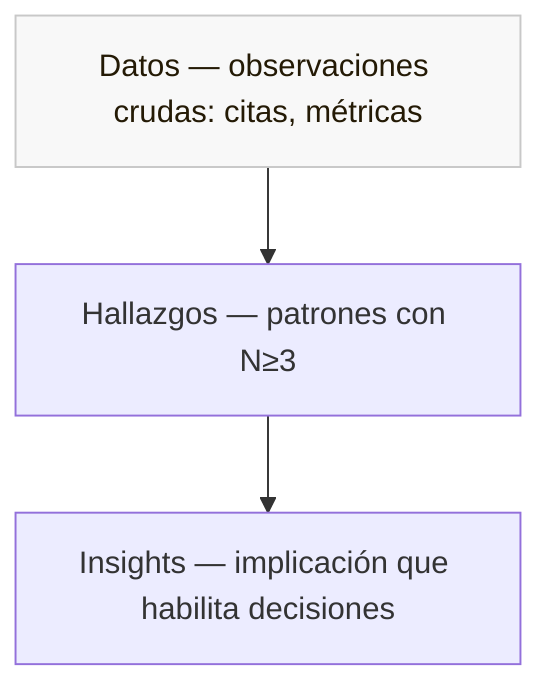

# 🔬 6 · Análisis

*Sección de [Cabeza · Motor de Evidencia](#/cabeza)*

---

> 📋 Plantilla: [Estrategia de Análisis](#/plantillas/estrategia-de-analisis). Técnicas extendidas en [Craft · Técnicas de análisis](#/craft/tecnicas-analisis).

## 6.1 · Los cuatro pasos

| Paso | Qué se hace | Cuándo |
| --- | --- | --- |
| 1. Revisar | Leer transcripciones sin analizar. Validar que las notas concuerden con la transcripción. | Día siguiente al cierre de sesiones. |
| 2. Codificar | Etiquetar observaciones por apuesta y por valencia (positiva/negativa/neutra/ambigua). Análisis a ciegas con observador. | Día 1 del análisis, tarde. |
| 3. Encontrar temáticas | Identificar patrones que aparecen en N≥3 sesiones independientes. Triangular con otras fuentes (Customer Success, analytics). | Día 2, mañana. |
| 4. Insights y veredicto | Aplicar la fórmula Hallazgo · Interpretación · Implicación. Veredicto preliminar por apuesta. | Día 2, tarde. |

## 6.2 · La pirámide Datos → Hallazgos → Insights

- **Datos** — información cruda sin procesar. Citas textuales, observaciones literales, métricas en bruto. *"En el minuto 12, P3 dijo: 'no entiendo qué significa este preset'."*
- **Hallazgos** — patrones categorizados que emergen de los datos. *Aún no son conclusiones.* Se construyen con N≥3. *"5 de 6 administradores eligen un preset al primer set-up en vez de empezar en blanco."*
- **Insights** — interpretación de los hallazgos en el contexto del problema. Es lo que habilita decisiones. *"La estrategia de presets como aceleradores de set-up funciona. Implicación: invertir en cobertura del catálogo tiene retorno claro."*

**La regla del salto:** cada insight tiene que poder reconstruirse hacia abajo, hasta los datos crudos que lo sostienen. Si no se puede, es opinión, no insight.

## 6.3 · Anatomía de un insight bien formado

Un insight tiene tres componentes — los tres son necesarios:

> **[Hallazgo] · [Interpretación] · [Implicación]**

Sin **hallazgo**, no es insight, es opinión. Sin **interpretación**, es solo el hallazgo. Sin **implicación**, no informa decisiones.

**Ejemplo:**

> *Hallazgo:* Los administradores (5 de 6) eligen presets al primer set-up por reducción de trabajo. *Interpretación:* Esto valida que el patrón "guided onboarding" funciona para esta audiencia y que los administradores están dispuestos a confiar en sugerencias del sistema cuando son específicas a su contexto. *Implicación:* Invertir en cobertura del catálogo de presets es high-ROI, y se puede aplicar el mismo patrón a otras configuraciones iniciales.

## 6.4 · Análisis a ciegas

Procedimiento:

1. Facilitador y observador (o tercero) codifican las mismas transcripciones de manera independiente, sin ver el tagging del otro.
2. Se comparan los taggings.
3. **Coincidencias** → código robusto. Pasa al hallazgo.
4. **Diferencias** → observación ambigua. Se reporta como tal o se descarta del veredicto.

El análisis a ciegas es la mitigación principal contra el sesgo de confirmación cuando el investigador también diseñó la solución. → Guía: [Análisis a ciegas](#/guias/analisis-ciegas).

## 6.5 · Técnicas de análisis disponibles

Los cuatro pasos de §6.1 son el proceso. Las técnicas de abajo son las herramientas que se aplican durante esos pasos — especialmente en el paso 3 (encontrar temáticas) y paso 4 (insights). El analista elige según el tipo de dato y la pregunta del estudio.

### Análisis temático (Braun & Clarke)
**Qué es.** Identificación de patrones recurrentes (temas) en datos cualitativos a través de codificación inductiva. Es la técnica default cuando no hay un framework predefinido y el dato es cualitativo abierto (entrevistas, transcripciones).

**Cuándo aplica.** Estudios generativos descriptivos donde no sabes qué patrones emergerán. Análisis de tickets Customer Success cuando no hay taxonomía previa.

**Cómo se aplica.**
1. Familiarización (lectura completa sin codificar).
2. Generación de códigos iniciales (etiquetas a fragmentos).
3. Búsqueda de temas (agrupar códigos relacionados).
4. Revisión de temas (refinar, fusionar, descartar).
5. Definición de cada tema con una frase declarativa.

**Ejemplos.**
- *Análisis de 47 tickets de Customer Success sobre "cuotas de plaza vencidas":* emergieron 3 temas no esperados (la pena del marchante frente a sus vecinos de pasillo, el miedo a perder el lugar histórico en el corredor, la presión de la mesa directiva de comerciantes) que reformularon el PRD original.
- *Entrevistas exploratorias para Comunicados:* análisis temático sobre 8 transcripciones reveló que el "canal informal" no es WhatsApp (como se asumía) sino conversaciones en el lobby.

### Mental model diagrams (Indi Young)
**Qué es.** Diagrama jerárquico que captura cómo el usuario piensa sobre una tarea o dominio, no cómo el sistema está organizado. Lado superior = comportamientos y motivos del usuario; lado inferior = features que (o no) los soportan.

**Cuándo aplica.** Cuando el equipo está rediseñando arquitectura de información o cuando hay desconexión entre el modelo mental del usuario y la organización del producto. También útil para detectar gaps funcionales.

**Cómo se aplica.**
1. Entrevistas cualitativas (5–10) con foco en una tarea específica.
2. Extracción de "atomic actions" (verbos + objetos: *"recordar al staff que limpie", "evidenciar que limpió"*).
3. Agrupación en mental spaces (clusters de comportamientos relacionados).
4. Mapeo del producto actual al modelo mental — gaps visibles.

**Ejemplos.**
- *Modelo mental del administrador para "operación diaria":* reveló que el administrador piensa en "zonas del tianguis" (pasillo de comida, pasillo de ropa, entrada) antes que en "tareas" — base del rediseño del modelo de Zonas en Actividades.
- *Modelo mental para "comunicación con marchantes":* mostró que el administrador agrupa mensajes por urgencia social, no por canal, lo que llevó a repensar la priorización de notificaciones.

### Journey mapping
**Qué es.** Visualización temporal del recorrido del usuario por una experiencia (multi-touchpoint), capturando acciones, pensamientos, emociones y oportunidades de mejora en cada paso.

**Cuándo aplica.** Cuando una experiencia abarca múltiples sesiones, canales o estados (no una sola pantalla). Útil para alinear al equipo cross-functional sobre la experiencia completa.

**Cómo se aplica.**
1. Definir scope del journey (entrada → salida).
2. Identificar fases (5–7 típicamente).
3. Para cada fase: acciones · puntos de contacto · pensamientos · emociones (curva) · oportunidades.
4. Sintetizar pain points y momentos de la verdad.

**Ejemplos.**
- *Journey de onboarding del administrador:* desde la firma del contrato hasta el AHA Moment. Identificó 3 puntos donde el administrador tira la toalla antes de generar su primer reporte.
- *Journey de "cuotas vencidas mes a mes":* mapeó el ciclo emocional del administrador del día 1 al día 30, revelando que el dolor pico no es la falta de pago sino la conversación con la mesa directiva de comerciantes.

### Affinity diagramming
**Qué es.** Agrupación bottom-up de observaciones individuales en clusters por afinidad — sin categorías predefinidas. Es la técnica más simple para encontrar estructura en data dispersa.

**Cuándo aplica.** Cuando tienes muchas observaciones (50+) y no sabes cómo organizarlas. Útil en sesiones colaborativas con el equipo.

**Cómo se aplica.**
1. Cada observación en una nota (post-it físico o digital).
2. Agrupar en silencio: notas similares juntas, sin pre-etiquetar grupos.
3. Después de la agrupación, nombrar cada cluster con la frase que mejor lo captura.
4. Identificar relaciones entre clusters.

**Ejemplos.**
- *Sesión de affinity con Customer Success sobre tickets de Q1:* 120 tickets en 12 clusters, 4 patrones que no estaban en la taxonomía oficial.
- *Post-concept-test debrief:* observaciones del observador silente agrupadas por afinidad antes del análisis estructurado, para detectar señales que no caben en las apuestas predefinidas.

### Triangulación cualitativa-cuantitativa
**Qué es.** Confirmar (o desafiar) un hallazgo cualitativo con un dato cuantitativo, o viceversa. No es una técnica única sino una disciplina aplicable en el paso 3 del análisis.

**Cuándo aplica.** Siempre que un hallazgo principal vaya a entrar al reporte. Sin triangulación, el hallazgo es hipótesis.

**Cómo se aplica.**
1. Para cada hallazgo principal, identificar al menos una fuente alternativa que lo pueda confirmar.
2. Cruzar contra esa fuente: ¿el patrón aparece también ahí?
3. Clasificar: confirmado · parcial · no soportado · contradicho.
4. Reportar la confianza del hallazgo según el resultado.

**Ejemplos.**
- *Hallazgo cualitativo:* "los administradores evitan funciones de Comunicados en horario nocturno." *Triangulación:* analytics confirma 73% del uso del módulo entre 9am–6pm. **Confirmado.**
- *Hallazgo cualitativo:* "los administradores no usan el dashboard porque está sobrecargado." *Triangulación:* analytics muestra que 4 de las 5 cards más usadas están en el dashboard. **Contradicho.** El hallazgo se reformula: el administrador usa el dashboard pero no lo recuerda hacerlo.

### Análisis de planeación estratégica (FODA / OKR mapping)
**Qué es.** Cruzar hallazgos del research contra el OST trimestral o un FODA de la iniciativa para evaluar fit estratégico. No es análisis cualitativo per se — es la traducción de insights a decisiones de portafolio.

**Cuándo aplica.** Al cierre del estudio, antes de la sesión de presentación, cuando la decisión Build / Pivot / No build implica trade-offs estratégicos (capacidad de Eng, scope del trimestre, prioridades cross-equipo).

**Cómo se aplica.**
1. Listar los hallazgos principales (3–5).
2. Mapearlos contra el Outcome del trimestre: ¿cuáles aceleran el Outcome? ¿Cuáles lo desaceleran o son neutros?
3. Mapear contra capacidad de Engineering: ¿qué cuesta atender cada hallazgo?
4. Output: lista priorizada de acciones con justificación estratégica, no solo evidencial.

**Ejemplos.**
- *Reporte de Actividades Fase 1:* la triangulación con OST mostró que A4 (audit trail) acelera retención (Outcome del Q3) más que A5 (reagendar), lo que reordenó la prioridad de implementación.
- *Reporte post-launch de Comunicados:* cruzar hallazgos vs FODA reveló que la oportunidad principal no era mejorar el módulo, sino cancelar y redirigir capacidad al Cobro de cuotas — decisión estratégica derivada del research.

## 6.6 · Diferencia entre hallazgo e insight

Un equipo puede leer el mismo hallazgo y derivar dos insights distintos según su contexto y prioridades — eso es legítimo. Lo que no es legítimo es saltarse el hallazgo y publicar la interpretación como si fuera el dato.

| Hallazgo (descriptivo) | Insight (interpretativo) |
| --- | --- |
| 4 de 6 administradores expresan preocupación de que su personal de plaza no pueda escanear un QR. | El handoff vía QR asume un nivel de digitalización del personal que no existe en la mayoría de los tianguis. Implicación: el QR no es la ruta principal — debe diseñarse una vía alternativa. |
| 3 de 6 administradores de tianguis pequeños mencionan que el audit trail "sería raro" para su personal de confianza. | La narrativa del audit trail como protección legal no resuena en tianguis pequeños. Implicación: el copy debe contextualizar el audit trail según el tamaño del tianguis. |
