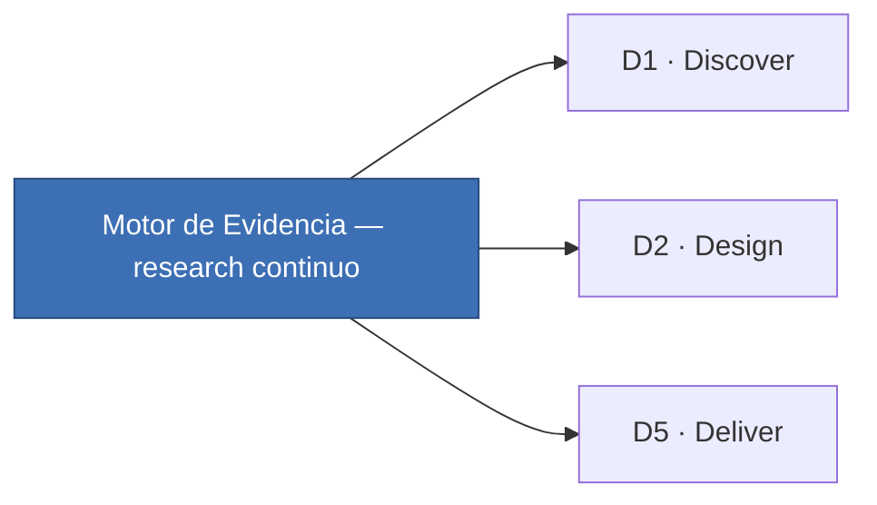

# 🔗 11 · Conexión con el Marco de Desarrollo

*Sección de [Cabeza · Motor de Evidencia](#/cabeza)*

---

## 11.1 · Mapeo a las 5Ds

Cada fase del [Marco de Desarrollo](#/tripa) tiene un perfil de research distinto. La elección del método y la profundidad del Plan se calibran a la fase:

| Fase | Sub-página del Initiative Spec | Research que alimenta | Cuándo se ejecuta |
| --- | --- | --- | --- |
| D1 · Discover | PRD | Entrevistas generativas · análisis de feedback Customer Success · analytics · fake doors | Antes del Opportunity Mapping (continuo, durante Cooldown del Discovery Track). |
| D2 · Design | Design Spec / RFC | Pruebas de concepto · tests de preferencia · card sorting | Discovery Sprint (3 semanas). |
| D3 · Develop | ADR / diseño detallado | Pruebas de usabilidad async (validación de UI a detalle) | Delivery Sprint, antes del Product Jam. |
| D4 · Deploy | [Release Checklist](#/plantillas/release-checklist) | Validación con beta users · soft launch | Antes del release general. |
| D5 · Deliver | [Impact Report](#/plantillas/impact-report) | Análisis de cohort post-release · encuesta de satisfacción · A/B test | 30 días post-release (continuo) o mes 1 + mes 3 (periódico). |



## 11.2 · Cadencia: Sprint vs Cooldown

El [Marco de Desarrollo](#/tripa) organiza el trabajo en ciclos de **3 semanas de Sprint + 1 semana de Cooldown**. El research se asigna distinto a cada uno:

| Etapa | Foco del Discovery Track | Tipo de research típico |
| --- | --- | --- |
| Sprint (3 sem) | Iniciativas activas en D1/D2. Concept tests con prototipo, sesiones moderadas, análisis. | Evaluativo descriptivo (concept tests). Análisis de estudios concluidos. |
| Cooldown (1 sem) | Preparación del siguiente ciclo. Revisión de feedback acumulado. Redacción de nuevos Planes. | Generativo (entrevistas exploratorias). Triangulación de tickets de Customer Success con métricas de Data & Analytics. Consolidación de insights. |

**Regla operativa:** los Planes de Investigación se redactan en Cooldown y se ejecutan en el Sprint siguiente. Si un Plan se redacta a mitad de Sprint, casi siempre es señal de research solution-first (anti-patrón §9.1).

## 11.3 · RACI: quién hace qué en cada estudio

El [Marco de Desarrollo](#/tripa) define la RACI por fase. Esta es la traducción específica al research:

| Rol | Responsabilidad en research |
| --- | --- |
| PD (Product Design) | **Facilitador del Motor de Evidencia.** R en D1 y D2. Dueño del proceso de investigación: redacta Planes, Briefs, Estrategias y Reportes, conduce sesiones moderadas y **organiza y genera los insights** a partir de lo que aportan las demás áreas. |
| Data & Analytics (Growth) | R en D1 (capa cuantitativa). Aporta datos de comportamiento y **triangula lo cualitativo con lo cuantitativo** para el facilitador. Lleva los insights consolidados al Opportunity Mapping. Bajo Product-Led Growth, conecta el comportamiento medido con la evidencia cualitativa. |
| Customer Success | C en research formal. Es el **canal de voz del cliente**: recopila feedback cualitativo continuo, categoriza tickets con dimensiones etnográficas y sirve como recruiter. |
| EM / Engineering | C en D1, R en D3–D4. Aporta evaluación temprana de viabilidad técnica vía Revisión Cruzada Asincrónica (ver [Marco de Desarrollo](#/tripa) §7). |
| PM (Product Manager) | A en D1. Sign-off del scope del Plan cuando alimenta el OST. Defiende el rigor de evidencia bajo presión. Decide en la sesión de presentación, junto con el equipo. |

Roles operativos por sesión (propios del Motor de Evidencia):

- **Facilitador** — conduce. Default: PD.
- **Observador silente** — codifica en paralelo. Puede ser Data & Analytics, otro PD, o alguien de Customer Success entrenado.
- **Recruiter** — convoca participantes. Default: Customer Success.

## 11.4 · Qué entra al Initiative Spec, dónde y cuándo

Los outputs del research no flotan — viven en sub-páginas específicas del Initiative Spec:

| Output | Va a | Cuándo |
| --- | --- | --- |
| Hallazgos generativos (entrevistas, análisis de tickets) | Sub-página D1 (PRD) | Antes del Opportunity Mapping. |
| [Plan de Investigación](#/plantillas/plan-de-investigacion) | Anexo D1 o D2 (según fase) | Al inicio del estudio. |
| [Reporte de Hallazgos](#/plantillas/reporte-de-hallazgos) (concept test) | Sub-página D2 (Design Spec) | Al cierre del estudio, antes del Kick-off. |
| [Reporte de Hallazgos](#/plantillas/reporte-de-hallazgos) (usabilidad) | Sub-página D3 (ADR) | Al cierre, antes del Product Jam. |
| Análisis post-release | Sub-página D5 ([Impact Report](#/plantillas/impact-report)) | 30 días post-release. |

## 11.5 · Quién consume cada output

| Output | Audiencia primaria |
| --- | --- |
| [Plan de Investigación](#/plantillas/plan-de-investigacion) | PM (sign-off de scope) · Data & Analytics (validación de hipótesis a probar) · PD (ejecutor) |
| [Research Brief](#/plantillas/research-brief) | PD (ejecutor) · observador de la sesión · recruiter |
| [Reporte de Hallazgos](#/plantillas/reporte-de-hallazgos) | Equipo completo. Anexo en Initiative Spec D2 o D5. |
| Repositorio de evidencia | Disponible al equipo. Consultable cuando aparezcan dudas en Delivery o en Impact Report. |

## 11.6 · Mecanismos del Marco de Desarrollo que el Motor de Evidencia consume

El Motor de Evidencia usa los mecanismos que el [Marco de Desarrollo](#/tripa) ya define:

- **Opportunity Mapping** (D1) — donde Data & Analytics consolida insights de research y los lleva a la decisión trimestral. El Motor de Evidencia alimenta este momento; no lo reemplaza.
- **Revisión Cruzada Asincrónica** — donde EM y PD validan mutuamente sus propuestas. Es el mecanismo por el que Eng entra al Discovery sin bloquearlo.
- **Kick-off (gate D2→D3)** — el momento donde el Reporte de Hallazgos del concept test debe estar publicado para que el Design Spec pase. Si no hay reporte, no hay Kick-off.
- **Retrospectiva de Proceso (Cooldown)** — donde se levantan red flags estructurales del research (§9.4).
- **Protocolo de Urgencias** — excepción acotada que permite saltarse el research formal cuando aplican los criterios estrictos del Marco de Desarrollo. **No es licencia para operar fuera del Motor de Evidencia de forma habitual.** Post-mortem obligatorio.

## 11.7 · Ciclo completo: del Discovery al Impact Report

El ciclo se cierra cuando los hallazgos del research se contrastan con los resultados reales:

```
D1 Insights (research generativo)
    ↓
D2 Concept test → Reporte → Veredicto por apuesta
    ↓ (si pasa el gate)
D3 Usabilidad async → Validación de UI
    ↓
D4 Beta users / soft launch
    ↓
D5 Impact Report → ¿Las predicciones del research se cumplieron?
    ↓
Si NO → red flag estructural (§9.4) → revisión en Cooldown
Si SÍ → conocimiento institucional → repositorio de evidencia
```

El cierre del ciclo no es ceremonial. Es el mecanismo que distingue research que predice de research que adivina. Si los Impact Reports consistentemente difieren de las predicciones, el motor está roto y hay que repararlo en la práctica, no en la documentación.
