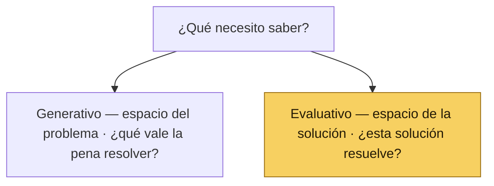

# 🔀 2 · Tipos de research

*Sección de [Cabeza · Motor de Evidencia](#/cabeza)*

---

## 2.1 · Generativo vs Evaluativo

| Generativo | Evaluativo |
| --- | --- |
| Produce información nueva. | Confirma o rechaza información existente. |
| Vive en el espacio del problema. | Vive en el espacio de la solución. |
| Pregunta qué problema vale la pena resolver. | Pregunta si esta solución resuelve el problema. |
| Métodos típicos: entrevistas, etnografía, análisis de tickets. | Métodos típicos: prueba de concepto, prueba de usabilidad, A/B test, encuesta. |

**En un producto en evolución continua, el research evaluativo carga la mayor parte del trabajo.** Las apuestas se validan con prototipos o con cambios incrementales en producción. El research generativo se ejecuta cuando hay una apuesta grande con incertidumbre alta — un nuevo módulo, una expansión de scope, una hipótesis de mercado adyacente.

## 2.2 · Descriptivo vs Analítico

| Descriptivo | Analítico |
| --- | --- |
| Cómo alguien hace algo. | Cuántos lo hacen. |
| Cualitativo. | Cuantitativo. |
| No es estadísticamente representativo. | Sí lo es (con muestra suficiente). |
| Da contexto, mental models, vocabulario. | Da distribuciones, proporciones, magnitudes. |
| Métodos: entrevistas, etnografía, concept tests moderados, card sorting cualitativo. | Métodos: encuestas, A/B tests, analytics, fake doors, tree testing async. |

Estos dos ejes son ortogonales. Un método puede ser **generativo descriptivo** (entrevista exploratoria), **generativo analítico** (encuesta abierta a base masiva para detectar patrones nuevos), **evaluativo descriptivo** (concept test moderado) o **evaluativo analítico** (A/B test).

## 2.3 · La matriz de información

Una segunda forma de pensar los métodos: ¿qué tipo de fuente da el dato?

| | Lo que la gente dice (actitudinal) | Lo que la gente hace (comportamiento) |
| --- | --- | --- |
| Escuchar opinión | Entrevistas, focus groups, formularios, pruebas de concepto | — |
| Observar acciones | — | Pruebas de usabilidad, etnografía, tracking visual |
| Medir actitudes | Encuestas, NPS, CSAT | — |
| Medir acciones | — | Analytics, A/B tests, tree testing |

La trampa común es tratar lo que la gente dice como evidencia de lo que hace. Para saber si alguien va a usar un feature, no se le pregunta si lo usaría — se le pone enfrente y se observa qué hace.

## 2.4 · Fuentes de información: jerarquía de calidad

| Tipo de fuente | Calidad | Cuándo usar |
| --- | --- | --- |
| Investigación primaria — el usuario en su contexto o en sesión moderada. | Máxima. | Default para validación de hipótesis. |
| Investigación secundaria — gente que interactúa con el usuario (Customer Success) o que se imagina al usuario (Gerentes, Legal). | Media. Trae sesgos corporativos. | Como complemento, nunca como sustituto. |
| Investigación terciaria — reportes de la industria, benchmarks públicos. | Baja para decisiones de producto, alta para contexto de mercado. | Background, no validación. |

## 2.5 · Cómo elegir el tipo correcto

Cuatro preguntas en orden:

1. **¿Estoy en espacio del problema o en espacio de la solución?** → Define si es generativo o evaluativo.
2. **¿Necesito entender cómo o cuánto?** → Define si es descriptivo o analítico.
3. **¿Lo que necesito saber es lo que dicen o lo que hacen?** → Define la matriz de información.
4. **¿Tengo acceso al usuario primario, o solo a fuentes secundarias?** → Define la jerarquía de calidad.

El método se elige al final, después de contestar las cuatro. No al principio. Decir *"vamos a hacer entrevistas"* antes de saber qué se quiere averiguar es uno de los anti-patrones más comunes.
