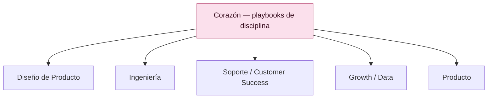

# ❤️ Corazón · Marco de Playbooks de Disciplina

*La capa disciplinar del sistema [Producto de Cabeza, Tripa y Corazón](#/inicio)*

| | |
| --- | --- |
| **Versión** | v1.0 |
| **Estado** | Documento vivo |
| **Audiencia** | Toda disciplina que hace producto: Diseño, Ingeniería, Soporte, Growth/Data, Producto |

---

## Qué es el Corazón

El Corazón es la **capa disciplinar** del sistema. Mientras la [Cabeza](#/cabeza) (qué construir) y la [Tripa](#/tripa) (cómo construimos juntos) son prácticas *compartidas* donde convergen todas las áreas, el Corazón es *vertical*: describe el oficio de cada disciplina por separado — su craft, sus principios, su forma de operar y de crecer.

Por eso el Corazón **no es un documento, es una familia de documentos.** Hay un playbook por disciplina, y cada uno responde lo mismo para su área: ¿en qué creemos?, ¿cómo trabajamos?, ¿qué método llevamos a la mesa?, ¿con qué herramientas?, ¿cómo crecemos?, ¿a quién sumamos?

---

## El esqueleto común de seis secciones

Todos los playbooks de disciplina comparten la misma estructura. Esto hace el sistema predecible (sabes dónde buscar, sin importar la disciplina) y comparable (puedes ver qué tan madura está cada área).

1. **Filosofía y principios** — la actitud y las creencias que rigen a la disciplina.
2. **Operación día a día** — cómo trabaja el área en su rutina.
3. **Qué método aporta a la Cabeza y a la Tripa** — la metodología que lleva a las mesas compartidas.
4. **Herramientas** — el armamento concreto.
5. **Crecimiento profesional** — rúbricas, niveles, cómo se progresa.
6. **Reclutamiento** — cómo se incorpora y evalúa talento.

De las seis, dos son el **núcleo mínimo** con el que cualquier playbook puede arrancar: la **filosofía** (sección 1) y el **método que aporta** (sección 3). Con esas dos, una disciplina ya puede sentarse a la mesa. Las otras cuatro se llenan conforme el área madura.

> 🟡 Las dos secciones del núcleo (filosofía y método que aporta) son el mínimo para arrancar. Una disciplina con solo esas dos ya es útil.

---

## La asimetría es un mapa de madurez, no un hueco

No todos los playbooks nacen llenos. Diseño e Ingeniería llegan con metodologías ricas y maduras; Soporte, Growth/Data o Producto pueden empezar solo con su filosofía y el método que aportan, y crecer después. Misma forma, distinto nivel de llenado.

Ver un playbook a medias no es una falla: es el mapa de hacia dónde madurar. El estado actual de la familia:

| Playbook | Madurez | Núcleo (1 y 3) | Secciones por documentar |
| --- | --- | --- | --- |
| [Diseño de Producto](#/corazon/diseno) | Maduro | ✅ | — (completo) |
| [Ingeniería](#/corazon/ingenieria) | Maduro · método X-Workflow integrado | ✅ | 4 · stack/CI por afinar |
| [Soporte / Customer Success](#/corazon/soporte) | Esbozo | ✅ | 2, 4, 5, 6 |
| [Growth / Data](#/corazon/growth-data) | Esbozo | ✅ | 2, 4, 5, 6 |
| [Producto](#/corazon/producto) | Esbozo | ✅ | 2, 4, 5, 6 |

---

## Disciplina es función, no organigrama

Una "disciplina" aquí es un **cuerpo de práctica** — una función, un oficio — **no una unidad organizacional.** El Playbook de Ingeniería sirve igual a un área de veinte personas que a una sola persona que se pone el sombrero de ingeniería dos horas al día.

La capa de managers y líneas de reporte queda **fuera** del sistema: cada organización la sobrepone encima según su tamaño. Esto es lo que permite que el mismo Corazón sirva a un equipo formado y a alguien trabajando en solitario.

---

## Cómo se conecta con la Cabeza y la Tripa

Cada disciplina lleva su método (definido en su playbook, sección 3) a las dos mesas compartidas. Este es el puente:

| Disciplina | Aporta a la [Cabeza](#/cabeza) (evidencia) | Aporta a la [Tripa](#/tripa) (ejecución) |
| --- | --- | --- |
| **[Diseño](#/corazon/diseno)** | Facilita el research, sintetiza insights | Definición de función y forma, design specs |
| **[Ingeniería](#/corazon/ingenieria)** | Evidencia de viabilidad técnica | X-Workflow: specs, prototipos, capa operativa |
| **[Soporte](#/corazon/soporte)** | Voz del cliente, etnografía de tickets | Materiales de autonomía, feedback continuo |
| **[Growth / Data](#/corazon/growth-data)** | Datos cuantitativos, triangulación | Medición, experimentos, Impact Report |
| **[Producto](#/corazon/producto)** | Prioridad estratégica de qué investigar | Convoca la mesa, guarda el scope, decide |

---

## 🧰 Dónde viven las plantillas y las guías

Los playbooks describen el oficio; no son la bodega de formatos. Las plantillas concretas de cada disciplina (el Product Design Brief, el Spec de Ingeniería, el Design Review Deck…) y las guías de proceso viven en el repositorio central **[Plantillas, Guías y Craft](#/plantillas)**, y cada playbook las **referencia** desde ahí.

La frontera es la misma que distingue al método del formato: el **método profundo** de la disciplina (cómo se diseña, cómo se ejecuta el X-Workflow) se queda en su playbook; el **artefacto reutilizable** (el molde que se llena) vive en la barra. Una sola fuente de verdad.

---

## Cómo crear un nuevo playbook de disciplina

1. Copia el esqueleto de seis secciones.
2. Llena primero el núcleo: **filosofía** (en qué cree tu disciplina) y **método que aporta** (qué llevas a la Cabeza y a la Tripa).
3. Publica el esbozo. No esperes a tenerlo completo — un playbook con el núcleo ya es útil.
4. Crece las otras cuatro secciones conforme tu disciplina las necesite.

> Recuerda: la asimetría es sana. Un esbozo honesto es mejor que un documento inflado que finge madurez que no existe.

---

## 📑 Índice de playbooks

- 🎨 **[Playbook de Diseño de Producto](#/corazon/diseno)** — maduro.
- ⚙️ **[Playbook de Ingeniería](#/corazon/ingenieria)** — maduro · su método (X-Workflow) es su sección central.
- 🎧 **[Playbook de Soporte / Customer Success](#/corazon/soporte)** — esbozo.
- 📈 **[Playbook de Growth y Data](#/corazon/growth-data)** — esbozo.
- 🧭 **[Playbook de Producto](#/corazon/producto)** — esbozo.
