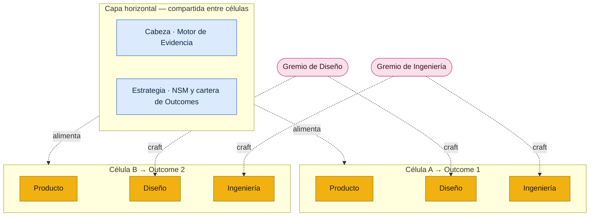

# 🌮 Producto de Cabeza, Tripa y Corazón

*El sistema. Cómo encajan la Cabeza, la Tripa y el Corazón.*

| | |
| --- | --- |
| **Versión** | v2.0 |
| **Estado** | Documento vivo |
| **Audiencia** | Cualquier persona que haga producto: Producto, Diseño, Ingeniería, Growth/Data, Soporte, Liderazgo |
| **Aplica a** | Individuos y organizaciones que quieran construir producto equilibrando visión y evidencia |

---

## 🤔 Por qué se llama así

Hacer buen producto no depende de una sola virtud. Depende de tres que casi nunca viven en la misma persona ni en la misma área al mismo tiempo, y que cuando se desbalancean producen los fracasos clásicos: construir con mucha pasión algo que nadie necesita, validar con mucho rigor algo que a nadie le importa, o tener clarísimo el qué pero no rematar nunca el cómo.

Este sistema le pone nombre a las tres con una imagen que en México todos entienden. Un buen taco se arma con varios cortes, y dos de ellos le dan el nombre a este método:

- 🧠 **[Cabeza](#/cabeza)** — la objetividad. Decidir con evidencia, no con la corazonada ni con la voz más fuerte de la sala. Saber *por qué* los usuarios hacen lo que hacen antes de comprometer recursos.
- 🔥 **[Tripa](#/tripa)** — el empuje. Ejecutar con disciplina, resiliencia y consistencia, sprint tras sprint. La fuerza que convierte una buena decisión en software que llega a producción.
- ❤️ **[Corazón](#/corazon)** — el craft y la empatía. Cuidar la artesanía, los principios y el crecimiento de cada disciplina, y atender de verdad las necesidades de quien usa el producto, equilibrándolas con los objetivos del negocio.

Las tres se necesitan. Cabeza sin corazón construye cosas correctas que a nadie le importan. Corazón sin cabeza construye cosas hermosas que nadie pidió. Y las dos juntas sin tripa se quedan en presentación: nunca llegan a las manos del usuario.

---

## 🧩 Lo primero que hay que entender: no son tres pilares iguales

Es tentador imaginar la Cabeza, la Tripa y el Corazón como tres columnas hermanas, una al lado de la otra. No lo son. Son **tres cosas de naturaleza distinta**, y entender esa diferencia es lo que hace que el sistema funcione.

- **La [Cabeza](#/cabeza) y la [Tripa](#/tripa) son prácticas compartidas.** Son la *mesa principal* donde convergen todas las disciplinas. Son horizontales: todo el mundo participa en ellas, sin importar de qué área venga. Definen el **estándar** y el **cómo trabajamos juntos**.
- **El [Corazón](#/corazon) es una capa disciplinar.** Es vertical, por especialidad. No es un documento único: es una **familia de playbooks**, uno por disciplina. Define la **habilidad** y el **método** con que cada área se presenta a la mesa.

El principio que gobierna todo el sistema sale de ahí:

> **Las prácticas compartidas (Cabeza, Tripa) definen el estándar y la mesa. Las disciplinas (Corazón) traen la habilidad y el método. El método científico es el suelo que hace que todos los métodos rimen.**

---

## 🍽️ Las dos prácticas compartidas

### 🧠 [Cabeza · Motor de Evidencia](#/cabeza) — *¿qué construir y por qué?*

La Cabeza es la práctica compartida de evidencia. Responde a una sola pregunta: por qué los usuarios hacen lo que hacen. Es la que **alimenta y empuja estratégicamente lo que vale la pena llevar a la mesa de ejecución.**

Tres cosas importan de su naturaleza:

- **Es de todos, facilitada por uno.** Soporte aporta la voz del cliente, Growth/Data lo cuantitativo, Ingeniería la viabilidad, Producto la prioridad estratégica. Product Design *facilita* el motor y es dueño del proceso, pero la evidencia es contribución de todo el equipo.
- **Es dueña de la práctica y el estándar.** Cada método de investigación se documenta una sola vez aquí — con sus plantillas y sus mecanismos anti-sesgo. *Cómo crece* una persona en ese método es asunto del Corazón de su disciplina, no de la Cabeza.
- **Es un torrente, no una compuerta.** No se apaga cuando una iniciativa entra a la Tripa: sigue alimentando evidencia a lo largo del ciclo, sobre todo al inicio (Discover), durante el diseño y al cierre.

### 🔥 [Tripa · Marco de Desarrollo](#/tripa) — *¿cómo construimos juntos?*

La Tripa es la práctica compartida de ejecución: cómo todas las disciplinas trabajan juntas para producir y entregar producto. Opera en **células multidisciplinarias** y es dueña del ciclo de vida de una iniciativa ya comprometida — el ciclo de las 5Ds (Discover, Design, Develop, Deploy, Deliver), la cadencia de Sprint + Cooldown, la RACI por fase y la jerarquía NSM → Outcome → Oportunidad.

La clave: **cada disciplina trae su propia metodología a esta mesa.** La Tripa no impone *cómo* hace su trabajo cada área; impone *cómo convergen* para construir juntas. Diseño trae la definición de función y forma; Ingeniería trae su método de ejecución (X-Workflow); Soporte trae la voz continua del cliente; Growth/Data trae la medición; Producto convoca la mesa y guarda el alcance.

#### Cómo se relacionan la Cabeza y la Tripa

La frontera es limpia: **la Tripa es dueña del ciclo de una iniciativa comprometida; la Cabeza es dueña de la evidencia que fluye hacia y a través de ese ciclo, más la decisión de qué vale la pena comprometer.** La *actividad* de discovery ocurre dentro de la Tripa (en su fase Discover); el *método y el estándar* de esa actividad viven en la Cabeza. Dicho de otro modo: la Tripa pone el tiempo y el lugar; la Cabeza pone el rigor.

---

## ❤️ La capa disciplinar: el Corazón

El [Corazón](#/corazon) no es un playbook. Es **el conjunto de playbooks de las disciplinas que hacen producto** — el armamento que cada área tiene, cómo lo usa, cómo crece, qué actitud y qué principios la rigen. Es, literalmente, el corazón de cada oficio.

Hay un playbook por disciplina:

- 🎨 **[Playbook de Diseño de Producto](#/corazon/diseno)**
- ⚙️ **[Playbook de Ingeniería](#/corazon/ingenieria)** (donde vive X-Workflow)
- 🎧 **[Playbook de Soporte / Customer Success](#/corazon/soporte)**
- 📈 **[Playbook de Growth / Data](#/corazon/growth-data)**
- 🧭 **[Playbook de Producto](#/corazon/producto)**

### Un esqueleto común para todos

Cada playbook de disciplina sigue la misma estructura de seis secciones, para que el sistema sea predecible y comparable entre áreas:

1. **Filosofía y principios** — la actitud y las creencias que rigen a la disciplina.
2. **Operación día a día** — cómo trabaja el área en su rutina.
3. **Qué método aporta a la Cabeza y a la Tripa** — la metodología que lleva a las mesas compartidas.
4. **Herramientas** — el armamento concreto.
5. **Crecimiento profesional** — rúbricas, niveles, cómo se progresa.
6. **Reclutamiento** — cómo se incorpora y evalúa talento.

### La asimetría es un mapa de madurez, no un hueco

No todos los playbooks nacen llenos. Ingeniería y Diseño llegan con metodologías ricas y maduras; Soporte o Producto pueden empezar solo con su filosofía y el método que aportan, y crecer después. Misma forma, distinto nivel de llenado. Ver un playbook a medias no es una falla: es el mapa de hacia dónde madurar.

### Disciplina es función, no organigrama

Una "disciplina" aquí es un **cuerpo de práctica** — una función, un oficio — **no una unidad organizacional.** El Playbook de Ingeniería sirve igual a un área de veinte personas que a una sola persona que se pone el sombrero de ingeniería dos horas al día. La capa de managers y líneas de reporte queda **fuera** del sistema: es algo que cada organización sobrepone encima, según su tamaño y su contexto. Esto es lo que permite que el mismo sistema sirva a un equipo formado y a alguien trabajando en solitario: en solitario, una persona carga varios playbooks a la vez, pero los playbooks no cambian — solo cambia quién los sostiene.

---

## 🔬 El cimiento: el método científico

Debajo de todo está el método científico. No es decoración: es la raíz común de la que salen las tres piezas.

- El **research** de la Cabeza es el método científico aplicado a *saber qué construir*.
- El **X-Workflow** de Ingeniería es el método científico aplicado a *construir bien*.
- El **scientific design** de Diseño es el método científico aplicado a *equilibrar lo que debería ser (diseño) con lo que es (evidencia)*.

Son la misma raíz enactuada por cada disciplina a su manera. Por eso no chocan entre sí: observar, formular una hipótesis (que no es más que una idea), probarla, aprender y volver a empezar es el latido compartido de todo el sistema. El cimiento es lo que hace que los métodos de áreas distintas *rimen* en lugar de pelearse.

### Construir sobre conocimiento, no sobre esperanza

Este cimiento tiene un nombre en la disciplina del diseño: **scientific design** — tratar el diseño y el producto como una práctica científica, no como una cuestión de gusto u opinión. Su tesis es simple y dura: la mayoría de los productos no fracasan por mal diseño, mala investigación o mal código, sino por **construir lo incorrecto** — y construir lo incorrecto viene de malos insumos en el momento equivocado. La cura es dejar de *construir sobre esperanza* y empezar a construir sobre conocimiento.

El loop que lo hace posible — investigar, diseñar, probar, y volver a empezar — es el mismo bajo todos sus nombres: método científico, ciclo ágil, user-centricity. Todos son sinónimos de un ciclo de retroalimentación movido por **evidencia, no por opiniones**. Y una hipótesis, en este marco, no es nada intimidante: es simplemente **una idea escrita de forma que se pueda probar**. Eso es lo que conecta el research de la Cabeza, el X-Workflow de Ingeniería y el craft del Diseño: los tres escriben ideas y las ponen a prueba.

*Esta base recoge las ideas de scientific design de Dr. Nick Fine y el origen del X-Workflow de Fernando Trasviña — dos articulaciones independientes del mismo principio.*

---

## 🪄 La matriz: qué aporta cada disciplina a la mesa

El puente entre el Corazón (las disciplinas) y las prácticas compartidas (Cabeza y Tripa) es este: qué trae cada área cuando se sienta a la mesa.

| Disciplina | Aporta a la Cabeza (evidencia) | Aporta a la Tripa (ejecución) |
| --- | --- | --- |
| **[Diseño](#/corazon/diseno)** | Facilita el research, sintetiza insights | Definición de función y forma, design specs |
| **[Ingeniería](#/corazon/ingenieria)** | Evidencia de viabilidad técnica | X-Workflow: specs, prototipos, capa operativa |
| **[Soporte](#/corazon/soporte)** | Voz del cliente, etnografía de tickets | Materiales de autonomía, feedback continuo |
| **[Growth / Data](#/corazon/growth-data)** | Datos cuantitativos, triangulación | Medición, experimentos, Impact Report |
| **[Producto](#/corazon/producto)** | Prioridad estratégica de qué investigar | Convoca la mesa, guarda el scope, decide |

Esta matriz no es solo explicativa: es el corazón de cómo el sistema se adapta. Según quién cubra cada disciplina en tu equipo —una persona dedicada, alguien que comparte sombreros, o nadie todavía— se encienden o se apagan filas, y la documentación se ajusta a tu estructura real.

---

## 🧬 Cómo escala el sistema: la célula fractal

El sistema describe **una célula**: un equipo multidisciplinario que corre las tres piezas —Cabeza, Tripa, Corazón— para mover un Outcome. La célula es la unidad mínima completa: tiene su mesa de ejecución (Tripa), su motor de evidencia (Cabeza) y las disciplinas que se sientan a ella (Corazón). Una persona en solitario es una célula de una sola silla; un equipo formado es una célula con cada silla ocupada. El método no cambia con el tamaño — solo cambia cuántas manos lo sostienen.

Escalar no es engordar una célula hasta el infinito: es **replicarla**. Cuando una sola célula ya no abarca todos los Outcomes que la organización persigue, se crea otra que corre el mismo sistema para su propio Outcome. El método es invariante a la escala — por eso es *fractal*: la misma forma a uno y a muchos.

Al aparecer varias células surgen dos capas de coordinación:

- **Horizontal — lo que se comparte entre células.** La Cabeza (el motor de evidencia y su estándar) y la estrategia (la NSM y la cartera de Outcomes) son comunes a todas. Una célula no reinventa el método de research ni su norte: los hereda.
- **Vertical — los gremios de disciplina.** Las personas de un mismo oficio (todo Diseño, todo Ingeniería) forman un gremio que cruza las células: cuida el craft, la consistencia y el crecimiento de la disciplina, aunque cada quien ejecute en una célula distinta. Es la "vertical" que mantiene a los oficios afilados sin importar dónde trabajen.

La capa de organigrama —managers, líneas de reporte— queda fuera del sistema, como siempre: cada organización la sobrepone según su tamaño y su contexto.

*Una célula corre el sistema completo para un Outcome. Escalar = replicar células. La Cabeza y la estrategia se comparten en horizontal; los gremios de disciplina cruzan en vertical.*

---

## 🧰 El repositorio: [Plantillas, Guías y Craft](#/plantillas)

Las tres capas comparten una despensa común. Las plantillas (el Brief, el Plan de Investigación, el Spec, el Release Checklist…), las guías de proceso (cómo llevar un Design Review, cómo construir un Opportunity Solution Tree…) y el craft táctico de cada disciplina no viven dentro de cada marco o playbook, sino en un repositorio central: **[Plantillas, Guías y Craft](#/plantillas)**.

La regla es simple: el recurso vive una sola vez en la barra; los marcos y playbooks lo **referencian**. Así, cuando una plantilla cambia, cambia en un solo lugar y todo el sistema queda al día. El repositorio se organiza por dos ejes —por fase de las 5Ds (para quien busca qué tomar en un momento del flujo) y por disciplina (para quien afila su oficio)— y un mismo recurso puede aparecer en ambos índices.

---

## 🚪 Onboarding — por dónde empezar según tu rol

- **Si lideras producto (Producto/PM):** este documento → la [Tripa](#/tripa) completa (es tu mesa) → la [Cabeza](#/cabeza) (para defender el rigor) → tu propio [playbook](#/corazon/producto) en el Corazón.
- **Si eres de Diseño:** este documento → el [Playbook de Diseño](#/corazon/diseno) → la [Cabeza](#/cabeza) (eres su facilitador) → la [Tripa](#/tripa) (cómo entra tu trabajo a la mesa).
- **Si eres de Ingeniería:** este documento → el [Playbook de Ingeniería y X-Workflow](#/corazon/ingenieria) → la [Tripa](#/tripa) (dónde ejecuta tu método) → la [Cabeza](#/cabeza) (tu aporte de viabilidad).
- **Si eres de Growth/Data:** este documento → la [Cabeza](#/cabeza) (triangulación) → la [Tripa](#/tripa) (medición e Impact Report) → tu [playbook](#/corazon/growth-data).
- **Si eres de Soporte:** este documento → la [Cabeza](#/cabeza) (eres la voz del cliente) → tu [playbook](#/corazon/soporte) → la [Tripa](#/tripa) (cómo clasificas lo que entra).

---

## 🪜 Guía de adopción

Se adopta por capas, de fundamento hacia afuera:

1. **Asienta el método científico como acuerdo.** Antes que cualquier proceso, el equipo acuerda que se decide con evidencia e hipótesis, no con opiniones. Sin esto, lo demás es burocracia.
2. **Pon a andar la [Tripa](#/tripa).** El ciclo de vida compartido (5Ds, NSM → Outcome → Oportunidad, cadencia). Es el esqueleto donde todo se cuelga.
3. **Formaliza la [Cabeza](#/cabeza).** Cómo se produce y valida la evidencia que alimenta la Tripa. Empieza ligero (research evaluativo) y reserva lo pesado para apuestas grandes.
4. **Levanta los playbooks del [Corazón](#/corazon), uno por disciplina.** Empieza por las disciplinas con método más maduro (Diseño, Ingeniería) y deja que las demás crezcan desde su filosofía.
5. **Activa disciplinas conforme creces.** En un equipo chico, pocas personas cargan varios playbooks. Cuando el volumen lo justifique, cada disciplina se vuelve función propia.

> **Regla de oro:** no instrumentes lo que no necesitas todavía. Cada ritual, artefacto y herramienta debe pasar la prueba de *"¿esto se justifica con el tamaño de equipo que tengo hoy?"*.

---

## 💬 FAQ

**¿Tengo que adoptar todo para que funcione?**
No de golpe. El método científico y la Tripa son el mínimo viable. La Cabeza y el Corazón potencian lo que la Tripa ya asume. El valor compuesto aparece cuando las tres operan juntas.

**¿La Cabeza no es parte de la Tripa?**
Son prácticas distintas que se tocan. La Tripa es dueña del ciclo de una iniciativa; la Cabeza es dueña de la evidencia y de la decisión de qué entra. La actividad de discovery vive en la Tripa; su método y estándar viven en la Cabeza.

**¿Por qué el Corazón es muchos playbooks y no uno?**
Porque cada disciplina tiene su propio oficio, sus herramientas y su forma de crecer. Un solo playbook tendría que ser de diseño *o* de ingeniería *o* de soporte; ninguno serviría bien a las demás. El Corazón es la suma de todos.

**Soy una sola persona (o dos o tres). ¿Esto es para mí?**
Sí. Disciplina es función, no organigrama: en solitario, una persona carga varios playbooks a la vez. Los playbooks no cambian; cambia quién los sostiene. El sistema se adapta colapsando disciplinas en sombreros.

**¿Dónde vive X-Workflow?**
En el [Playbook de Ingeniería](#/corazon/ingenieria) (Corazón), como el método que Ingeniería aporta. Sus principios se *ejecutan* en la Tripa. Es una de las formas de ejecutar ingeniería; Agile/Scrum o un híbrido son otras.

**¿Necesito un equipo de Data o de Soporte dedicado?**
No para empezar. Son disciplinas que alguien del equipo puede cubrir como sombrero hasta que el volumen justifique una función propia.

**¿Dónde viven las plantillas y las guías?**
En el repositorio central **[Plantillas, Guías y Craft](#/plantillas)** — la despensa compartida del sistema. Los marcos y playbooks no las copian: las referencian desde ahí, para que haya una sola fuente de verdad.

**¿De dónde sale el nombre?**
Del juego de palabras con los tacos (de cabeza, de tripa) y el paralelismo con las tres virtudes del buen producto: cabeza (objetividad), tripa (empuje) y corazón (craft y carácter de cada oficio). Es un doble sentido blanco, y un recordatorio de que las tres se sirven juntas o no saben a nada.

---

## 👀 De un vistazo

> 🧠 **[Cabeza](#/cabeza)** te dice *qué* construir, con evidencia.
> 🔥 **[Tripa](#/tripa)** es la mesa donde *construimos juntos*, con disciplina.
> ❤️ **[Corazón](#/corazon)** es *quién es cada oficio* — su craft, sus principios, su forma de crecer.
> 🔬 Debajo de las tres, **el método científico** las hace rimar.
>
> *Sírvelas juntas.*
