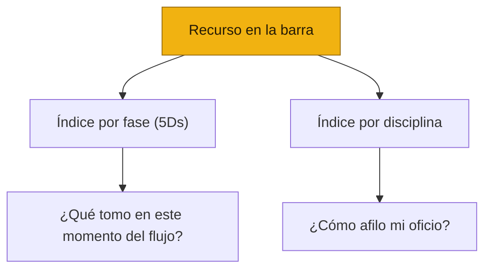

# 📄 Plantillas

*La barra de plantillas del sistema [Producto de Cabeza, Tripa y Corazón](#/inicio)*

| | |
| --- | --- |
| **Versión** | v0.1 — Esqueleto |
| **Estado** | En construcción. Encuadre e índices completos; migración de recursos en curso |
| **Audiencia** | Cualquier persona que haga producto |
| **Aplica a** | Todo equipo que opere el sistema, sin importar su tamaño |

---

## 🌮 Qué es el repositorio — la barra del taquero

Esta página es la **barra de *mise en place*** del sistema: el lugar donde viven, picados y listos para tomarse, todos los recursos reutilizables que las disciplinas y las prácticas compartidas necesitan para trabajar.

Los marcos ([Cabeza](#/cabeza), [Tripa](#/tripa)) y los playbooks ([Corazón](#/corazon)) son las **recetas**. Una receta dice *"toma el Brief de la barra"* — no reimprime el Brief entero. Así, cada recurso vive **en un solo lugar** (esta barra), y todo lo demás lo **referencia**. Si el Brief cambia, cambia una sola vez y todas las recetas quedan al día.

> **Regla del repositorio:** el recurso vive aquí; los marcos y playbooks lo referencian con un *stub* (qué es + cuándo se usa + link). Una sola fuente de verdad, sin romper la lectura de corrido.

---

## Los tres tipos de recurso

La barra guarda tres clases de cosa, hoy repartidas en tres categorías del menú. Conviene no confundirlas:

1. 📄 **Plantillas** — artefactos con estructura fija que alguien llena (Brief, Plan de Investigación, Spec, PRD, Release Checklist…). Son el *molde*. **Viven en esta página.**
2. 🧭 **[Guías de proceso](#/guias)** — cómo conducir un ritual o una actividad de principio a fin. Son la *receta de la actividad*.
3. ✨ **[Craft / especialidad táctica](#/craft)** — cómo hacer bien el oficio fino de cada disciplina (buena UI, motion, microcopy, técnicas de análisis). Es el *sazón* que no se aprende llenando un molde.

Esta página es la principal de la barra: aquí vive el encuadre general (qué es el repositorio, los dos ejes de organización y la leyenda de estado), que aplica por igual a [Guías](#/guias) y [Craft](#/craft).

---

## Los dos ejes de organización

Un recurso se busca de dos maneras, y la barra está indexada por las dos:

- **Por fase de las 5Ds** — para quien está parado en un momento del flujo y pregunta *"¿qué tomo aquí?"*.
- **Por disciplina** — para quien quiere afilar su oficio sin importar la fase.

Un mismo recurso puede aparecer en **ambos índices**. Los índices son dos puertas a la misma barra, no dos barras.

---

## Leyenda de estado

Esta leyenda es transversal: vale también para [Guías](#/guias) y [Craft](#/craft).

| Símbolo | Significado |
| --- | --- |
| ✅ | **Completo** — migrado a la barra, listo para usarse |
| 🟡 | **Curaduría** — existe como lista de referencias/links, no como recurso propio |
| ⏳ | **Plantilla en camino** — referenciada por el sistema pero aún no escrita |
| 🌱 | **Por crecer** — estante reservado a propósito; aún sin contenido |

---

## 🗂️ Plantillas por fase (Discover → Deliver)

Solo plantillas. Las **guías** de cada fase viven en [Guías de proceso](#/guias) y los recursos de **craft** en [Craft / especialidad](#/craft). Las plantillas marcadas ⏳ aún no tienen página (se mencionan como texto plano).

### Discover (D1) — qué construir y por qué

| Recurso | Disciplina dueña | Estado |
| --- | --- | --- |
| PRD | Producto | ⏳ |
| [Opportunity Solution Tree](#/plantillas/opportunity-solution-tree) | Producto / equipo | ✅ |
| [Plan de Investigación](#/plantillas/plan-de-investigacion) | Research *(transversal D1–D3)* | ✅ |

### Design (D2) — función y forma

| Recurso | Disciplina dueña | Estado |
| --- | --- | --- |
| [Product Design Brief](#/plantillas/product-design-brief) | Diseño | ✅ |
| [Product Design Spec](#/plantillas/product-design-spec) | Diseño | ✅ |
| RFC (solución técnica) | Ingeniería | ⏳ |
| [Research Brief](#/plantillas/research-brief) | Research | ✅ |
| [Notas de Sesión](#/plantillas/notas-de-sesion) | Research | ✅ |
| [Estrategia de Análisis](#/plantillas/estrategia-de-analisis) | Research | ✅ |
| [Reporte de Hallazgos](#/plantillas/reporte-de-hallazgos) | Research | ✅ |
| Voiceover Internal Review | Diseño | ⏳ |
| [Debrief y Síntesis Rápida](#/plantillas/debrief-sintesis) | Research | ✅ |

### Develop (D3) — construir bien

| Recurso | Disciplina dueña | Estado |
| --- | --- | --- |
| [Spec de Ingeniería](#/plantillas/spec-ingenieria) | Ingeniería | ✅ |
| ADR (si aplica) | Ingeniería | ⏳ |
| [Pull Request](#/plantillas/pull-request) | Ingeniería | ✅ |
| [Diario de trabajo](#/plantillas/diario-de-trabajo) | Ingeniería | ✅ |
| [Design Review Deck](#/plantillas/design-review-deck) | Diseño | ✅ |

### Deploy (D4) — sacarlo a producción

| Recurso | Disciplina dueña | Estado |
| --- | --- | --- |
| [Release Checklist](#/plantillas/release-checklist) | Tripa / equipo | ✅ |

### Deliver (D5) — medir y cerrar el loop

| Recurso | Disciplina dueña | Estado |
| --- | --- | --- |
| [Impact Report](#/plantillas/impact-report) | Growth / Data | ✅ |
| Post Mortem (si aplica) | equipo | ⏳ |

### Transversal — no atado a una sola fase

| Recurso | Disciplina dueña | Estado |
| --- | --- | --- |
| [Probing Questions](#/plantillas/probing-questions) | Research | ✅ |
| [Guía de Discusión para Entrevista](#/plantillas/guia-de-discusion) | Research | ✅ |
| [Script para Prueba de Usabilidad Moderada](#/plantillas/script-usabilidad) | Research | ✅ |
| [Preguntas para Investigación de Dashboard](#/plantillas/preguntas-dashboard) | Research | ✅ |

---

## 🎯 Plantillas por disciplina

Solo plantillas. Para las guías y el craft de cada disciplina, ver [Guías de proceso](#/guias) y [Craft / especialidad](#/craft).

### Producto

| Recurso | Fase | Estado |
| --- | --- | --- |
| PRD | D1 | ⏳ |
| [Opportunity Solution Tree](#/plantillas/opportunity-solution-tree) | D1 | ✅ |

### Diseño

| Recurso | Fase | Estado |
| --- | --- | --- |
| [Product Design Brief](#/plantillas/product-design-brief) | D2 | ✅ |
| [Product Design Spec](#/plantillas/product-design-spec) | D2 | ✅ |
| [Design Review Deck](#/plantillas/design-review-deck) | D3/D4 | ✅ |
| Voiceover Internal Review | D2 | ⏳ |

### Ingeniería

| Recurso | Fase | Estado |
| --- | --- | --- |
| [Spec de Ingeniería](#/plantillas/spec-ingenieria) | D2/D3 | ✅ |
| RFC | D2 | ⏳ |
| ADR | D3 | ⏳ |
| [Pull Request](#/plantillas/pull-request) | Transversal | ✅ |
| [Diario de trabajo](#/plantillas/diario-de-trabajo) | Transversal | ✅ |

### Research *(práctica de la [Cabeza](#/cabeza), facilitada por Diseño)*

| Recurso | Fase | Estado |
| --- | --- | --- |
| [Plan de Investigación](#/plantillas/plan-de-investigacion) | D1–D3 | ✅ |
| [Research Brief](#/plantillas/research-brief) | D1–D3 | ✅ |
| [Notas de Sesión](#/plantillas/notas-de-sesion) | D1–D3 | ✅ |
| [Estrategia de Análisis](#/plantillas/estrategia-de-analisis) | D1–D3 | ✅ |
| [Reporte de Hallazgos](#/plantillas/reporte-de-hallazgos) | D2/D3/D5 | ✅ |
| [Debrief y Síntesis Rápida](#/plantillas/debrief-sintesis) | Post-sesión | ✅ |
| [Probing Questions](#/plantillas/probing-questions) | Transversal | ✅ |
| [Guía de Discusión para Entrevista](#/plantillas/guia-de-discusion) | Transversal | ✅ |
| [Script para Prueba de Usabilidad Moderada](#/plantillas/script-usabilidad) | Transversal | ✅ |
| [Preguntas para Investigación de Dashboard](#/plantillas/preguntas-dashboard) | Transversal | ✅ |

### Growth / Data

| Recurso | Fase | Estado |
| --- | --- | --- |
| [Impact Report](#/plantillas/impact-report) | D5 | ✅ |
| Plan de medición y KPIs | D2/D5 | 🌱 |

### Soporte / Customer Success

| Recurso | Fase | Estado |
| --- | --- | --- |
| Materiales de autonomía del usuario | D4 | 🌱 |

### Tripa *(práctica compartida, no disciplina)*

| Recurso | Fase | Estado |
| --- | --- | --- |
| [Release Checklist](#/plantillas/release-checklist) | D4 | ✅ |
| Post Mortem | D5 | ⏳ |

---

> 🚧 **Estado del esqueleto.** Los índices están completos y cada plantilla con página ya existe en el menú. En este checkpoint, el **[Plan de Investigación](#/plantillas/plan-de-investigacion)** está migrado como muestra; el resto de las plantillas se rellenará en capas posteriores. Las [Guías](#/guias) y el [Craft](#/craft) viven en sus propias secciones.
