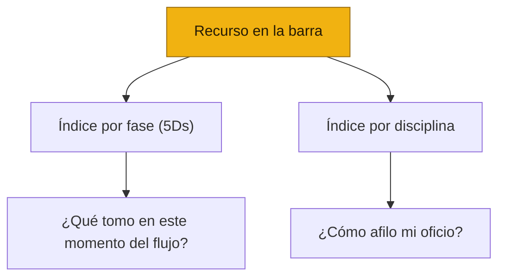

# 🧰 Plantillas, Guías y Craft

*El repositorio central del sistema [Producto de Cabeza, Tripa y Corazón](#/inicio)*

| | |
| --- | --- |
| **Versión** | v0.1 — Esqueleto |
| **Estado** | En construcción. Encuadre e índices completos; migración de recursos en curso |
| **Audiencia** | Cualquier persona que haga producto |
| **Aplica a** | Todo equipo que opere el sistema, sin importar su tamaño |

---

## 🌮 Qué es este repositorio — la barra del taquero

Este documento es la **barra de *mise en place*** del sistema: el lugar donde viven, picados y listos para tomarse, todos los recursos reutilizables que las disciplinas y las prácticas compartidas necesitan para trabajar.

Los marcos ([Cabeza](#/cabeza), [Tripa](#/tripa)) y los playbooks ([Corazón](#/corazon)) son las **recetas**. Una receta dice *"toma el Brief de la barra"* — no reimprime el Brief entero. Así, cada recurso vive **en un solo lugar** (esta barra), y todo lo demás lo **referencia**. Si el Brief cambia, cambia una sola vez y todas las recetas quedan al día.

> **Regla del repositorio:** el recurso vive aquí; los marcos y playbooks lo referencian con un *stub* (qué es + cuándo se usa + link). Una sola fuente de verdad, sin romper la lectura de corrido.

---

## Los tres tipos de recurso

La barra guarda tres clases de cosa, y conviene no confundirlas:

1. 📄 **Plantillas** — artefactos con estructura fija que alguien llena (Brief, Plan de Investigación, Spec, PRD, Release Checklist…). Son el *molde*.
2. 🧭 **Guías de proceso** — cómo conducir un ritual o una actividad de principio a fin. Son la *receta de la actividad*.
3. ✨ **Craft / especialidad táctica** — cómo hacer bien el oficio fino de cada disciplina (buena UI, motion, microcopy, técnicas de análisis). Es el *sazón* que no se aprende llenando un molde.

---

## Los dos ejes de organización

Un recurso se busca de dos maneras, y la barra está indexada por las dos:

- **Por fase de las 5Ds** — para quien está parado en un momento del flujo y pregunta *"¿qué tomo aquí?"*.
- **Por disciplina** — para quien quiere afilar su oficio sin importar la fase.

Un mismo recurso puede aparecer en **ambos índices**. Los índices son dos puertas a la misma barra, no dos barras.

---

## Leyenda de estado

| Símbolo | Significado |
| --- | --- |
| ✅ | **Completo** — migrado a la barra, listo para usarse |
| 🟡 | **Curaduría** — existe como lista de referencias/links, no como recurso propio |
| ⏳ | **Plantilla en camino** — referenciada por el sistema pero aún no escrita |
| 🌱 | **Por crecer** — estante reservado a propósito; aún sin contenido |

---

## 🗂️ Índice por fase (Discover → Deliver)

### Discover (D1) — qué construir y por qué

| Recurso | Tipo | Disciplina dueña | Estado |
| --- | --- | --- | --- |
| PRD | Plantilla | Producto | ⏳ |
| [Opportunity Solution Tree](#/plantillas/opportunity-solution-tree) | Plantilla | Producto / equipo | ✅ |
| [Priorización RICE](#/guias/rice) | Plantilla + Guía | Producto | ✅ |
| [Construir el OST paso a paso](#/guias/ost-paso-a-paso) | Guía | Producto / equipo | ✅ |
| [Plan de Investigación](#/plantillas/plan-de-investigacion) | Plantilla | Research *(transversal D1–D3)* | ✅ |

### Design (D2) — función y forma

| Recurso | Tipo | Disciplina dueña | Estado |
| --- | --- | --- | --- |
| [Product Design Brief](#/plantillas/product-design-brief) | Plantilla | Diseño | ✅ |
| [Product Design Spec](#/plantillas/product-design-spec) | Plantilla | Diseño | ✅ |
| RFC (solución técnica) | Plantilla | Ingeniería | ⏳ |
| [Research Brief](#/plantillas/research-brief) | Plantilla | Research | ✅ |
| [Notas de Sesión](#/plantillas/notas-de-sesion) | Plantilla | Research | ✅ |
| [Estrategia de Análisis](#/plantillas/estrategia-de-analisis) | Plantilla | Research | ✅ |
| [Reporte de Hallazgos](#/plantillas/reporte-de-hallazgos) | Plantilla | Research | ✅ |
| Voiceover Internal Review | Plantilla | Diseño | ⏳ |
| [Debrief y Síntesis Rápida](#/plantillas/debrief-sintesis) | Plantilla | Research | ✅ |

### Develop (D3) — construir bien

| Recurso | Tipo | Disciplina dueña | Estado |
| --- | --- | --- | --- |
| [Spec de Ingeniería](#/plantillas/spec-ingenieria) | Plantilla | Ingeniería | ✅ |
| ADR (si aplica) | Plantilla | Ingeniería | ⏳ |
| [Pull Request](#/plantillas/pull-request) | Plantilla | Ingeniería | ✅ |
| [Diario de trabajo](#/plantillas/diario-de-trabajo) | Plantilla | Ingeniería | ✅ |
| [Design Review Deck](#/plantillas/design-review-deck) | Plantilla | Diseño | ✅ |
| [Cómo llevar un Design Review](#/guias/design-review) | Guía | Diseño | ✅ |

### Deploy (D4) — sacarlo a producción

| Recurso | Tipo | Disciplina dueña | Estado |
| --- | --- | --- | --- |
| [Release Checklist](#/plantillas/release-checklist) | Plantilla | Tripa / equipo | ✅ |
| [Cadena de aprobación del Release](#/guias/cadena-release) | Guía | Tripa | ✅ |

### Deliver (D5) — medir y cerrar el loop

| Recurso | Tipo | Disciplina dueña | Estado |
| --- | --- | --- | --- |
| [Impact Report](#/plantillas/impact-report) | Plantilla | Growth / Data | ✅ |
| Post Mortem (si aplica) | Plantilla | equipo | ⏳ |

### Transversal — no atado a una sola fase

| Recurso | Tipo | Disciplina dueña | Estado |
| --- | --- | --- | --- |
| [Probing Questions](#/plantillas/probing-questions) | Plantilla | Research | ✅ |
| [Guía de Discusión para Entrevista](#/plantillas/guia-de-discusion) | Plantilla | Research | ✅ |
| [Script para Prueba de Usabilidad Moderada](#/plantillas/script-usabilidad) | Plantilla | Research | ✅ |
| [Preguntas para Investigación de Dashboard](#/plantillas/preguntas-dashboard) | Plantilla | Research | ✅ |
| [Pre-flight, conducción y moderación](#/guias/sesion-research) | Guía | Research | ✅ |
| [Anti-bias checklist](#/guias/anti-bias) | Guía | Research | ✅ |
| [Análisis a ciegas (procedimiento)](#/guias/analisis-ciegas) | Guía | Research | ✅ |
| [Matriz para elegir método de research](#/guias/matriz-metodo) | Guía | Research | ✅ |
| [Git · PR · CHANGELOG · SemVer](#/guias/git-pr-changelog) | Guía | Ingeniería | ✅ |
| [Cómo llevar un Design Debt Review](#/guias/design-debt-review) | Guía | Diseño | ✅ |
| [Cómo llevar un Design Critique informal](#/guias/design-critique) | Guía | Diseño | ✅ |

---

## 🎯 Índice por disciplina

### Producto

| Recurso | Tipo | Fase | Estado |
| --- | --- | --- | --- |
| PRD | Plantilla | D1 | ⏳ |
| [Opportunity Solution Tree](#/plantillas/opportunity-solution-tree) | Plantilla | D1 | ✅ |
| [Priorización RICE](#/guias/rice) | Plantilla + Guía | D1 | ✅ |
| [Construir el OST paso a paso](#/guias/ost-paso-a-paso) | Guía | D1 | ✅ |

### Diseño

| Recurso | Tipo | Fase | Estado |
| --- | --- | --- | --- |
| [Product Design Brief](#/plantillas/product-design-brief) | Plantilla | D2 | ✅ |
| [Product Design Spec](#/plantillas/product-design-spec) | Plantilla | D2 | ✅ |
| [Design Review Deck](#/plantillas/design-review-deck) | Plantilla | D3/D4 | ✅ |
| Voiceover Internal Review | Plantilla | D2 | ⏳ |
| [Cómo llevar un Design Review](#/guias/design-review) | Guía | D3/D4 | ✅ |
| [Cómo llevar un Design Debt Review](#/guias/design-debt-review) | Guía | Transversal | ✅ |
| [Cómo llevar un Design Critique informal](#/guias/design-critique) | Guía | Transversal | ✅ |
| [Craft de UI · motion · microcopy](#/craft/ui-motion-microcopy) | Craft | Transversal | 🌱 |

### Ingeniería

| Recurso | Tipo | Fase | Estado |
| --- | --- | --- | --- |
| [Spec de Ingeniería](#/plantillas/spec-ingenieria) | Plantilla | D2/D3 | ✅ |
| RFC | Plantilla | D2 | ⏳ |
| ADR | Plantilla | D3 | ⏳ |
| [Pull Request](#/plantillas/pull-request) | Plantilla | Transversal | ✅ |
| [Diario de trabajo](#/plantillas/diario-de-trabajo) | Plantilla | Transversal | ✅ |
| [Git · PR · CHANGELOG · SemVer](#/guias/git-pr-changelog) | Guía | Transversal | ✅ |

### Research *(práctica de la [Cabeza](#/cabeza), facilitada por Diseño)*

| Recurso | Tipo | Fase | Estado |
| --- | --- | --- | --- |
| [Plan de Investigación](#/plantillas/plan-de-investigacion) | Plantilla | D1–D3 | ✅ |
| [Research Brief](#/plantillas/research-brief) | Plantilla | D1–D3 | ✅ |
| [Notas de Sesión](#/plantillas/notas-de-sesion) | Plantilla | D1–D3 | ✅ |
| [Estrategia de Análisis](#/plantillas/estrategia-de-analisis) | Plantilla | D1–D3 | ✅ |
| [Reporte de Hallazgos](#/plantillas/reporte-de-hallazgos) | Plantilla | D2/D3/D5 | ✅ |
| [Debrief y Síntesis Rápida](#/plantillas/debrief-sintesis) | Plantilla | Post-sesión | ✅ |
| [Probing Questions](#/plantillas/probing-questions) | Plantilla | Transversal | ✅ |
| [Guía de Discusión para Entrevista](#/plantillas/guia-de-discusion) | Plantilla | Transversal | ✅ |
| [Script para Prueba de Usabilidad Moderada](#/plantillas/script-usabilidad) | Plantilla | Transversal | ✅ |
| [Preguntas para Investigación de Dashboard](#/plantillas/preguntas-dashboard) | Plantilla | Transversal | ✅ |
| [Catálogo de métodos de research](#/craft/catalogo-metodos) | Craft | Transversal | ✅ |
| [Técnicas de análisis](#/craft/tecnicas-analisis) | Craft | Transversal | ✅ |

### Growth / Data

| Recurso | Tipo | Fase | Estado |
| --- | --- | --- | --- |
| [Impact Report](#/plantillas/impact-report) | Plantilla | D5 | ✅ |
| Plan de medición y KPIs | Plantilla | D2/D5 | 🌱 |

### Soporte / Customer Success

| Recurso | Tipo | Fase | Estado |
| --- | --- | --- | --- |
| Materiales de autonomía del usuario | Plantilla | D4 | 🌱 |

### Tripa *(práctica compartida, no disciplina)*

| Recurso | Tipo | Fase | Estado |
| --- | --- | --- | --- |
| [Release Checklist](#/plantillas/release-checklist) | Plantilla | D4 | ✅ |
| [Cadena de aprobación del Release](#/guias/cadena-release) | Guía | D4 | ✅ |
| Post Mortem | Plantilla | D5 | ⏳ |

### Curaduría compartida

| Recurso | Tipo | Estado |
| --- | --- | --- |
| [Biblioteca de recursos](#/craft/biblioteca-recursos) | Craft | 🟡 |

---

> 🚧 **Estado del esqueleto.** Los índices están completos y cada recurso ya tiene su propia página. En este checkpoint, el **[Plan de Investigación](#/plantillas/plan-de-investigacion)** está migrado como muestra; el resto de las plantillas se rellenará en capas posteriores. Navega cualquiera desde el menú lateral para ver su estado.
