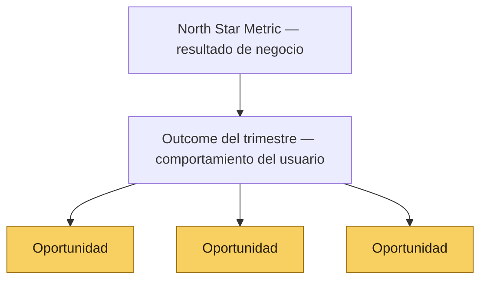
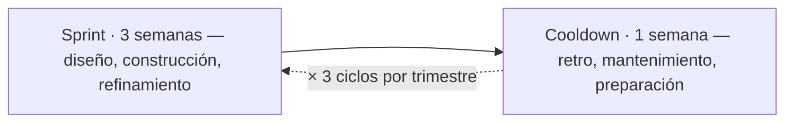
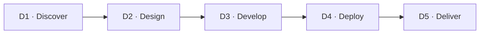
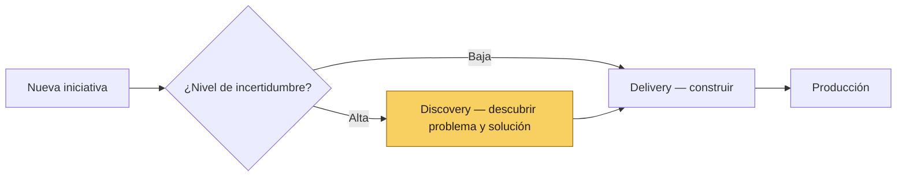

# 🔥 Tripa · Marco de Desarrollo de Producto

*Parte del sistema [Producto de Cabeza, Tripa y Corazón](#/inicio)*

| | |
| --- | --- |
| **Versión** | v1.0 |
| **Estado** | Documento vivo |
| **Audiencia** | Todo el equipo. Es la mesa donde convergen todas las disciplinas |

---

## 💪 Qué es la Tripa

La **Tripa** es el sistema de gestión para el ciclo de vida de producto. Está diseñada bajo los principios de Product-Led Growth (PLG), con el objetivo de escalar de forma sostenible hacia la meta del equipo mediante la eliminación de sesgos, la trazabilidad técnica y la validación de hipótesis de negocio. Si la **[Cabeza](#/cabeza)** aporta la objetividad de la evidencia y el **[Corazón](#/corazon)** el craft y el cuidado del usuario, la **Tripa** es el empuje disciplinado que convierte las decisiones en producto, sprint tras sprint.

La meta es que cada cambio en el producto haga que quien lo usa adquiera:

- **Capacidad:** Porque entiende qué hacer sin ayuda externa.
- **Confianza:** Porque sabe que los datos son fiables y útiles.
- **Profesionalismo:** Porque los resultados que entrega a quienes dependen de él son impecables.

---

## 🛤️ 1 · El Mindset: Dual-Track Agile

*[Diagrama de referencia]*

El desarrollo se ejecuta en dos carriles paralelos y constantes que separan el riesgo de "construir lo incorrecto" del riesgo de "construir mal":

- **Discovery Track (Descubrimiento):** Enfocado en la identificación y validación de problemas de usuario. Su propósito es asegurar que solo las iniciativas con evidencia clara de impacto en el crecimiento o la retención pasen a la fase de construcción.
- **Delivery Track (Ejecución):** Enfocado en la implementación técnica de alta calidad. Su propósito es convertir los requerimientos validados en software funcional, escalable y documentado.

Ambos tracks corren en paralelo. Una iniciativa **no siempre** pasa de Discovery a Delivery en ciclos consecutivos — puede esperar su turno según el Release Plan, la capacidad del equipo, o ajustes estratégicos.

---

## 📊 1.1 La jerarquía de métricas: NSM → Outcome → Oportunidad

Antes de trabajar con el [Opportunity Solution Tree](#/plantillas/opportunity-solution-tree), todos los miembros del equipo deben entender esta jerarquía. Sin ella, los *Outcomes* se confunden con la *NSM* y las *Oportunidades* se confunden con los *Outcomes*.

Operamos con tres niveles de métricas:

| Nivel | Qué mide | Quién lo define | Frecuencia de revisión |
| --- | --- | --- | --- |
| North Star Metric (NSM) | El resultado de negocio principal de la compañía | Liderazgo + PM — no es redefinible por ningún área | Mensual / trimestral |
| Outcome del trimestre | Un comportamiento específico del usuario que Producto puede mover directamente y que contribuye a la NSM | Trío de producto (PM, PD, EM) con Data & Analytics | Trimestral, con checkpoint al tercer ciclo |
| Oportunidad | Un problema concreto del usuario que, si se resuelve, mueve el Outcome | Cualquier área que aporta evidencia; el PM prioriza | Se actualiza durante el trimestre |



### La North Star Metric (NSM)

Un ejemplo de NSM para una plataforma B2B2C es el **número de cuentas activas** — en un producto que conecta administradores de tianguis con sus marchantes, serían los administradores que usan la plataforma de forma regular, reciben y entregan valor a su comunidad de comerciantes.

Es un indicador **rezagado (lagging)**: confirma el resultado acumulado de todo el funnel. El funnel opera así:

| Etapa | Qué ocurre | Actor principal |
| --- | --- | --- |
| TOFU — Awareness | Un administrador descubre el producto, generalmente por recomendación de otro administrador o por búsqueda directa | El administrador actual (boca a boca) + el producto como evidencia de valor |
| MOFU — Consideración | El administrador evalúa si la plataforma resuelve su problema de gestión | El producto — la propuesta de valor debe ser obvia sin intervención humana |
| BOFU — Activación | El administrador completa su configuración inicial y genera su primer reporte | El producto — el onboarding y el AHA Moment son la conversión real |
| Retención | El administrador sigue usando la plataforma porque le genera valor continuo | El producto + Customer Success cuando hay fricción activa |
| Expansión | El administrador incorpora más tianguis, usa más módulos, o recomienda a otros | El producto — la profundidad de uso genera el efecto boca a boca |
| Prevención | Se evita el churn de cuentas en riesgo | Customer Success en coordinación con el producto |

En un modelo Product-Led, **el producto es el principal motor de adquisición, activación, retención y expansión**. Las demás áreas amplifican lo que el producto genera — no lo reemplazan.

> **Importante:** La NSM la definen **Liderazgo + PM** al inicio de cada año. No es una métrica que ningún área puede mover unilateralmente ni redefinir sin esa autorización.

### El Outcome del trimestre

El Outcome es el **indicador adelantado (leading indicator)** que el equipo de Producto se compromete a mover cada trimestre. Es un cambio observable y medible en el comportamiento del usuario que el producto puede causar directamente.

La diferencia entre un indicador adelantado y uno rezagado es simple: el indicador adelantado predice el resultado; el rezagado lo confirma cuando ya ocurrió.

**Ejemplo de la cadena:**

- **NSM (lagging):** Número de cuentas activas — confirma si el negocio creció.
- **Outcome (leading):** % de administradores nuevos que completan la activación en los primeros 14 días — predice si habrá más cuentas activas.
- **Oportunidad:** El administrador nuevo no entiende qué pasos debe completar para tener la plataforma lista — si se resuelve, más administradores completan la activación.

### ¿Por qué esta jerarquía importa?

Cuando no existe esta jerarquía, ocurren tres problemas comunes:

1. **Accountability difuso:** Si el Outcome del trimestre es la NSM, Producto no puede demostrar su impacto porque la NSM la mueven múltiples factores.
2. **Priorización sin dirección:** Sin un Outcome claro, cualquier iniciativa puede justificarse. El [RICE Score](#/guias/rice) sin un Outcome de referencia optimiza por reach y esfuerzo, no por impacto estratégico.
3. **Oportunidades desconectadas:** Sin la cadena causal explícita, el equipo puede trabajar en problemas reales de usuarios que no mueven nada relevante para el trimestre.

---

## ⏱️ 2 · La Cadencia: Sprint + Cooldown

Cada trimestre se divide en **3 ciclos mensuales**. Cada ciclo tiene dos etapas:



| Etapa | Foco | Duración |
| --- | --- | --- |
| Sprint | Diseño, construcción y refinamiento de soluciones de producto | 3 semanas |
| Cooldown | Retrospectiva, mantenimiento, deuda técnica y preparación del siguiente ciclo | 1 semana |

### Durante el Cooldown — dos carriles paralelos

El Cooldown no es tiempo libre. Tiene dos focos simultáneos según el track:

- **Delivery Track (Engineering):** Trabaja en deuda técnica, bugs no críticos, investigación, mantenimiento de infraestructura y refactorización.
- **Discovery Track (PD, Data & Analytics, Customer Success):** Avanza en investigación, generación de insights, actualización de iniciativas y preparación del siguiente Sprint.

PM + Data & Analytics dedican el Cooldown a revisar el estado de las iniciativas activas y preparar el Opportunity Mapping si corresponde al inicio de un nuevo trimestre.

**Responsabilidades por área durante el Cooldown:**

| Área / Rol | Foco |
| --- | --- |
| EM + Engineering | Deuda técnica, bugs no críticos, investigación, mantenimiento de infraestructura y refactorización |
| PD | Revisión de deuda de diseño, actualización de componentes, preparación de insumos visuales para próximas iniciativas, recolección de nueva evidencia y entrega de insights a Data & Analytics |
| Data & Analytics | Análisis de métricas del Sprint anterior, actualización del OST, preparación de insumos para el Opportunity Mapping |
| Customer Success | Consolidación de feedback de usuarios del Sprint anterior, entrega de insights a Data & Analytics |
| PM | Revisión del estado de iniciativas activas, preparación del Opportunity Mapping si aplica al inicio de trimestre |

### La Retrospectiva del Cooldown

El Cooldown incluye dos sesiones de reflexión con propósitos y participantes distintos. No son opcionales — son parte estructural del ciclo.

#### Sesión 1: Retrospectiva de Proceso

**Participantes:** Todo el equipo de producto | **Duración:** 60 min | **Facilita:** PM

Propósito: revisar cómo trabajó el equipo durante el Sprint — qué friccionó, qué funcionó, qué ajustar al proceso.

Preguntas guía:

- ¿Qué funcionó bien en este Sprint que debemos repetir?
- ¿Qué generó fricción o nos frenó?
- ¿Hay algo del framework que no estamos aplicando bien?
- ¿Qué cambiaríamos para el siguiente Sprint?

> **Regla:** Las observaciones son sobre procesos y sistemas, no sobre personas. El objetivo es mejorar el sistema, no evaluar individuos.

#### Sesión 2: Retrospectiva de Resultados

**Participantes:** Todo el equipo de producto | **Duración:** 45 min | **Facilita:** PM

Propósito: revisar el avance de las iniciativas activas y el estado del backlog para el siguiente Sprint.

Agenda:

- Estado de cada iniciativa activa (¿en qué D está? ¿va según plan?)
- ¿Qué entra al siguiente Sprint?
- ¿Hay ajustes al Opportunity Mapping vigente?

---

## 🔄 3 · El Ciclo de las 5Ds

Cada iniciativa atraviesa cinco hitos de validación. Las 5Ds son el **marco conceptual** — le dicen al equipo en qué etapa del pensamiento está una iniciativa. Dentro de cada D viven las fases operativas que determinan qué hacer concretamente.

| D | Fase | Foco operativo | Fases internas | Output |
| --- | --- | --- | --- | --- |
| D1 | Discover | Identificar el problema con evidencia objetiva | Opportunity Mapping → Business Discovery | Iniciativa aprobada + sub-página D1 del Initiative Spec completada (JTBD, evidencia, hipótesis, hipótesis causal) |
| D2 | Design | Definir cómo abordar el problema, validar apuestas y producir la solución | Design Brief → Research → Design Spec → Kick-off → Product Jam | Product Design Brief + Reporte de Hallazgos + RFC + Product Design Spec aprobados en Kick-off y Product Jam |
| D3 | Develop | Construir minimizando costo y riesgo técnico | Product Jam → Delivery Planning → Dev Cycle | Software en staging que pasa los dos Design Reviews |
| D4 | Deploy | Lanzamiento al mercado con preparación total | [Release Checklist](#/plantillas/release-checklist) → Go to Market | Feature en producción + Release Checklist completado + materiales publicados |
| D5 | Deliver | Evaluar el valor real y recolectar aprendizajes | Measure & Learn → Impact Report | [Impact Report](#/plantillas/impact-report) |



---

## 🔀 4 · La Bifurcación: Discovery vs. Delivery

No todas las iniciativas entran al mismo carril. El criterio es el **nivel de incertidumbre**:

- **Alta incertidumbre** (no sabemos bien el problema o la solución) → la iniciativa entra a **Discovery** primero.
- **Baja incertidumbre** (ya hay evidencia suficiente: tickets, datos, solicitudes validadas) → la iniciativa entra directo al **backlog de Delivery**.



PM define la bifurcación de cada iniciativa durante el Opportunity Mapping. Esta decisión no es permanente — si durante Delivery aparece nueva incertidumbre significativa, la iniciativa puede volver a Discovery.

> **Nota sobre los boards:** Las iniciativas de Discovery y Delivery vivirán en boards separados dentro de una carpeta "Product" en la herramienta de gestión. La estructura detallada de estos boards se define en una sesión de configuración de la herramienta de gestión. Por ahora, la bifurcación se registra en el campo "Carril" del Initiative Spec de cada iniciativa.

---

## 📄 5 · El Initiative Spec — Documento Vivo por Iniciativa

Cada iniciativa tiene **un solo documento** que nace cuando se aprueba y se alimenta a lo largo de todas las fases. No es un documento que se redacta de una vez — cada sección se activa cuando arranca la fase correspondiente.

**Estructura del Initiative Spec:**

```yaml
TASK en la herramienta de gestión: [Nombre de la iniciativa]
  Status, assignee, fechas, subtareas de trabajo
  DOC: Initiative Spec
    Pagina raiz: Resumen ejecutivo + Bitacora + estado actual de la iniciativa
    Sub-pagina D1: PRD (Contexto, evidencia, JTBD, requerimientos de producto, hipotesis, hipotesis causal Oportunidad hacia Outcome hacia NSM)
    Sub-pagina D2:
      - Product Design Brief (estrategia de diseno, apuestas, riesgos UX)
      - Plan de Investigacion + Reporte de Hallazgos (Motor de Evidencia)
      - RFC (solucion tecnica)
      - Product Design Spec (solucion final, handoff a ingenieria)
    Sub-pagina D3: ADR (si aplica)
    Sub-pagina D4: Release Checklist
    Sub-pagina D5: Impact Report + Post Mortem (si aplica)
```

**¿Cuándo se llena cada sección?**

| Fase | Responsable de llenar | Activador |
| --- | --- | --- |
| D1: Discover | PM / Data & Analytics / PD | Aprobación en Opportunity Mapping |
| D2: Design (apertura) | PD escribe el Design Brief · consultor de método revisa · PM firma · PD escribe el Plan de Investigación y ejecuta el research | Gate D1 → D2 (Brief firmado dispara el research) |
| D2: Design (cierre) | PD (Design Spec, parte diseño) + EM (RFC, parte técnica) | Reporte de Hallazgos publicado dispara el Spec · Kick-off cierra D2 |
| D3: Develop | EM | Gate D2 → D3 + Kick-off |
| D4: Deploy | Customer Success + PD + Data & Analytics | Gate D3 → D4 + Kick-off |
| D5: Deliver | Data & Analytics + PM | Gate D4 → D5 |

---

## 🧩 6 · Tipos de requerimientos y separación de dominios

Una iniciativa tiene un solo problema pero produce tres tipos de requerimientos distintos, cada uno con su dueño y su autoridad. Mantener esa separación clara es la diferencia entre un equipo que construye lo correcto con la calidad correcta, y un equipo donde cualquier rol levanta cualquier requerimiento y termina implementando bonito pero equivocado.

### 6.1 Los tres tipos y sus owners

| Tipo de requerimiento | Qué define | Dueño con autoridad | Documento donde vive |
| --- | --- | --- | --- |
| De producto | Qué debe hacer el sistema para resolver el problema | PM | PRD (D1) |
| De diseño / UX | Cómo el usuario interactúa con esa capacidad | PD | Design Brief + Spec (D2) |
| Técnicos / no funcionales | Cómo el sistema implementa esa capacidad | EM | RFC (D2) |

La jerarquía es **Producto → Diseño → Técnico**. Los técnicos sirven a los de diseño, y los de diseño sirven a los de producto. Cuando se invierte con el EM decidiendo qué se construye, o PD decidiendo qué problemas resolver, el equipo construye con calidad lo que no debió construirse. Es el síntoma que la red flag de saltarse el proceso nombra cuando dice "alguien del equipo va directamente a otra área a solicitar cambios sin pasar por el proceso".

> **Regla.** La separación no es subordinación. Cada dueño tiene autoridad final en su dominio. PD no es subordinado del PM; tiene autoridad sobre el diseño. EM no es subordinado del PM ni de PD; tiene autoridad sobre la implementación. Lo que hace coherente al equipo es que cada uno respete los dominios de los demás y aporte input al dominio ajeno para mejorar la decisión.

### 6.2 Requerimientos de producto — qué levanta el PM

Son seis categorías. Todas se derivan del problema y del JTBD, no de la solución. Viven en el D1 PRD como sección explícita.

1. **Funcionales:** qué capacidades debe tener el sistema. *Ejemplo:* "El administrador debe poder cancelar el servicio sin perder el historial de transacciones."
2. **Reglas de negocio:** la lógica comercial específica. *Ejemplo:* "El cobro se inicia al inicio del próximo periodo de facturación tras la activación."
3. **Objetivos de experiencia de usuario (UX Goals):** qué debe lograr el usuario, *sin especificar cómo*. La diferencia con un requerimiento de diseño está en el nivel de abstracción. *Ejemplo:* "El administrador debe entender en su primera visita a la sección qué documentos faltan y qué hacer a continuación." Cómo se logra visualmente es tarea de PD.
4. **De datos:** qué información se captura, persiste y muestra. No incluye cómo se modelan tablas, eso es del RFC. *Ejemplo:* "Se debe registrar la fecha exacta de cada cambio de estado en el proceso de alta para auditoría."
5. **De cumplimiento:** marcos legales o regulatorios aplicables, y restricciones legales identificadas durante discovery. *Ejemplo:* "El servicio opera bajo el marco regulatorio aplicable; la cédula del proveedor de pagos usa la leyenda acordada con asesoría legal."
6. **De integración:** qué sistemas externos están en juego y qué se intercambia. No incluye qué endpoints específicos, eso es del RFC. *Ejemplo:* "Integración con proveedor externo X para alta de cuentas; integración con servicio Y para firma electrónica."

> **Regla.** Si el PM se encuentra escribiendo "la cancelación debe tener un botón rojo con confirmación modal" o "usar React con Tailwind", está invadiendo el dominio de PD o EM respectivamente. La señal es escribir cómo se ve o cómo se construye, en lugar de qué debe hacer.

### 6.3 Requerimientos de diseño

PD parte de los requerimientos de producto del D1 y los traduce a especificación de experiencia.

Viven en el Design Spec (D2):

- Flujos de navegación (qué pantalla lleva a cuál, qué pasos hace el usuario)
- Criterios de interacción (clics máximos, confirmaciones, undo)
- Estados visuales (vacío, carga, error, éxito, deshabilitado)
- Accesibilidad (contraste AA, navegación por teclado, screen readers)
- Comportamiento por dispositivo (mobile, tablet, desktop)
- Edge cases de UX (qué se muestra si el endpoint falla, si no hay datos, si la red se cae)

### 6.4 Requerimientos técnicos

EM parte de los requerimientos de producto del D1 y de los requerimientos de diseño del D2, y los traduce a especificación técnica. Viven en el RFC (D2):

- Arquitectura (qué servicios se tocan, qué se crea nuevo)
- Modelo de datos (tablas, campos, migraciones, índices)
- Endpoints / servicios (qué se expone, qué consume)
- Requerimientos no funcionales (performance, escalabilidad, seguridad, observabilidad)
- Estrategia de despliegue (feature flag, rollback, fases)
- Riesgos técnicos y mitigaciones

### 6.5 Input vs autoridad: la dinámica entre roles

Que cada tipo tenga un dueño con autoridad no significa que los demás roles no aporten. Significa que aportan como **input**, no como decisión.

- Cuando PD descubre que para que el usuario logre un objetivo necesita además otra capacidad no contemplada en los requerimientos de producto, **informa** al PM. El PM decide si agrega el requerimiento o no de acuerdo al JTBD y al scope.
- Cuando EM descubre que un requerimiento de producto es técnicamente inviable o desproporcionadamente costoso, **informa** al PM. El PM decide si ajusta el requerimiento o lo mantiene.
- Cuando el PM tiene una idea de cómo debería verse la UI, **informa** a PD. PD decide cómo se diseña.
- Cuando el PM tiene una idea de cómo implementar técnicamente algo, **informa** a EM. EM decide cómo se construye.

Esa dinámica de información en ambas direcciones con autoridad clara en cada dominio es lo que permite que un equipo pequeño avance rápido sin sacrificar la calidad de cada disciplina.

### 6.6 Scope creep

El scope creep puede originarse desde cualquier rol: PD agregando polish no acordado, EM agregando refactors no acordados, el cliente pidiendo cambios durante D3, el PM agregando ideas a media iniciativa. Cualquier rol es fuente potencial.

Sin embargo, **el PM es el único con autoridad para evitarlo o aceptarlo**. Su responsabilidad es ser el guardián del alcance, no el productor exclusivo de los requerimientos. Cuando alguien propone agregar algo:

1. El PM evalúa si el agregado se justifica contra el outcome y la evidencia.
2. Si se justifica, el alcance se actualiza formalmente (sección de Alcance explícito del D1) y la decisión se registra en la sub-sección de Decisiones tomadas del Resumen Ejecutivo.
3. Si no se justifica, queda como Feature Request para el siguiente Opportunity Mapping (ver Glosario Operativo).

### 6.7 RACI complementario por tipo de requerimiento

Esta tabla complementa a la del RACI por fase. No la reemplaza. Una describe responsabilidades en cada D; esta describe responsabilidades por tipo de requerimiento, transversal a las D.

**[ R ] Responsable:** Redacta el requerimiento | **[ A ] Autoridad:** Aprueba y decide en caso de conflicto | **[ C ] Consultado:** Aporta input que el A debe escuchar | **[ I ] Informado:** Recibe el requerimiento finalizado para alinear su trabajo derivado

| Tipo de requerimiento | PM | Data & Analytics | EM | Customer Success | PD |
| --- | --- | --- | --- | --- | --- |
| De producto | A + R | C | C | C | C |
| De diseño / UX | C | C | C | C | A + R |
| Técnicos / no funcionales | C | I | A + R | I | C |

**Lectura de la tabla.** En cada tipo de requerimiento hay un solo A y un solo R (que pueden ser el mismo rol). Los C aportan input, pero su input no obliga al A. Los I se informan del requerimiento ya finalizado para alinear su trabajo derivado. En requerimientos de producto, Customer Success entra como C porque su conocimiento del usuario alimenta la definición; en requerimientos técnicos, entra como I porque debe conocer las restricciones para soportar a clientes después del release.

### 6.8 Anti-patrones

Síntomas de que la separación de dominios no se está respetando. Refuerzan los Red Flags:

1. **El PRD describe la solución, no el problema.** Si el D1 menciona componentes de UI, tecnologías o estructura de pantallas, está invadiendo dominios de PD y EM.
2. **El Design Spec o el RFC redefine el alcance.** Si en D2 aparecen capacidades nuevas que no estaban en los Requerimientos de producto del D1, sin haber pasado por una decisión formal del PM, se está moviendo el alcance silenciosamente.
3. **El PM prescribe la solución de diseño.** "Quiero un dropdown con tres opciones" en vez de "el administrador debe poder elegir entre estos tres modos de operación". La primera quita autonomía a PD; la segunda da claridad sin invadir.
4. **EM toma decisiones de producto.** "Decidimos no implementar X porque era complejo" sin que el PM haya aceptado la decisión. EM informa la complejidad; el PM decide si se mantiene o se ajusta.
5. **Un rol salta directamente a otro sin pasar por el PM.** PD pidiéndole a EM cambios no acordados, o EM avanzando con cambios de UX que no consultó con PD. Es la red flag de saltarse el proceso, explícita.
6. **Las "ideas" de un rol fuera de su dominio se tratan como decisiones.** Si el PM opina sobre UX, es input para PD, no decisión. Si PD opina sobre alcance, es input para el PM, no decisión.

---

## 🧮 7 · Matriz de Responsabilidades (RACI) por Fase

**[ R ] Responsable:** Ejecuta la tarea | **[ A ] Autoridad:** Tiene la última palabra | **[ C ] Consultado:** Aporta feedback | **[ I ] Informado:** Recibe la notificación de cierre

| Fase | PM | Data & Analytics | EM | Customer Success | PD |
| --- | --- | --- | --- | --- | --- |
| D1: Discover | A: Filtra y aprueba iniciativas con alineación estratégica. Se asegura que las iniciativas hagan sentido hacia el Outcome del trimestre | R: Provee datos de retención y fricción desde el funnel y los triangula con la evidencia cualitativa<br>Ayuda a redactar el PRD | C: Informa sobre limitaciones técnicas previas | C: Aporta feedback cualitativo continuo como canal de voz del cliente | R: Facilita el [Motor de Evidencia](#/cabeza). Conduce la investigación, organiza la evidencia de todas las áreas y la convierte en insights antes de la sesión de Opportunity Mapping |
| D2: Design | R/A: Aprueba el Brief y el Spec. Firma como autoridad final. Garantiza que no haya Scope Creep en ambos artefactos | R: Valida que las apuestas del Brief y la solución del Spec cumplan con el JTBD. Define el plan de medición PLG y KPIs de activación | C en el Brief (viabilidad técnica temprana vía Revisión Cruzada Asincrónica) · R en el Spec (co-autor del RFC y la parte técnica del Spec) | C: Valida que la propuesta sea comprensible para el usuario sin ayuda | R: Autor del Design Brief y del Design Spec. Conduce el research que valida las apuestas. Garantiza usabilidad y flujo centrado en el usuario |
| D3: Develop | I: Recibe reportes de progreso y desviaciones | I: Se prepara para implementación de métricas y guías | A: Autoridad en calidad del código, rendimiento y ADRs | I: Comienza preparación de materiales para Help Center | C: Design Reviews en checkpoint de mitad y cierre de Sprint |
| D4: Deploy | I: Recibe confirmación de que la herramienta está lista para GTM | R: Ejecuta flujos de guía para facilitar el AHA Moment.<br>A: Revisa y aprueba manuales y guías de ayuda. | A: Garantiza despliegue seguro, estable y sin degradación | R: Publica manuales y guías para que el usuario sea autónomo (con aprobación explícita de Data & Analytics) | R: Verifica que la implementación final respete el estándar de diseño |
| D5: Deliver | I: Evalúa si el impacto justifica la inversión de recursos | R: Mide KPIs de adopción y valida cumplimiento de la hipótesis | A: Lidera el análisis técnico post-lanzamiento y Post-mortem si hay fallos. Monitorea los sistemas y verifica que el equipo no trabaje en refactorización durante el sprint. | C: Recopila feedback cualitativo y satisfacción del usuario y lo aporta con evidencias. | R: Sintetiza el aprendizaje de uso real (datos, entrevistas) y evalúa si la solución requiere iteraciones |

---

## 🚦 8 · Mecanismos de Validación y Control

El Marco de Desarrollo establece puntos críticos de control para asegurar que la ejecución se mantenga fiel a los objetivos de negocio:

- **Control D1 → D2:** No se diseña nada sin evidencia. El sentimiento o la intuición por sí solos no son suficientes para consumir recursos de diseño e ingeniería.
- **Control D2 → D3:** No se programa nada sin haber completado el Kick-off y el Product Jam. El Kick-off requiere que los cuatro artefactos de D2 estén publicados: Product Design Brief (con apuestas firmadas), Reporte de Hallazgos (del research que validó las apuestas), RFC y Product Design Spec. La cadena es estricta: el Brief firmado dispara el research; el Reporte publicado dispara el Spec; el Spec con el RFC se aprueban en el Kick-off.
- **Control D3 → D4 (Design Review doble):**
    - **Checkpoint 1 — Mitad del Sprint:** PD revisa lo construido contra el diseño aprobado. Las desviaciones se corrigen antes de continuar.
    - **Checkpoint 2 — Cierre de D3:** Gate formal de salida. Si el diseño no está respetado, el feature no entra a Deploy.
- **Control D4 → D5:** No se cierra el proyecto con el lanzamiento. El "Done" real se alcanza cuando se resuelve el JTBD y los datos lo confirman en la fase de Deliver.

### Revisión Cruzada (Asincrónica)

Antes de formalizar cualquier solución, EM y PD deben validar mutuamente sus propuestas de forma asincrónica. El diseño debe ser técnicamente viable y la solución técnica debe respetar los estándares de usabilidad.

### Kick-off (D2 → D3)

Sesión de 1 día donde PM presenta el contexto del PRD, PD presenta las apuestas del Brief y el veredicto del Reporte de Hallazgos, EM presenta el RFC con la propuesta técnica, y PD presenta el Design Spec con la solución final y los flujos de usuario. El equipo de ingeniería calcula el esfuerzo y define el plan de trabajo de desarrollo.

**Entregable:** Initiative Spec actualizado + board de ingeniería con todas las acciones definidas.

*Ejemplo: El equipo se reúne para el Kick-off del módulo de presupuestos. PM recuerda el problema del PRD. PD presenta las apuestas del Design Brief y el veredicto del Reporte: tres apuestas pasaron, una pivotó. EM presenta el RFC con el modelo de datos. PD muestra el Design Spec con la solución final. El equipo estima 2 Sprints y crea las tareas en la herramienta de gestión. La iniciativa queda lista para entrar a D3.*

### Product Jam (Gate D3)

Sesión de 1 día donde PD presenta los diseños finales al equipo de ingeniería para alinear el trabajo de desarrollo con el diseño aprobado. Es el gate formal que confirma la entrada a D3.

**Entregable:** Plan de release confirmado y cualquier ajuste de alcance documentado antes de que empiece el *Dev Cycle*.

*Ejemplo: Dos semanas después del Kick-off, PD muestra los diseños finales del módulo de presupuestos. El equipo detecta que un flujo de edición necesita un endpoint adicional no contemplado en el RFC. Se ajusta el plan y se documenta el cambio antes de que cualquier dev escriba una línea de código.*

---

## 👥 9 · Responsabilidad

Cada iniciativa es liderada por los roles que representan las funciones clave del producto:

| Rol | Perspectiva | Función |
| --- | --- | --- |
| PM | ¿Tiene sentido de negocio y se alinea con la estrategia? | Business Value |
| PD | ¿Los usuarios necesitan o quieren esta solución? | Desirability |
| EM | ¿Podemos construirlo de forma escalable? | Technical Viability |

> **El trío de liderazgo.** Toda iniciativa la lideran tres roles que representan las tres preguntas clave del producto: **Product Manager** (valor de negocio y estrategia), **Product Designer** (deseabilidad y experiencia) y **Engineering Manager** (viabilidad técnica). **Data & Analytics (Growth)** aporta la lectura cuantitativa que sostiene las tres perspectivas. En equipos pequeños un mismo rol puede cubrir más de una de estas perspectivas de forma temporal; lo importante es que las tres estén representadas en cada decisión.

---

## 🗄️ 10 · Protocolos de Memoria Técnica

La documentación técnica obligatoria se activa bajo criterios de rigor basados en método científico:

- **ADR (Architecture Decision Record):** Obligatorio ante cambios en el esquema de datos core, adopción de nuevas tecnologías, o cambios en la arquitectura de comunicación entre servicios.
- **Post-mortem:** Obligatorio ante incidentes de seguridad/financieros, caídas del sistema, o cuando una iniciativa de impacto no mueva la métrica de éxito definida en el PRD.

Estos documentos viven como sub-páginas del Initiative Spec de la iniciativa correspondiente, no como documentos aislados.

---

## 🚩 11 · Red Flags — Síntomas de Mal Uso del Framework

El Marco de Desarrollo no es infalible. Si observas alguno de estos síntomas, es señal de que algo en el proceso necesita atención:

1. Todo es una prioridad, o no se prioriza con base en impacto al Outcome del trimestre
2. Roadmaps de más de 6 meses (2 trimestres)
3. No se puede articular con claridad el valor de negocio de una iniciativa ni su conexión al Outcome del trimestre
4. Hay demasiadas cosas en el backlog sin criterio de entrada claro
5. La deuda técnica y de diseño están siempre fuera de scope
6. Se vuelve normal llevarse trabajo incompleto al siguiente Sprint de forma habitual
7. Se omite el Cooldown o el Post-mortem porque "no hay tiempo"
8. Un área recibe el feature sin tiempo planificado para hacer su trabajo
9. Falta de voz del equipo por desconfianza o apatía
10. Se trata el framework como algo rígido e infalible en lugar de adaptarlo al contexto
11. Una sola persona concentra todo el conocimiento de una iniciativa
12. Alguien del equipo va directamente a otra área (diseño, ingeniería) a solicitar cambios sin pasar por el proceso y aprobación explícita (ver matriz RACI)
13. Se confunde un bug con una nueva iniciativa o mejora de alcance
14. Un área o individuo asume que todas sus solicitudes tienen prioridad automática
15. Las iniciativas se desarrollan porque "el cliente dijo". Una solicitud del cliente puede señalar una Oportunidad válida. El equipo de Producto valida si esa Oportunidad conecta con el Outcome del trimestre antes de incluirla en el árbol. La presión del cliente no es evidencia de impacto estratégico.

---

## 🚨 12 · Protocolo de Urgencias

El Marco de Desarrollo asume que toda iniciativa entra por el Opportunity Mapping. Sin embargo, existen situaciones que requieren acción inmediata sin pasar por el proceso estándar.

### ¿Qué califica como urgencia?

Una situación califica como urgencia cuando cumple al menos uno de estos criterios:

- Afecta directamente la operación de cuentas activas (el sistema no funciona para una funcionalidad crítica)
- Genera riesgo financiero para los marchantes o administradores (cálculos incorrectos, cobros duplicados, errores en transacciones)
- Implica un riesgo legal o de seguridad de datos
- Caída del sistema de más de 10 minutos

### ¿Qué NO califica como urgencia?

- Solicitudes de clientes o áreas que no cumplen los criterios anteriores, independientemente de la presión comercial
- Features que "idealmente" deberían estar antes de una fecha
- Bugs de baja criticidad que no bloquean la operación del administrador

### Proceso de excepción

1. **EM evalúa** el impacto técnico y confirma si aplica alguno de los criterios de urgencia
2. **PM autoriza** la excepción — es el único rol con autoridad para declarar una urgencia. Si PM no está disponible, Liderazgo puede autorizar. Nadie más tiene esta autoridad.
3. **EM ejecuta** la solución con el nivel mínimo de documentación posible (al menos un registro del problema y la solución en la herramienta de gestión)
4. **Post-mortem breve** (30 min) una vez resuelta la urgencia, para documentar causa raíz y prevenir recurrencia

> **Regla:** La presión comercial no es un criterio de urgencia. Si el problema no pone en riesgo la operación, los datos o la seguridad, entra al proceso normal en el siguiente Opportunity Mapping.

---

## 📖 13 · Glosario Operativo — Cómo Clasificamos el Trabajo Entrante

No todo el trabajo que llega al equipo de producto es una iniciativa. Clasificar correctamente el trabajo entrante es la primera línea de defensa contra el scope creep y las prioridades falsas.

### North Star Metric (NSM)

El indicador principal del negocio. Mide el valor que el producto entrega al mercado de forma sostenida. Es un indicador **rezagado (lagging)**: confirma el resultado acumulado de todo el funnel a lo largo del tiempo. El equipo de Producto no puede atribuirle su impacto directamente, porque la NSM depende de múltiples factores del funnel.

NSM del equipo: **número de cuentas activas**. La definen **Liderazgo + PM** al inicio de cada año. No es redefinible por ningún área.

### Outcome

El comportamiento específico y medible del usuario que el equipo de Producto se compromete a cambiar durante un trimestre. Es un **indicador adelantado (leading)**: si se mueve en la dirección correcta, predice que la NSM mejorará.

Un Outcome válido cumple los tres criterios siguientes:

1. El producto puede causarlo directamente, sin requerir que Customer Success o Marketing intervengan para que el comportamiento ocurra;
2. Tiene una hipótesis causal documentada que conecta el Outcome con la NSM;
3. Tiene un baseline real y una meta concreta con fecha.

Un Outcome no es lo que el equipo construye (eso es un Output). No es la NSM. Es el comportamiento específico del usuario que el producto puede cambiar y que, si cambia, predice que la NSM mejorará.

**Fórmula de referencia:** *"Aumentar / Reducir [comportamiento observable del administrador] de [baseline actual] a [meta] para [fecha]."* Esta fórmula es una guía, no una camisa de fuerza.

Ver la sección de Opportunity Mapping para ejemplos y el test diagnóstico completo.

### Output

Lo que el equipo construye o entrega: un feature, un flujo, una pantalla, una campaña. Un Output no es un Outcome. Construir algo no garantiza mover el comportamiento del usuario.

> **Señal de alerta:** Si el equipo define su éxito por haber lanzado algo ("lanzamos el módulo de pagos"), está midiendo Outputs. El éxito real se mide por el cambio de comportamiento que ese Output produjo.

### Leading indicator (indicador adelantado)

Métrica que predice un resultado futuro. Cambia antes de que el resultado ocurra, lo que permite al equipo ajustar el rumbo a tiempo. El Outcome del trimestre siempre debe ser un indicador adelantado.

### Lagging indicator (indicador rezagado)

Métrica que confirma un resultado que ya ocurrió. Útil para validar, pero no para tomar decisiones en tiempo real. La NSM es un indicador rezagado.

### Hipótesis causal

El argumento que conecta una Oportunidad con el Outcome y el Outcome con la NSM. Sigue el formato:

*"Creemos que [problema del usuario] impide [comportamiento que el Outcome busca mover] porque [evidencia concreta]. Si resolvemos este problema, [comportamiento] mejorará, lo que moverá el Outcome del trimestre."*

Toda Oportunidad en el OST debe tener su hipótesis causal documentada. Sin ella, la Oportunidad no puede entrar al árbol del trimestre.

### AHA Moment

El momento específico en el que un usuario experimenta por primera vez el valor real de la plataforma. Ejemplo: un administrador de tianguis que completa su configuración inicial y genera su primer reporte de cobro de cuotas. Los usuarios que alcanzan su AHA Moment tienen significativamente mayor retención a 90 días.

### Bug

Comportamiento del sistema que difiere de lo que el PRD o el RFC especificaron como correcto. El sistema hace algo diferente a lo que fue diseñado para hacer.

- **Quién lo reporta:** Cualquier persona del equipo o usuario
- **Quién lo valida:** EM confirma si es un bug real o comportamiento esperado
- **Cómo entra al proceso:** Directo al backlog técnico de Engineering. No pasa por Opportunity Mapping.

*Ejemplo: "Al generar el reporte de cobro de cuotas, los totales no coinciden con la suma de los adeudos individuales." El RFC especificó que los totales deben ser la suma exacta de los registros. Esto es un bug.*

*Contraejemplo: "El botón de exportar debería estar más visible." El diseño aprobado no especificó la posición del botón como criterio de aceptación. Esto NO es un bug — es un feature request.*

### Nueva Iniciativa

Una oportunidad de mejora o funcionalidad nueva que requiere PRD y pasa por el proceso completo de las 5Ds. Debe tener evidencia que la respalde y conectarse con el Outcome del trimestre.

- **Quién la propone:** Cualquier persona del equipo
- **Quién la aprueba:** PM en el Opportunity Mapping
- **Cómo entra al proceso:** Por el Opportunity Mapping. Sin evidencia ni conexión al Outcome del trimestre, no es una iniciativa — es un feature request.

*Ejemplo: "Customer Success ha recibido cinco solicitudes distintas de administradores que quieren exportar el reporte de cobro de cuotas a PDF para presentarlo a su mesa directiva. Tenemos los tickets que lo respaldan." Hay evidencia, hay un JTBD claro. Esto es una iniciativa.*

### Feature Request

Una solicitud de usuario o de cualquier área que todavía no tiene evidencia suficiente para ser considerada una iniciativa. Es una señal, no una decisión.

- **Quién la recibe:** Cualquier área o canal público de feedback (ej. un portal de roadmap abierto a usuarios)
- **Dónde va:** Al backlog de exploración, disponible para el siguiente Opportunity Mapping
- **Cómo entra al proceso:** Solo entra al plan si en el Opportunity Mapping se decide priorizarla con base en evidencia acumulada

*Ejemplo: "Un administrador pidió que el menú lateral tenga un color diferente." No hay evidencia de que esto afecte a más usuarios ni mueva la North Star Metric. Va al backlog de exploración.*

**Regla de clasificación:** Si no se puede responder *"¿qué problema del administrador resuelve esto, cuántos usuarios lo tienen, y cómo conecta con el Outcome del trimestre?"* con evidencia concreta, es un feature request — no una iniciativa.

> **Señal de alerta:** Cuando alguien lleva una solicitud directamente a Product Design o Engineering sin pasar por este proceso de clasificación, es un Red Flag (ver Red Flags, punto 12).

### Scope Creep

El **scope creep** (o corrupción/desviación del alcance) es la expansión incontrolada de los requisitos de una iniciativa después de haber iniciado, sin ajustes en presupuesto, tiempo o recursos. Ocurre cuando se añaden tareas o características sin aprobación formal, causando retrasos, sobrecostos y fatiga en el equipo.

---

## 📚 Referencias y Bibliografía

- Product-Led Growth (Wes Bush / Reforge)
- Software as a Science (Dan Martell)
- Dual Track Agile (Marty Cagan)
- The RFC Process (IETF / Steve Crocker)
- Data & Analytics Levers and How to Find Them (Matt Lerner)
- Dual-Track Agile Framework (Marty Cagan)
- Shape Up (Basecamp)
- Opportunity Solution Tree (Teresa Torres)

*Este documento constituye la base operativa del Marco de Desarrollo. Cualquier modificación a este proceso debe ser aprobada por el PM para asegurar la integridad del sistema.*

---

## 🌳 Opportunity Solution Tree

> **Módulo migrado a [Plantillas, Guías y Craft](#/plantillas).**
> El [Opportunity Solution Tree](#/plantillas/opportunity-solution-tree) —qué es, los 4 niveles, cómo se construye paso a paso, el RICE Score y el ejemplo trabajado— vive ahora en el repositorio central, en *§1 · Plantillas*. La Tripa lo usa en su fase Discover; el artefacto reutilizable vive en la barra. Una sola fuente de verdad.

---

## ✅ Release Checklist

> **Módulo migrado a [Plantillas, Guías y Craft](#/plantillas).**
> El [Release Checklist](#/plantillas/release-checklist) —dimensiones de lanzamiento y riesgo, las secciones por área, la cadena de aprobación y el calendario de timings— vive ahora en el repositorio central, en *§1 · Plantillas*. La Tripa lo invoca en D4 (Deploy).

---

## 📈 Impact Report

> **Módulo migrado a [Plantillas, Guías y Craft](#/plantillas).**
> El [Impact Report](#/plantillas/impact-report) —estructura, estándar de calidad, cómo se comparte y el ejemplo— vive ahora en el repositorio central, en *§1 · Plantillas*. La Tripa lo produce en D5 (Deliver) para cerrar el loop hacia el Opportunity Mapping.
