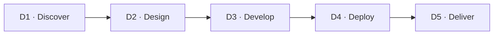

# 🔄 3 · El Ciclo de las 5Ds

*Sección de [Tripa · Marco de Desarrollo de Producto](#/tripa)*

---

Cada iniciativa atraviesa cinco hitos de validación. Las 5Ds son el **marco conceptual** — le dicen al equipo en qué etapa del pensamiento está una iniciativa. Dentro de cada D viven las fases operativas que determinan qué hacer concretamente.

| D | Fase | Foco operativo | Fases internas | Output |
| --- | --- | --- | --- | --- |
| D1 | Discover | Identificar el problema con evidencia objetiva | Opportunity Mapping → Business Discovery | Iniciativa aprobada + sub-página D1 del Initiative Spec completada (JTBD, evidencia, hipótesis, hipótesis causal) |
| D2 | Design | Definir cómo abordar el problema, validar apuestas y producir la solución | Design Brief → Research → Design Spec → Kick-off → Product Jam | Product Design Brief + Reporte de Hallazgos + RFC + Product Design Spec aprobados en Kick-off y Product Jam |
| D3 | Develop | Construir minimizando costo y riesgo técnico | Product Jam → Delivery Planning → Dev Cycle | Software en staging que pasa los dos Design Reviews |
| D4 | Deploy | Lanzamiento al mercado con preparación total | [Release Checklist](#/plantillas/release-checklist) → Go to Market | Feature en producción + Release Checklist completado + materiales publicados |
| D5 | Deliver | Evaluar el valor real y recolectar aprendizajes | Measure & Learn → Impact Report | [Impact Report](#/plantillas/impact-report) |

