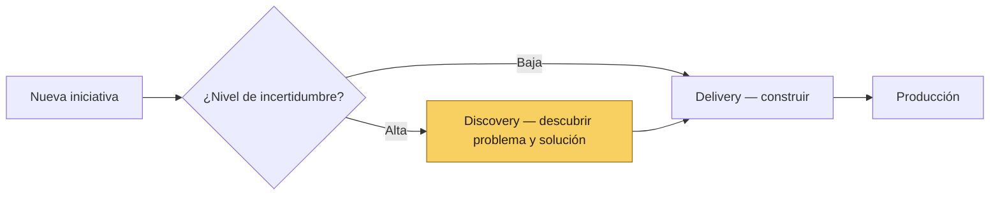

# 🔀 4 · La Bifurcación: Discovery vs. Delivery

*Sección de [Tripa · Marco de Desarrollo de Producto](#/tripa)*

---

No todas las iniciativas entran al mismo carril. El criterio es el **nivel de incertidumbre**:

- **Alta incertidumbre** (no sabemos bien el problema o la solución) → la iniciativa entra a **Discovery** primero.
- **Baja incertidumbre** (ya hay evidencia suficiente: tickets, datos, solicitudes validadas) → la iniciativa entra directo al **backlog de Delivery**.

PM define la bifurcación de cada iniciativa durante el Opportunity Mapping. Esta decisión no es permanente — si durante Delivery aparece nueva incertidumbre significativa, la iniciativa puede volver a Discovery.

> **Nota sobre los boards:** Las iniciativas de Discovery y Delivery vivirán en boards separados dentro de una carpeta "Product" en la herramienta de gestión. La estructura detallada de estos boards se define en una sesión de configuración de la herramienta de gestión. Por ahora, la bifurcación se registra en el campo "Carril" del Initiative Spec de cada iniciativa.
