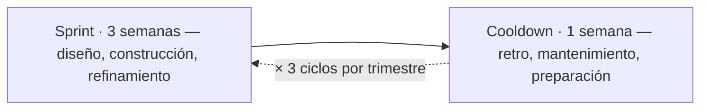

# ⏱️ 2 · La Cadencia: Sprint + Cooldown

*Sección de [Tripa · Marco de Desarrollo de Producto](#/tripa)*

---

Cada trimestre se divide en **3 ciclos mensuales**. Cada ciclo tiene dos etapas:

| Etapa | Foco | Duración |
| --- | --- | --- |
| Sprint | Diseño, construcción y refinamiento de soluciones de producto | 3 semanas |
| Cooldown | Retrospectiva, mantenimiento, deuda técnica y preparación del siguiente ciclo | 1 semana |

## Durante el Cooldown — dos carriles paralelos

El Cooldown no es tiempo libre. Tiene dos focos simultáneos según el track:

- **Delivery Track (Engineering):** Trabaja en deuda técnica, bugs no críticos, investigación, mantenimiento de infraestructura y refactorización.
- **Discovery Track (PD, Data & Analytics, Customer Success):** Avanza en investigación, generación de insights, actualización de iniciativas y preparación del siguiente Sprint.

PM + Data & Analytics dedican el Cooldown a revisar el estado de las iniciativas activas y preparar el Opportunity Mapping si corresponde al inicio de un nuevo trimestre.

**Responsabilidades por área durante el Cooldown:**

| Área / Rol | Foco |
| --- | --- |
| EM + Engineering | Deuda técnica, bugs no críticos, investigación, mantenimiento de infraestructura y refactorización |
| PD | Revisión de deuda de diseño, actualización de componentes, preparación de insumos visuales para próximas iniciativas, recolección de nueva evidencia y entrega de insights a Data & Analytics |
| Data & Analytics | Análisis de métricas del Sprint anterior, actualización del OST, preparación de insumos para el Opportunity Mapping |
| Customer Success | Consolidación de feedback de usuarios del Sprint anterior, entrega de insights a Data & Analytics |
| PM | Revisión del estado de iniciativas activas, preparación del Opportunity Mapping si aplica al inicio de trimestre |

## La Retrospectiva del Cooldown

El Cooldown incluye dos sesiones de reflexión con propósitos y participantes distintos. No son opcionales — son parte estructural del ciclo.

### Sesión 1: Retrospectiva de Proceso

**Participantes:** Todo el equipo de producto | **Duración:** 60 min | **Facilita:** PM

Propósito: revisar cómo trabajó el equipo durante el Sprint — qué friccionó, qué funcionó, qué ajustar al proceso.

Preguntas guía:

- ¿Qué funcionó bien en este Sprint que debemos repetir?
- ¿Qué generó fricción o nos frenó?
- ¿Hay algo del framework que no estamos aplicando bien?
- ¿Qué cambiaríamos para el siguiente Sprint?

> **Regla:** Las observaciones son sobre procesos y sistemas, no sobre personas. El objetivo es mejorar el sistema, no evaluar individuos.

### Sesión 2: Retrospectiva de Resultados

**Participantes:** Todo el equipo de producto | **Duración:** 45 min | **Facilita:** PM

Propósito: revisar el avance de las iniciativas activas y el estado del backlog para el siguiente Sprint.

Agenda:

- Estado de cada iniciativa activa (¿en qué D está? ¿va según plan?)
- ¿Qué entra al siguiente Sprint?
- ¿Hay ajustes al Opportunity Mapping vigente?
