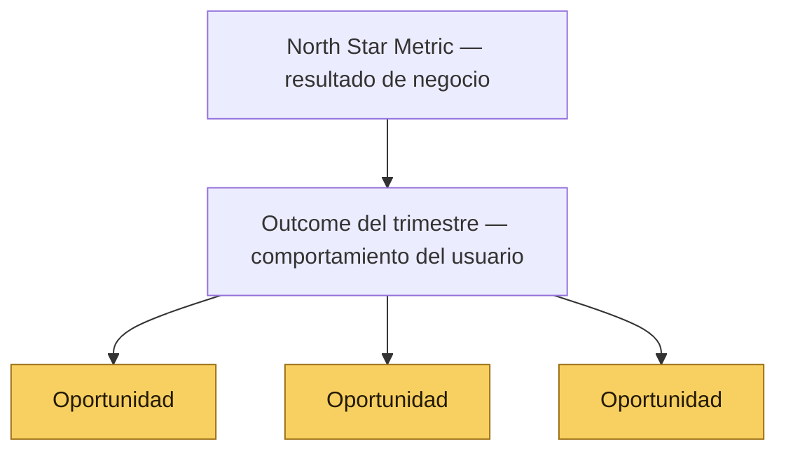

# 📊 1.1 La jerarquía de métricas: NSM → Outcome → Oportunidad

*Sección de [Tripa · Marco de Desarrollo de Producto](#/tripa)*

---

Antes de trabajar con el [Opportunity Solution Tree](#/plantillas/opportunity-solution-tree), todos los miembros del equipo deben entender esta jerarquía. Sin ella, los *Outcomes* se confunden con la *NSM* y las *Oportunidades* se confunden con los *Outcomes*.

Operamos con tres niveles de métricas:

| Nivel | Qué mide | Quién lo define | Frecuencia de revisión |
| --- | --- | --- | --- |
| North Star Metric (NSM) | El resultado de negocio principal de la compañía | Liderazgo + PM — no es redefinible por ningún área | Mensual / trimestral |
| Outcome del trimestre | Un comportamiento específico del usuario que Producto puede mover directamente y que contribuye a la NSM | Trío de producto (PM, PD, EM) con Data & Analytics | Trimestral, con checkpoint al tercer ciclo |
| Oportunidad | Un problema concreto del usuario que, si se resuelve, mueve el Outcome | Cualquier área que aporta evidencia; el PM prioriza | Se actualiza durante el trimestre |

## La North Star Metric (NSM)

Un ejemplo de NSM para una plataforma B2B2C es el **número de cuentas activas** — en un producto que conecta administradores de tianguis con sus marchantes, serían los administradores que usan la plataforma de forma regular, reciben y entregan valor a su comunidad de comerciantes.

Es un indicador **rezagado (lagging)**: confirma el resultado acumulado de todo el funnel. El funnel opera así:

| Etapa | Qué ocurre | Actor principal |
| --- | --- | --- |
| TOFU — Awareness | Un administrador descubre el producto, generalmente por recomendación de otro administrador o por búsqueda directa | El administrador actual (boca a boca) + el producto como evidencia de valor |
| MOFU — Consideración | El administrador evalúa si la plataforma resuelve su problema de gestión | El producto — la propuesta de valor debe ser obvia sin intervención humana |
| BOFU — Activación | El administrador completa su configuración inicial y genera su primer reporte | El producto — el onboarding y el AHA Moment son la conversión real |
| Retención | El administrador sigue usando la plataforma porque le genera valor continuo | El producto + Customer Success cuando hay fricción activa |
| Expansión | El administrador incorpora más tianguis, usa más módulos, o recomienda a otros | El producto — la profundidad de uso genera el efecto boca a boca |
| Prevención | Se evita el churn de cuentas en riesgo | Customer Success en coordinación con el producto |

En un modelo Product-Led, **el producto es el principal motor de adquisición, activación, retención y expansión**. Las demás áreas amplifican lo que el producto genera — no lo reemplazan.

> **Importante:** La NSM la definen **Liderazgo + PM** al inicio de cada año. No es una métrica que ningún área puede mover unilateralmente ni redefinir sin esa autorización.

## El Outcome del trimestre

El Outcome es el **indicador adelantado (leading indicator)** que el equipo de Producto se compromete a mover cada trimestre. Es un cambio observable y medible en el comportamiento del usuario que el producto puede causar directamente.

La diferencia entre un indicador adelantado y uno rezagado es simple: el indicador adelantado predice el resultado; el rezagado lo confirma cuando ya ocurrió.

**Ejemplo de la cadena:**

- **NSM (lagging):** Número de cuentas activas — confirma si el negocio creció.
- **Outcome (leading):** % de administradores nuevos que completan la activación en los primeros 14 días — predice si habrá más cuentas activas.
- **Oportunidad:** El administrador nuevo no entiende qué pasos debe completar para tener la plataforma lista — si se resuelve, más administradores completan la activación.

## ¿Por qué esta jerarquía importa?

Cuando no existe esta jerarquía, ocurren tres problemas comunes:

1. **Accountability difuso:** Si el Outcome del trimestre es la NSM, Producto no puede demostrar su impacto porque la NSM la mueven múltiples factores.
2. **Priorización sin dirección:** Sin un Outcome claro, cualquier iniciativa puede justificarse. El [RICE Score](#/guias/rice) sin un Outcome de referencia optimiza por reach y esfuerzo, no por impacto estratégico.
3. **Oportunidades desconectadas:** Sin la cadena causal explícita, el equipo puede trabajar en problemas reales de usuarios que no mueven nada relevante para el trimestre.
